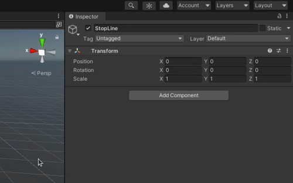
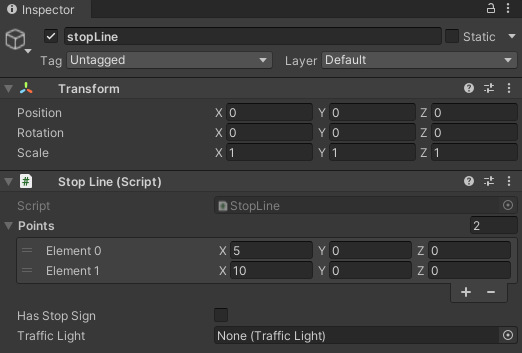
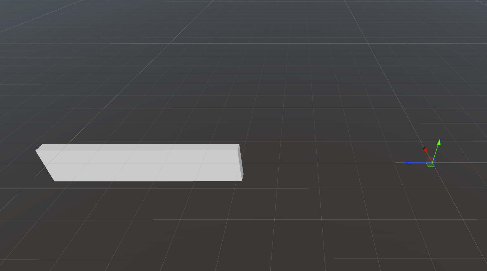

To add `RandomTraffic` to the `Environment`, it is necessary to load elements from the *lanelet2*.
As a result of loading, `TrafficLanes` and `StopLines` will be added to the scene. Details of these components can be found [here](../../../../UserGuide/ProjectGuide/Components/RandomTrafficSimulator/).

!!!warning
    Before following this tutorial make sure you have added an [Environment Script](../../AddANewEnvironment/AddAEnvironment/#add-an-environment-script) and set a proper `MGRS` offset position. This position is used when loading elements from the *lanelet2*!

1. Click on the `AWSIM` button in the top menu of the Unity editor and navigate to `AWSIM -> Random Traffic -> Load Lanelet`

    

2. In the window that pops-up select your osm file, change some Waypoint Settings to suit your needs and click `Load`

    

    Waypoint Settings explanation:

    - Resolution: resolution of resampling. Lower values provide better accuracy at the cost of processing time
    - Min Delta Length: minimum length(m) between adjacent points
    - Min Delta Angle: minimum angle(deg) between adjacent edges. Lowering this value produces a smoother curve

3. Traffic Lanes and Stop Lanes should occur in the Hierarchy view.
If they appear somewhere else in your Hierarchy tree, then move them into the `Environment` object

## Complete loaded TrafficLanes
The Traffic Lanes that were loaded should be configures accordingly to the road situation.

## How to test
<!-- TODO -->

## Add a StopLine manually
When something goes wrong when loading data from *lanelet2* or you just want to add another StopLine manually please do the following

1. Add a new GameObject *StopLine* in the *StopLines* parent object.

    

1. Add a StopLine Script by clicking 'Add Component' and searching for `Stop Line`.

    

    

    So far your Stop Line should look like the following

    

1. Set the position of `Element 0` and `Element 1`

    These Elements are the two end points of a Stop Line.
    The Stop Line will span between these points.

    You don't need to set any data in the 'Transform' section as it is not used anyway.

    !!! warning "StopLine coordinate system"
        Please note that the Stop Line Script operates in the global coordinate system.
        The transformations of StopLine *Object* and its parent *Objects* won't affect the Stop Line.

        ??? example
            In this example you can see that the Position of the *Game Object* does not affect the position and orientation of the Stop Line.

            For a Game Object in the center of the coordinate system.

            

            The stop Line is in the specified position.

            

            However with the *Game Object* shifted in X axis.

            

            The Stop Line stays in the same position as before, not affected by any transformations happening to the *Game Object*.

            

1. Select whether there is a Stop Sign.

    Select the `Has Stop Sign` tick-box confirming that this Stop Line has a Stop Sign.
    The Stop Sign can be either vertical or horizontal.

1. Configure is selection of a Traffic Light.

    The last thing to configure is a Traffic Light.
    You need to select one only when the Stop Line is right in front of a [Traffic Intersection](../../../../UserGuide/ProjectGuide/Components/RandomTrafficSimulator/) that has a Traffic Lights.

    Select from the drop-down menu the Traffic Light that is on the Traffic Intersection and is facing the vehicle that would be driving on the Traffic Lane connected with the Stop Line you are configuring.

    In other words select the right Traffic Light for the Lane on which your Stop Line is placed.

    !!! tip "Select Traffic Lights visually"
        If you have a lot of Traffic Lights it can be challenging to add them from the list.
        You can select them visually from the Scene the same as you had selected Traffic Lanes in the [Random Traffic Simulator](../AddARandomTrafficSimulatorScript/#add-spawnable-lanes).

## Add a TrafficLane manually
<!-- TODO -->
