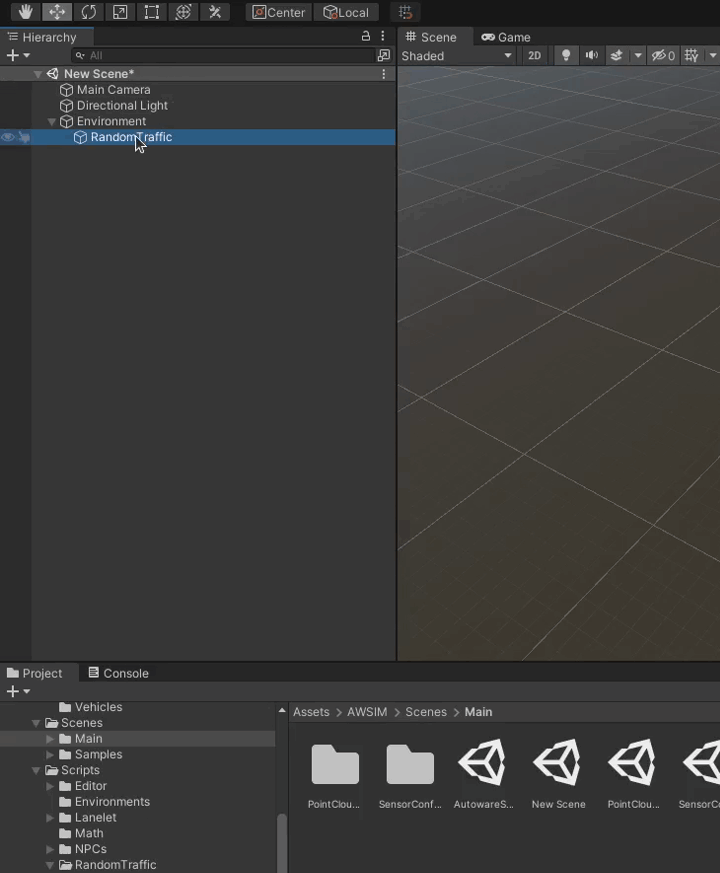

<!-- TODO everything -->
**Add a Random Traffic Simulator Script**

- Seed, Layers configuration (**screens**, mention of project settings layers - physics)
- Add NPCVehicles (**gifs**)
- Add spawnable lanes (**gifs/video**)
- Vehicles configuration (**screens**)

**Add a TrafficIntersection**

- Make sure that the TrafficLights have added scripts (hyperlink)
- Add a box collider (description, guidelines, **screen**)
- Add a Traffic Intersection Script
    - Create traffic light groups (guidelines, **gifs/videos**)
    - Create lighting sequences (pedestrian and vehicle sequences, intervals, how to test, example - **videos**)

**Load StopLines and Trafficlanes from Lanelet**

[Parf of Add Random Traffic Environemnt] (improve, **gifs**)

**Complete loaded TrafficLanes**

- Add right of way lanes
    - Turn left (guidelines, stop line, examples, **screens/videos**)
    - Turn right (guidelines, stop line, examples, **screens/videos**)
    - Straight (guidelines, stop line, examples, **screens/videos**)
- Add a stop line

**How to test**

(scene for example?, **gifs**)

**Add a StopLine manually**

- Add Points (guidelines, **gif**)
- TrafficLight assignment (guidelines, **gif**)

**Add a TrafficLane manually**

- Add waypoints (guidelines - case without stop line, **gifs**)
- Add a next and prev lanes (**gifs**)

## Add a Random Traffic Simulator Script
To add a Random Traffic to your scene you need the Random Traffic Simulator Script.
To add it to your scene create a new Game Object and call it `RandomTrafficSimulator` with optional prefix or suffix indicating for which location it is created.

Then click a button `Add Component` in the `Inspector` to add a script

A small window should pop-up.
Search for `RandomTrafficSimulator` script and add it by double clicking it or by pressing enter.

### Configuration
After clicking on the newly created `RandomTrafficSimulator` object in the Scene tree you should see something like this in the `Inspector` view

Random Traffic Simulator as the name suggests generates traffic based on random numbers.
To replicate situations you can set a specific [seed](https://en.wikipedia.org/wiki/Random_seed).

You can also set `Vehicle Layer Mask` and `Ground Layer Mask`.
It is important to set these layers correctly, as they are a base for vehicle physics.
If set incorrectly the vehicles may fall through the ground into the infinity.

## Add a TrafficIntersection

## Load StopLines and Trafficlanes from Lanelet

## Complete loaded TrafficLanes

## How to test

## Add a StopLine manually

## Add a TrafficLane manually