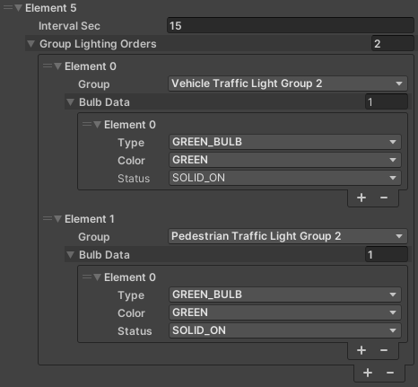
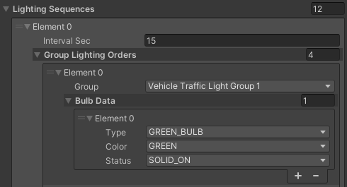

<!-- TODO everything -->
**Add a Random Traffic Simulator Script**

- Seed, Layers configuration (**screens**, mention of project settings layers - physics)
- Add NPCVehicles (**gifs**)
- Add spawnable lanes (**gifs/video**)
- Vehicles configuration (**screens**)

**Add a TrafficIntersection**

- Make sure that the TrafficLights have added scripts (hyperlink)
- Add a box collider (description, guidelines, **screen**)
- Add a Traffic Intersection Script
    - Create traffic light groups (guidelines, **gifs/videos**)
    - Create lighting sequences (pedestrian and vehicle sequences, intervals, how to test, example - **videos**)

**Load StopLines and Trafficlanes from Lanelet**

[Parf of Add Random Traffic Environemnt] (improve, **gifs**)

**Complete loaded TrafficLanes**

- Add right of way lanes
    - Turn left (guidelines, stop line, examples, **screens/videos**)
    - Turn right (guidelines, stop line, examples, **screens/videos**)
    - Straight (guidelines, stop line, examples, **screens/videos**)
- Add a stop line

**How to test**

(scene for example?, **gifs**)

**Add a StopLine manually**

- Add Points (guidelines, **gif**)
- TrafficLight assignment (guidelines, **gif**)

**Add a TrafficLane manually**

- Add waypoints (guidelines - case without stop line, **gifs**)
- Add a next and prev lanes (**gifs**)

## Add a Random Traffic Simulator Script
To add a Random Traffic to your scene you need the Random Traffic Simulator Script.

1. Create a new Game Object as a child of `Environment` and call it `RandomTrafficSimulator`.

    

1. Click a button `Add Component` in the `Inspector` to add a script

    

1. A small window should pop-up.
Search for `RandomTrafficSimulator` script and add it by double clicking it or by pressing enter.

    

### Basic Configuration
After clicking on the newly created `RandomTrafficSimulator` object in the Scene tree you should see something like this in the `Inspector` view

Random Traffic Simulator as the name suggests generates traffic based on random numbers.
To replicate situations you can set a specific [seed](https://en.wikipedia.org/wiki/Random_seed).

You can also set `Vehicle Layer Mask` and `Ground Layer Mask`.
It is important to set these layers correctly, as they are a base for vehicle physics.
If set incorrectly the vehicles may fall through the ground into the infinity.

### Add NPC Vehicles
Random Traffic Simulator Script moves, spawns and despawns vehicles based on the configuration.
These settings can to be adjusted to your preference.

1. Setting Max Vehicle Count.

1. Add NPC Prefabs

    - To do this click on the "+" sign and in the new list element at the bottom and click on the small icon on the right to select a prefab.

        

    - Change to the `Assets` tab in the small windows that popped-up.

        

    - Search for the Vehicle prefab you want to add, e.g. `Hatchback`.

        

    Available NPC prefabs are shown in the [NPC Vehicle section](../../../UserGuide/Components/NPCs/#npc-vehicle).

    !!!note
        Random Traffic Simulator Script will **on random** select one prefab from `Npc Prefabs` list every time when there  are not enough vehicles on the scene (the number of vehicles on the scene is smaller than the number specified in the `Max Vehicle Count` field).
        You can control the odds of selecting one vehicle prefab over another by adding more than one instance of the same prefab to this list.

### Add spawnable lanes
Spawnable lanes are the lanes on which new vehicles can be spawned by the Random Traffic Simulator Script.
Best practice is to use beginnings of the lanes on the edges of the map as spawnable lanes.

<!-- TODO link to loading a lanelet if it exists -->
To add a spawnable lane make sure you have a lanelet loaded into your scene.
Adding spawnable lanes is similar to [Adding NPC Prefabs](#add-npc-vehicles).

1. Add an element to the `Spawnable Lanes` list by clicking on the "+" symbol or by selecting number of lanes directly.

    

2. Now you can click on the small icon on the right of the list element and select a Traffic Lane you are interested in.

    

    Unfortunately all Traffic Lanes have the same names so it can be difficult to know which one to use.
    Alternatively you can do the following to add a traffic lane by visually selecting it in the editor:

    - Lock `RandomTrafficSimulator` in the Inspector view.

        

    - Select Traffic Lane you are interested in on the Scene and as it gets highlighted in the Hierarchy view you can now drag and drop this Traffic Lane into the appropriate list element.

        

### Vehicles configuration

The last thing to configure is the behavior of NPC Vehicles.
You can specify acceleration rate  of vehicles and three values of deceleration.

- Acceleration

    This value is used for every acceleration the vehicle performs (after stop line or traffic lights).

- Deceleration

    This deceleration value is used for most casual traffic situations like slowing down before stop line.

- Sudden Deceleration

    This deceleration rate is used for emergency situations, so when using standard deceleration rate is not enough to prevent some accident from happening (e.g. vehicle on the intersection didn't give way when it was supposed to).

- Absolute Deceleration

    This deceleration rate is a last resort for preventing a crash from happening.
    When no other deceleration is enough to prevent an accident this value is used.
    This should be set to the highest value achievable by a vehicle.

!!!note
    This configuration is common for all vehicles managed by the Random Traffic Simulator Script.

## Load StopLines and Trafficlanes from Lanelet
!!!warning
    Before following this tutorial make sure you have added an [Environment Script](../AddANewEnvironment/#add-a-environment-script) and set a proper MGRS data.

1. Click on the `AWSIM` button in the top menu of the Unity editor and navigate to `AWSIM -> Random Traffic -> Load Lanelet`

    

2. In the window that pops-up select your osm file, change some Waypoint Settings to suit your needs and click `Load`

    

    Waypoint Settings explanation:

    - Resolution: resolution of resampling. Lower values provide better accuracy at the cost of processing time
    - Min Delta Length: minimum length(m) between adjacent points
    - Min Delta Angle: minimum angle(deg) between adjacent edges. Lowering this value produces a smoother curve

3. Traffic Lanes and Stop Lanes should occur in the Hierarchy view.
If they appear somewhere else in your Hierarchy tree, then move them into the `Environment` object

## Complete loaded TrafficLanes
<!-- TODO -->

## Add a Traffic Intersection
Every Traffic Intersection on the scene needs to be added as a Game Object.
Best practice is to create a parent object `TrafficIntersections` and add all instances of Traffic Intersection as its children.
You can do this the same as with [Random Traffic Simulator](#add-a-random-traffic-simulator-script).

### Make sure that TrafficLights have added scripts
Check Traffic Lights and whether they are set up properly.

!!!note
    If you want to learn how to add and configure Traffic Lights check out [this tutorial](../AddANewEnvironment/AddTrafficLights/).

### Add a box collider
<!-- TODO add guidelines -->
1. Traffic intersection needs to be marked with a box collider.
First click on the `Add Component` button

    

1. In the window that popped up search for `Box Collider` and select it

    

1. Then set the position and orientation and size of the collider box to match the intersection on the scene.
You can do this by manipulating Box Collider properties `Center` and `Size` in the Inspector view.

    

### Add a Traffic Intersection Script
1. Click on the `Add Component` button

    

1. In the window that popped up search for `Traffic Intersection` and select it

    

1. You need to set a proper Collider Mask in order for the script to work.

    

#### Create traffic light groups
Traffic Light Groups are groups of traffic lights that are synchronized, meaning they light up with the same color and pattern at all times.

Traffic lights are divided into groups to simplify the process of creating a lighting sequence.
By default you will see 4 Traffic Light Groups, you can add and remove them to suit your needs.

1. First choose from the drop-down menu called `Group` the Traffic Light Group name you want to assign to your Traffic Light Group.

    <!--  -->
    

1. Then add as many Traffic Lights as you want your group to have.
From the drop-down menu select the Traffic Lights you want to add.

    <!--  -->
    

    !!!note
        If you have a lot of Traffic Lights it can be challenging to add them from the list.
        You can select them visually from the Scene the same as you had selected Traffic Lanes in the [Random Traffic Simulator](#add-spawnable-lanes).

#### Create lighting sequences
Lighting Sequences is the list of commands based on which the Traffic Lights will operate on given intersection.
The elements in the Lighting Sequences list are changes (commands) that will be executed on the Traffic Light Groups.

Group Lighting Order should be interpreted as a command (or order) given to all Traffic Lights in selected Traffic Light Group.
In Group Lighting Orders you can set different traffic light status for every Traffic Light Group (in separate elements).
Lighting sequences list is processed in an infinite loop.

It should be noted that changes applied to one Traffic Light Group will remain the same until the next Group Lighting Order is given to this Traffic Light Group.
This means that if in one Group Lighting Order no command is sent to a Traffic Light Group then this Group will remain its current lighting pattern (color, bulb and status).

For every Lighting Sequences Element you have to specify the following

1. Interval Sec

    This is the time for which the sequence should wait until executing next order, so how long this state will be active.

1. For every element in Group Lighting Orders there needs to be specified

    1. Group to which this order will be applied
    2. List of orders (Bulb Data)

        In other words - what bulbs should be turned on, their color and pattern.
        
        - Type - What type of bulb should be turned on
        - Color - What color this bulb should have (in most cases this will be the same as color of the bulb if specified)
        - Status - How the bulb should light up (selecting `SOLID_OFF` is necessary only when you want to turn the Traffic Light completely)

        !!!note
            When applying the change to a Traffic Light

            - First all bulbs are turned off
            - Only after that changes made in the order are applied

            This means it is only necessary to supply the data about what bulbs should be turned on.
            E.g. you don't have to turn off a red bulb when turning on the green one.

!!!warning
    The first Element in the Lighting Sequences (in most cases) should contain bulb data for every Traffic Light Group.
    Traffic Light Groups not specified in the first Element will not light up at the beginning of the scene.

##### Example
In the Lighting Sequence Element 5 presented below we tell all Traffic Lights in the Vehicle Traffic Light Group 2 to light up their Green Bulb with the color Green and status Solid On which means that they will be turned on all the time.
We also implicitly tell them to turn all other Bulbs off.

In the same time we tell all Traffic Lights in the Pedestrian Traffic Light Group 2 to do the very same thing.

This state will be active for the next 15 seconds, and after that Traffic Intersection will move to the next Element in the Sequence.

<!-- It should now be clear that Vehicle Traffic Light Group 2 and Pedestrian Traffic Light Group 2 are pointed towards pedestrians and vehicles moving in the same direction. -->

Lets consider the following Lighting Sequences Element 6.
Here we order the Traffic Lights in the Pedestrian Traffic Light Group 2 to light up their Green Bulb with the color Green and status Flashing.
We also implicitly tell them to turn all other bulbs off, which were already off from the implicit change in Element 5, so this effectively does nothing.

Note that Lighting Sequences Element 6 has no orders for Vehicle Traffic Light Group 2.
This means that Traffic Light in the Vehicle Traffic Light Group 2 will hold on to their earlier orders.

This state will be active for 5 seconds, which means that Traffic Lights in the Vehicle Traffic Light Group 2 will be lighting solid green for the total of 20 seconds.

<!--  -->
<!--  -->

## How to test
<!-- TODO -->

## Add a StopLine manually
<!-- TODO -->

## Add a TrafficLane manually
<!-- TODO -->
