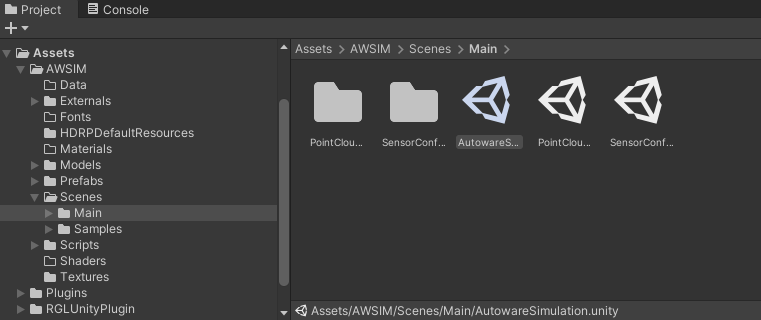

(prefab location, purpose of existence)

- Usage requirements (collider, mesh renderer, skinned mesh renderer, Read/Write Enabled)
- Add a prefab to scene
- Selection of interaction strategies (Mesh Source) (description of the impact on performance)
    - Only colliders (**gif**)
    - Regular Meshes And Colliders Instead Of Skinned (**gif**)
    - Regular Meshes And Skinned Meshes (**gif**)

Scene Manager is available as a prefab in the AWSIM project.
The prefab is located in the directory `Assets/AWSIM/Prefabs` in the Project tree.

Scene Manager is used for synchronizing model data between Unity and [RobotecGPULidar](https://github.com/RobotecAI/RobotecGPULidar).
Scene Manager watches for changes on the scene every frame and makes appropriate changes in stored models.
3D models are added and destroyed when they are needed or not needed anymore respectively.

## Usage requirements
<!-- TODO -->

## Add a prefab to scene
To add a Scene Manager prefab to a scene you need to

1. Open the scene

    

1. Find the prefab in the project (`Assets/AWSIM/Prefabs` directory)

    

1. Drag the prefab into a Hierarchy view

    

1. Rename this prefab to something like `AutowareSimulation` or just `Simulation` with preferred prefix or suffix and place all your simulation Game Objects as children (if you don't have any yet, this is where you will be placing them).

    
    

## Selection of interaction strategies (Mesh Source)
There are three possible interaction strategies for obtaining 3D models from Game Objects.

<!-- TODO add descriptions to every one -->
1. Only Colliders
2. Regular Meshes And Colliders Instead Of Skinned
3. Regular Meshes And Skinned Meshes

Please see the following on how to select the preferred strategy.

