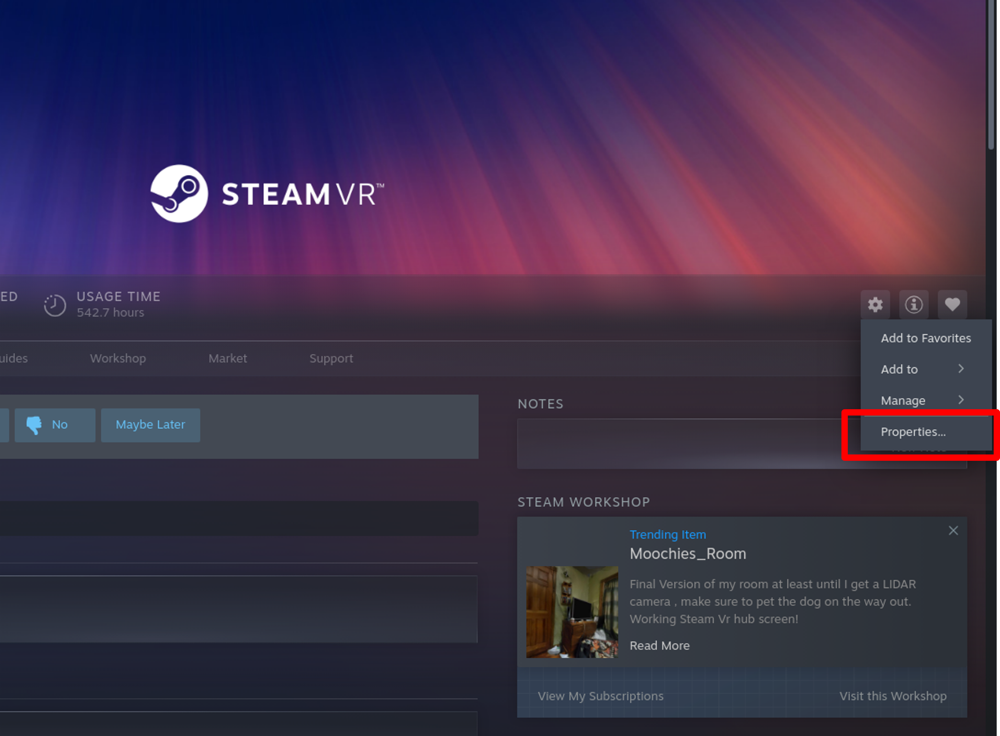
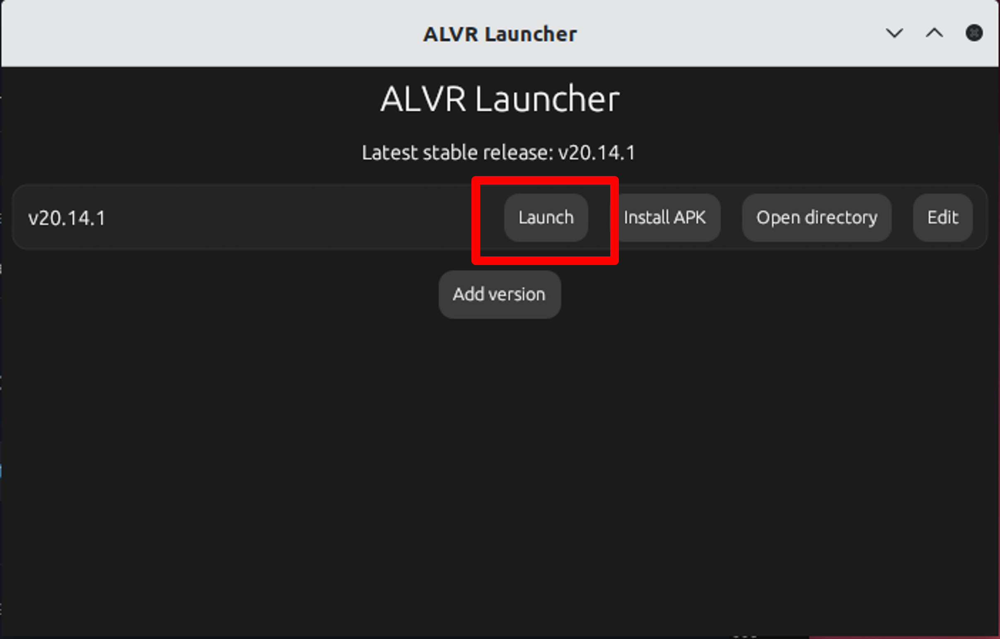
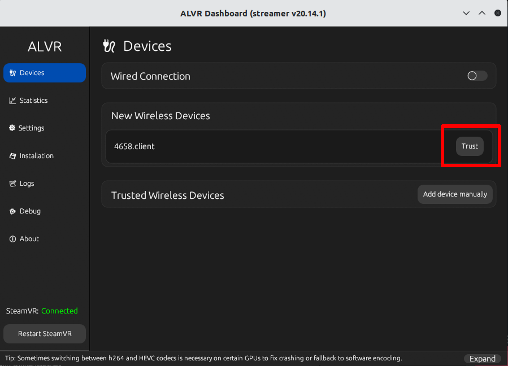

# Using VR

---

## Requirements  

Before using the VR functionality in AWSIM, you need to prepare a suitable VR headset and runtime environment. This section introudces the recommended devices.    

## Headset Selection  

Depending on the usage mode, you can choose from the following two categories of devices:  

### PCVR (Direct GPU Connection via Cable)  

- **Advantages**  
    - Low latency and fast response, suitable for simulations requiring high performance.  
    - Accurate spatial tracking with stable head and hand motion capture.  

- **Disadvantages**  
    - Relatively lower resolution, image clarity is not as high as the latest standalone headsets.  
    - Most devices were released earlier and are now difficult to purchase.  

- **Recommended Models**  
    - HTC Vive Pro  
    - HTC Vive Pro Eye  
    - Valve Index  

!!! info  
    Verified to work in Linux environments with good compatibility. Other PCVR devices may not work if Linux drivers are unavailable.  


### Standalone Headsets (Wireless/Wired Streaming)  

- **Advantages**  
    - Lightweight headset, easier to install and use.  
    - Widely available through multiple sales channels, more affordable and easier to purchase.  
    - No need for complex PC-side cable connections, offering greater flexibility.  

- **Disadvantages**  
    - Requires streaming software (ALVR) to connect with AWSIM.  
    - Tracking accuracy is generally lower than PCVR, and performance may be affected by lighting conditions in the environment.   

- **Recommended Model**  
    - Meta Quest 3  

- **Streaming Software ([ALVR](https://github.com/alvr-org/ALVR))**  
    - ALVR is an open-source VR streaming tool.  
    - Run **ALVR Server** on the PC and **ALVR Client** on the headset.  
    - Supports both wireless (Wi-Fi) and wired streaming.  

!!! info
    For other standalone devices, check the [ALVR supported headset list](https://github.com/alvr-org/ALVR). If listed as supported, the device should work in principle.  

---

## Installation

### 1. Install Steam  

Steam is required in order to run SteamVR. Please make sure Steam is correctly installed first.  

#### Setup  

1. Ensure you install the **official Steam `.deb` package**, not the Snap or Flatpak versions.  
   - Official download page: [https://store.steampowered.com/about/](https://store.steampowered.com/about/)  
   - Download the `.deb` file and install it:  
     ```bash
     sudo dpkg -i steam_latest.deb
     ```  

2. After installation, launch Steam from the terminal (`steam`) or from your desktop environment, and log in with your account.  

---

!!! infor
    - SteamVR requires **DRM leasing**, which is only available on **X11** or certain Wayland compositors.  
    - On Ubuntu with the default **GNOME Wayland**, SteamVR will **not work**.  
    - Workarounds:  
        - At the login screen, click the **cog icon** and select **Ubuntu (X11)** instead of **Ubuntu on Wayland**.  
        - Or install **KDE Plasma** and use **Plasma (X11/Wayland)**:  
    ```bash
    sudo apt install kde-plasma-desktop
    ```  

---

For more details, please refer to the official Steam Support documentation:  
[Steam Support – Installing Steam on Linux](https://help.steampowered.com/ja/faqs/view/18A4-1E10-8A94-3DDA)  

### 2. Install SteamVR 

- Open the **Steam client**.  
- In the **Store**, search for **SteamVR**.  
  
- Click **Install** and wait for the download to complete.  

---

!!! infor
    - In some cases, SteamVR may launch with a **black screen**. To fix this, set the following **Launch Option** in SteamVR properties:  
    
    ```bash
    ~/.local/share/Steam/steamapps/common/SteamVR/bin/vrmonitor.sh %command%
    ```
    


### 3. Install ALVR (for standalone headsets)
[ALVR](https://github.com/alvr-org/ALVR) is an open-source streaming software that allows standalone headsets (e.g., Meta Quest 3) to run SteamVR content from your PC via wireless or wired streaming.  

#### Setup  

1. Download **alvr_launcher_linux.tar.gz** from the [ALVR release page](https://github.com/alvr-org/ALVR/releases).  
1. Extract it into a directory that:  
   contains only ASCII characters (English path), and is writable without administrator/root privileges.  
1. Inside the extracted folder, run:  
   ```bash
   alvr_launcher_linux/ALVR Launcher
   ```
1. In the launcher UI, press Add version → keep the default channel and version → press Install.  

    

    This will download and install the required components.

1. Once installation is complete, click Install APK to install the ALVR Client on your Quest headset.
      
!!! info
    Make sure developer mode is enabled on the headset.

#### Usage

1. In the ALVR Launcher, click Launch to start ALVR Server on your PC.  

    

    On the first launch, you will be guided through a setup wizard (firewall rules, permissions, etc.).

1. Start SteamVR (must already be installed).

    
!!! info  
    On the first launch, SteamVR may appear blank and ALVR will not work. Close it and restart SteamVR — the ALVR driver will then be registered.

1. Launch the ALVR Client on your Quest headset.

1. While the headset screen is on, go to the Devices tab in ALVR Server and click Trust next to your device entry to establish the connection.

    

1. Once connected, the SteamVR output will be streamed to your headset.

    

For more details, please refer to the official installation guide:  
[ALVR Installation Guide](https://github.com/alvr-org/ALVR/wiki/Installation-guide) 


## Enable VR in AWSIM  

To enable VR in AWSIM, you need to modify the configuration file.  

### Setup  
  - Open the `sample-config.json` file located in the AWSIM project.  
  - Edit the following field:  

   ```json  
   "UseVR": true
   ```  

  - When "UseVR": true
    A VR camera will be attached under the Ego vehicle. The default MainCamera will be disabled.

  - When "UseVR": false
    AWSIM will run in normal mode using the MainCamera.

!!! info
    ### First-time Launch Notes  
      When starting AWSIM with VR enabled for the first time, SteamVR may display additional configuration prompts:  
        
    1. First, a popup window will appear, informing you that no SteamVR Input actions have been generated yet and asking if you would like to open the SteamVR Input window. Select **Yes** here.  

    

    2. Next, the SteamVR Input configuration window will open, showing the default Action Sets and input actions. At the bottom of the window, click **Save and generate**. The system will automatically create the default input bindings.  

    

    After completing these steps, SteamVR will save the input configuration, and you will not see this prompt again on subsequent launches.  
