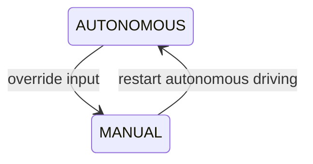
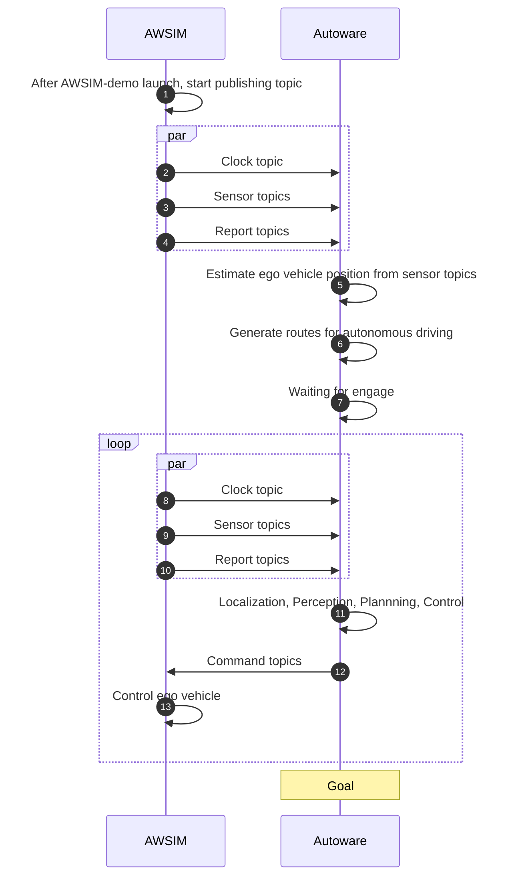

Detail of the [Quick start demo](../QuickStartDemo/index.md) `AWSIM-demo.x86_64` simulation.

## Overview
AWSIM simulates sensors, vehicles, driving environments, and traffic instead of reality. AWSIM and Autoware are connected by [ROS2](https://www.ros.org/) only. Each message that is also used in real vehicles is used. Therefore, Autoware can operate without being aware of whether it is a real or simulator.
<popup-img src="image_0.png" alt="image_0"></popup-img>

<br>

## UI

<popup-img src="image_1.png" alt="image_1"></popup-img>

|UI|Feature|
|:--|:--|
|Camera sensor|Preview of traffic light recognition camera sensor output image.|
|Time scale|The timescale of the simulation progress time. 0.5 simulates the simulation at 0.5x speed. (Range : 0.0 ~ 1.0)|
|Traffic settings|`Max vehicle count` is aximum number of NPC vehicles present in traffic at the same time. `Seed` is seed value used in random numbers for random traffic.|
|Follow camera|Enable follow camera operation.|
|Control mode|Change the control mode of the ego vehicle. When `MANUAL`, control input from the device is used; when `AUTONOMOUS`, control input from ROS2 (Autoware) is used. Since the control input override is simulated as in a real vehicle, the control mode switches to `MANUAL` when the control mode is `AUTONOMOUS` and an input is made by a device.|
|Vehicle information|Information about the vehicle.|
|Vehicle input device|Display of the vehicle's active input devices. Can be switched.|
|UI menu bar|Show/hide each UI; scaling of UI; resetting of UI|

<br>

## Vehicle

<popup-img src="image_2.png" width="500" alt="image_2"></popup-img>

This vehicle dynamics model was created for Autoware simulation, and assuming that Autoware has already created a gas pedal map, **this vehicle dynamics model uses acceleration as an input value**. It has the following features.

- Lexus RX450h 2015
- Longitudinal control by acceleration ($\frac{m}{s^2}$).
- Lateral control by two-wheel model.
- Compute pose by physics engine.
- Mass-spring-damper suspension model. 
- Automatic gear.(`P`, `D`, `R`, `N`)
- Effect of gradient resistance.
- Tire animation and signal light effects.
- Support for `Keyboard` input and `Logitech G29 steering wheel`
- First order delay of input.

### Device input

- Keyboard

!!! info
    Keyboard input for throttle and steering instantly switches the control mode from `AUTONOMOUS` to `MANUAL`.

|Key|Feature|
|:--|:--|
|D|Switch to move drive gear.|
|R|Switch to move reverse gear.|
|N|Switch to neutral gear.|
|P|Switch to parking gear.|
|Up arrow|Forward acceleration.|
|Down arrow|Reverse acceleration.|
|Left arrow|Left turning.|
|Right arrow|right turning.|
|1|Turn left blinker on.|
|2|Turn right blinker on.|
|3|Turn on hazard lights.|
|4|Turn off blinker or hazard lights.|
|C|Switch control mode `MANUAL` to `AUTONOMOUS`|

- Logitech G29 steering wheel

|Key|Feature|
|:--|:--|
|Triangle|Switch to move drive gear.|
|Square|Switch to move reverse gear.|
|Circle|Switch to neutral gear.|
|Cross|Switch to parking gear.|
|Throttle pedal|Forward acceleration.|
|Brake pedal|Reverse acceleration.|
|Steering wheel|Turning.|
|Left paddle|Turn left blinker on.|
|Right paddle|Turn right blinker on.|
|R2|Turn on hazard lights.|
|R3|Turn off blinker or hazard lights.|
|L2|Switch control mode `AUTONOMOUS` to `MANUAL`|
|L3|Switch control mode `MANUAL` to `AUTONOMOUS`|

### Control mode

AWSIM vehicle simulates operations that switch between autonomous driving and manual control. Autoware accepts manual steering and pedal control by the driver during Autonomus Driving. This allows the driver to shift from Autoware's Autonomous driving (`AUTONOMOUS` control mode) to Driver's Manual driving (`MANUAL` control mode).


<br>
UI allows checking and switching the current control mode.

|AUTONOMOUS|MANUAL|
|:--|:--|
| <popup-img src="image_3.png"></popup-img> | <popup-img src="image_4.png"></popup-img> |

!!! info
    
    Control mode can also be changed from Topic.   
    ```ros2 service call input/control_mode_request autoware_vehicle_msgs/srv/ControlModeCommand "mode: 1"```

    The following modes are supported.  
    - `AUTONOMOUS = 1`  
    - `MANUAL = 4`

<br>

## Sensor

Demo simulation has a total of four sensors.

- LiDAR sensor
- Camera sensor
- IMU sensor
- GNSS sensor

### LiDAR sensor

<popup-img src="image_5.png" width="500" alt="image_5"></popup-img>

Lidar sensor is the component that simulates the *LiDAR* (*Light Detection and Ranging*) sensor.
*LiDAR* works by emitting laser beams that bounc                e off objects in the environment, and then measuring the time it takes for the reflected beams to return, allowing the sensor to create a *3D* map of the surroundings.
This data is used for object detection, localization, and mapping.

Publish ROS2 topics.

|Topic|Msg|Hz|
|:--|:--|:--|
|`/sensing/lidar/top/pointcloud_raw` |`sensor_msgs/PointCloud2`|10|
|`/sensing/lidar/top/pointcloud_raw_ex`|`sensor_msgs/PointCloud2`|10|

### Camera sensor

<popup-img src="camera.png" alt="camera"></popup-img>

Camera sensor is a component that simulates an RGB camera. Autonomous vehicles can be equipped with many cameras used for various purposes. In the current version of AWSIM, the camera is used primarily to provide the image to the traffic light recognition module in Autoware.

Publish ROS2 topics.

|Topic|Msg|Hz|
|:--|:--|:--|
|`/sensing/camera/traffic_light/camera_info`|`sensor_msgs/CameraInfo`|10|
|`/sensing/camera/traffic_light/image_raw`|`sensor_msgs/Image`|10|

### IMU sensor

IMU sensor is a component that simulates an *IMU* (*Inertial Measurement Unit*) sensor.
Measures acceleration (${m}/{s^2}$) and angular velocity (${rad}/{s}$) based on the sensor pose.

Publish ROS2 topics.

|Topic|Msg|Hz|
|:--|:--|:--|
|`/sensing/imu/tamagawa/imu_raw`|`sensor_msgs/Imu`|30|

### GNSS sensor

GNSS sensor is a component which simulates the position of vehicle computed by the *Global Navigation Satellite System* based on the transformation of the *GameObject* to which this component is attached.
The GNSS sensor outputs the position in the [*MGRS*](https://www.maptools.com/tutorials/mgrs/quick_guide) coordinate system.

Publish ROS2 topics.

|Topic|Msg|Hz|
|:--|:--|:--|
|`/sensing/gnss/pose`|`geometry_msgs/Pose`|1|
|`/sensing/gnss/pose_with_covariance`|`geometry_msgs/PoseWithCovarianceStamped`|1|


<br>

## Traffic

<popup-img src="traffic.png" width="500" alt="traffic"></popup-img>
<popup-img src="traffic_ui.png" width="300" alt="traffic_ui"></popup-img>

Demo simulation simulates random traffic with NPCs driving according to traffic rules.
The Traffic settings UI allows you to change the content of the traffic.

- Max vehicle count : Maximum number of NPC vehicles present in traffic at the same time.
- Seed : Seed value used in random numbers for random traffic.

<br>

## Environment

<popup-img src="environment.png" width="500" alt="environment"></popup-img>

Map for the demo simulation is [West Shinjuku Tokyo Japan](https://maps.app.goo.gl/rXxhvdEm9L7WSAgH6). Road surfaces, lanes, traffic signals, signs, etc. are reproduced as in reality. For performance, the building is simplified. 


<br>

## Integration sequence

### Initialization
1. *AWSIM*: After AWSIM-demo launch, start publishing clock, sensor, and report topics. (1,2,3,4)
1. *Autoware*: Estimate ego vehicle position from sensor topics. (5)
1. *Autoware*: Generate routes for autonomous driving. (6)
1. *Autoware*: Waiting for engage (7)

### Autonomous driving loop
1. *AWSIM*: Publish each Clock, Sensor, and Report topic. (8, 9, 10)
1. *Autoware*: Localization, Perception, Plannning, Control. (11)
1. *Autoware*: Publish command topic to contol a vehicle (12)
1. *AWSIM*: Controlling Ego vehicles based on command topics. (13)

!!! Warning
    Note that this is a **simplified** sequence diagram. The actual ros2 topic is pub/sub asynchronously.


<br>

## Json configuration

It is possible to do some configurations by specifying the json path when starting `AWSIM-demo.x86_64`.

- Sample json.
    ```json
    {
        "TimeScale": 1,
        "TimeSourceType": 0,
        "RandomTrafficSeed": 33,
        "MaxVehicleCount": 10,
        "LogitechG29Settings": {
            "_devicePath": "/dev/input/event3",
            "_selfAligningTorqueCoeff": 1.0
        },
        "EgoVehicleSettings": {
            "_maxSteerTireAngleInput": 35,
            "_maxAccelerationInput": 2,
            "_maxDecelerationInput": 2
        },
        "EgoPose": {
            "Position": {
                "x": 81381.7265625,
                "y": 49920.1890625,
                "z": 41.57674865722656
            },
            "EulerAngles": {
                "x": 0.0,
                "y": 0.0,
                "z": 35.0
            }
        }
    }
    ```

    |params|type|feature|
    |:--|:--|:--|
    |TimeScale|float|The timescale of the simulation progress time. 0.5 simulates the simulation at 0.5x speed. (Range : 0.0 ~ 1.0)|
    |TimeSourceType|int|Time source to be used in the simulation. <br/>`0`: Unity<br/>`1`: External<br/>`2`: DotnetSystem<br/>`3`: DotnetSimulation<br/>`4`: Ros2|
    |RandomTrafficSeed|int|Seed value used in random numbers for random traffic.|
    |MaxVehicleCount|int|Maximum number of NPC vehicles present in traffic at the same time.|
    |LogitechG29Settings.<br>_devicePath|string|Device path for Logitech G29 Steering wheel.|
    |LogitechG29Settings.<br>_selfAligningTorqueCoeff|float|Self-aligning torque coefficient for g29. (Range : 0.0 ~ 1.0)|
    |EgoVehicleSettings.<br>_maxSteerTireAngleInput|float|Maximum steering angle of steerable tires on a vehicle. (degree.)|
    |EgoVehicleSettings.<br>_maxAccelerationInput|float|Maximum acceleration of the vehicle. (m/s^s)|
    |EgoVehicleSettings.<br>_maxDecelerationInput|float|Maximum deceleration of the vehicle. (m/s^s) No minus sign is needed.|
    |EgoPose.Position|vector3|Initial position of ego vehicle.|
    |EgoPose.EulerAngles|vector3|Initial rotation of ego vehicle.|


- Launch command with json path.
    ```
    ./AWSIM-demo.x86_64 --json_path <direcotry path>/<config json name>.json
    ```

    !!! info
        AWSIM-demo.zip contains `sample-config.json`


<br>

## ROS2

### Nodes

Two ROS2 nodes are used in AWSIM.

- `AWSIM`
- `RGL`

AWSIM ros2 pub/sub, with the exception of the pointcloud, will use the `AWSIM` ros2 node.
For performance, the pointcloud topic output from the LiDAR sensor is published from the `RGL` ros2 node.

!!! info 
    You can check ros2 topic list. (Using a terminal with ros2 sourced)
    ```
    ros2 topic list
    ```

### Topics

#### Subscribers

| Topic                                  | Message type                                                                                                                                                        | `frame_id` | `Hz`  | `QoS`                                                                 |
|--:-------------------------------------|--:------------------------------------------------------------------------------------------------------------------------------------------------------------------|--:---------|--:-:--|--:--------------------------------------------------------------------|
| `/control/command/control_cmd`         | [`autoware_control_msgs/Control`](https://github.com/autowarefoundation/autoware_msgs/blob/main/autoware_control_msgs/msg/Control.msg)                              | -          | `60`  | <ul><li>`Reliable`</li><li>`TransientLocal`</li><li>`KeepLast/1`</li> |
| `/control/command/gear_cmd`            | [`autoware_vehicle_msgs/GearCommand`](https://github.com/autowarefoundation/autoware_msgs/blob/main/autoware_vehicle_msgs/msg/GearCommand.msg)                      | -          | `10`  | <ul><li>`Reliable`</li><li>`TransientLocal`</li><li>`KeepLast/1`</li> |
| `/control/command/turn_indicators_cmd` | [`autoware_vehicle_msgs/TurnIndicatorsCommand`](https://github.com/autowarefoundation/autoware_msgs/blob/main/autoware_vehicle_msgs/msg/TurnIndicatorsCommand.msg)  | -          | `10`  | <ul><li>`Reliable`</li><li>`TransientLocal`</li><li>`KeepLast/1`</li> |
| `/control/command/hazard_lights_cmd`   | [`autoware_vehicle_msgs/HazardLightsCommand`](https://github.com/autowarefoundation/autoware_msgs/blob/main/autoware_vehicle_msgs/msg/HazardLightsCommand.msg)      | -          | `10`  | <ul><li>`Reliable`</li><li>`TransientLocal`</li><li>`KeepLast/1`</li> |
| `/control/command/emergency_cmd`       | [`tier4_vehicle_msgs/VehicleEmergencyStamped`](https://github.com/tier4/tier4_autoware_msgs/blob/tier4/universe/tier4_vehicle_msgs/msg/VehicleEmergencyStamped.msg) | -          | `60`  | <ul><li>`Reliable`</li><li>`TransientLocal`</li><li>`KeepLast/1`</li> |


#### Publishers
| Topic                                       | Message type                                                                                                                                                     | `frame_id`                              | `Hz`  | `QoS`                                                               |
|--:------------------------------------------|--:---------------------------------------------------------------------------------------------------------------------------------------------------------------|--:--------------------------------------|--:-:--|--:------------------------------------------------------------------|
| `/clock`                                    | [`rosgraph_msgs/Clock`](https://docs.ros.org/en/api/rosgraph_msgs/html/msg/Clock.html)                                                                           | -                                       | `100` | <ul><li>`Best effort`</li><li>`Volatile`</li><li>`Keep last/1`</li> |
| `/sensing/camera/traffic_light/camera_info` | [`sensor_msgs/C                ameraInfo`](https://docs.ros.org/en/api/sensor_msgs/html/msg/CameraInfo.html)                                                                     | `traffic_light_left_camera/camera_link` | `10`  | <ul><li>`Best effort`</li><li>`Volatile`</li><li>`Keep last/1`</li> |
| `/sensing/camera/traffic_light/image_raw`   | [`sensor_msgs/Image`](https://docs.ros.org/en/api/sensor_msgs/html/msg/Image.html)                                                                               | `traffic_light_left_camera/camera_link` | `10`  | <ul><li>`Best effort`</li><li>`Volatile`</li><li>`Keep last/1`</li> |
| `/sensing/gnss/pose`                        | [`geometry_msgs/Pose`](https://docs.ros.org/en/api/geometry_msgs/html/msg/Pose.html)                                                                             | `gnss_link`                             | `1`   | <ul><li>`Reliable`</li><li>`Volatile`</li><li>`Keep last/1`</li>    |
| `/sensing/gnss/pose_with_covariance`        | [`geometry_msgs/PoseWithCovarianceStamped`](https://docs.ros.org/en/api/geometry_msgs/html/msg/PoseWithCovarianceStamped.html)                                   | `gnss_link`                             | `1`   | <ul><li>`Reliable`</li><li>`Volatile`</li><li>`Keep last/1`</li>    |
| `/sensing/imu/tamagawa/imu_raw`             | [`sensor_msgs/Imu`](https://docs.ros.org/en/api/sensor_msgs/html/msg/Imu.html)                                                                                   | `tamagawa/imu_link`                     | `30`  | <ul><li>`Reliable`</li><li>`Volatile`</li><li>`Keep last/1000`</li> |
| `/sensing/lidar/top/pointcloud_raw`         | [`sensor_msgs/PointCloud2`](https://docs.ros.org/en/api/sensor_msgs/html/msg/PointCloud2.html)                                                                   | `sensor_kit_base_link`                  | `10`  | <ul><li>`Best effort`</li><li>`Volatile`</li><li>`Keep last/5`</li> |
| `/sensing/lidar/top/pointcloud_raw_ex`      | [`sensor_msgs/PointCloud2`](https://docs.ros.org/en/api/sensor_msgs/html/msg/PointCloud2.html)                                                                   | `sensor_kit_base_link`                  | `10`  | <ul><li>`Best effort`</li><li>`Volatile`</li><li>`Keep last/5`</li> |
| `/vehicle/status/velocity_status`           | [`autoware_vehicle_msgs/VelocityReport`](https://github.com/autowarefoundation/autoware_msgs/blob/main/autoware_vehicle_msgs/msg/VelocityReport.msg)             | `base_line`                             | `30`  | <ul><li>`Reliable`</li><li>`Volatile`</li><li>`Keep last/1`</li>    |
| `/vehicle/status/steering_status`           | [`autoware_vehicle_msgs/SteeringReport`](https://github.com/autowarefoundation/autoware_msgs/blob/main/autoware_vehicle_msgs/msg/SteeringReport.msg)             | -                                       | `30`  | <ul><li>`Reliable`</li><li>`Volatile`</li><li>`Keep last/1`</li>    |
| `/vehicle/status/control_mode`              | [`autoware_vehicle_msgs/ControlModeReport`](https://github.com/autowarefoundation/autoware_msgs/blob/main/autoware_vehicle_msgs/msg/ControlModeReport.msg)       | -                                       | `30`  | <ul><li>`Reliable`</li><li>`Volatile`</li><li>`Keep last/1`</li>    |
| `/vehicle/status/gear_status`               | [`autoware_vehicle_msgs/GearReport`](https://github.com/autowarefoundation/autoware_msgs/blob/main/autoware_vehicle_msgs/msg/GearReport.msg)                     | -                                       | `30`  | <ul><li>`Reliable`</li><li>`Volatile`</li><li>`Keep last/1`</li>    |
| `/vehicle/status/turn_indicators_status`    | [`autoware_vehicle_msgs/TurnIndicatorsReport`](https://github.com/autowarefoundation/autoware_msgs/blob/main/autoware_vehicle_msgs/msg/TurnIndicatorsReport.msg) | -                                       | `30`  | <ul><li>`Reliable`</li><li>`Volatile`</li><li>`Keep last/1`</li>    |
| `/vehicle/status/hazard_lights_status`      | [`autoware_vehicle_msgs/HazardLightsReport`](https://github.com/autowarefoundation/autoware_msgs/blob/main/autoware_vehicle_msgs/msg/HazardLightsReport.msg)     | -                                       | `30`  | <ul><li>`Reliable`</li><li>`Volatile`</li><li>`Keep last/1`</li>    |
| `/awsim/ground_truth/vehicle/pose`          | [`geometry_msgs/PoseStamped`](https://docs.ros.org/en/api/geometry_msgs/html/msg/PoseStamped.html)                                                               | `base_link`                             | `100` | <ul><li>`Reliable`</li><li>`Volatile`</li><li>`Keep last/1`</li>    |

### Service server
| Service                      | Message type                                                                                                                                                     |
|--:---------------------------|--:---------------------------------------------------------------------------------------------------------------------------------------------------------------|
| `input/control_mode_request` | [`autoware_vehicle_msgs/srv/ControlModeCommand`](https://github.com/autowarefoundation/autoware_msgs/blob/main/autoware_vehicle_msgs/srv/ControlModeCommand.srv) |
