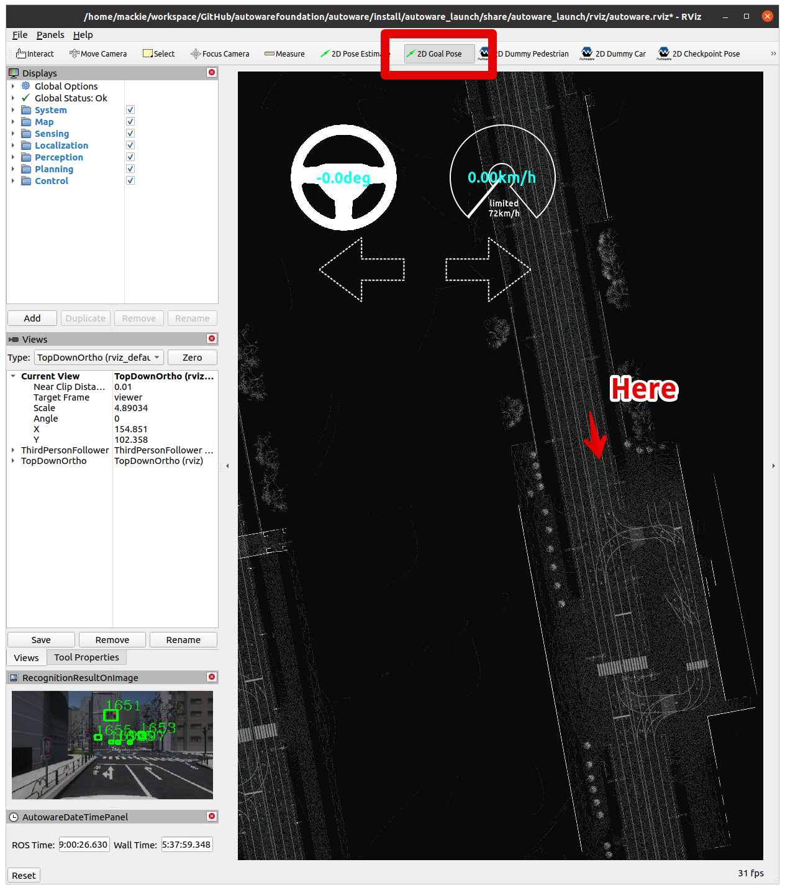

# Quick Start Demo

Below you can find instructions on how to setup the self-driving demo of AWSIM simulation controlled by Autoware.
The instruction assumes using the Ubuntu OS.


### Demo configuration

The simulation provided in the AWSIM demo is configured as follows:

|AWSIM Demo Settings||
|:--|:--|
|Vehicle|Lexus RX 450h|
|Environment|Japan Tokyo Nishishinjuku|
|Sensors|Gnss * 1<br> IMU * 1<br> LiDAR * 1<br> Traffic camera * 1|
|Traffic|Randomized traffic|
|ROS2|humble|

### PC specs

Please make sure that your machine meets the following requirements in order to run the simulation correctly:

|Required PC Specs||
|:--|:--|
|OS|Ubuntu 22.04|
|CPU|6cores and 12thread or higher|
|GPU|RTX2080Ti or higher|
|Nvidia Driver (Windows)|>=472.50|
|Nvidia Driver (Ubuntu 22)|>=515.43.04|


### Localhost settings

The simulation is based on the appropriate network setting, which allows for trouble-free communication of the AWSIM simulation with the Autoware software.
To apply required localhost settings please add the following lines to `~/.bashrc` file:

``` bash
if [ ! -e /tmp/cycloneDDS_configured ]; then
	sudo sysctl -w net.core.rmem_max=2147483647
	sudo ip link set lo multicast on
	touch /tmp/cycloneDDS_configured
fi
```

and these lines to `~/.profile` **or in either of files:** `~/.bash_profile` *or* `~/.bash_login`:

``` bash
export ROS_LOCALHOST_ONLY=1
export RMW_IMPLEMENTATION=rmw_cyclonedds_cpp
```

!!! warning
    A system restart is required for these changes to work.

## Start the demo

### Running the AWSIM simulation demo

To run the simulator, please follow the steps below.

1. Install Nvidia GPU driver (Skip if already installed).
    1. Add Nvidia driver to apt repository
    ```
    sudo add-apt-repository ppa:graphics-drivers/ppa
    sudo apt update
    ```
    2. Install the recommended version of the driver.
    ```
    sudo ubuntu-drivers autoinstall
    ```

        !!! warning
        
            Currently, there are cases where the Nvidia driver version is too high, resulting in Segmentation fault. In that case, please lower the Nvidia driver version (525 is recommended.)

    3. Reboot your machine to make the installed driver detected by the system.
    ```
    sudo reboot
    ```
    4. Open terminal and check if `nvidia-smi` command is available and outputs summary similar to the one presented below.
    ```
    $ nvidia-smi 
    Fri Oct 14 01:41:05 2022       
    +-----------------------------------------------------------------------------+
    | NVIDIA-SMI 515.65.01    Driver Version: 515.65.01    CUDA Version: 11.7     |
    |-------------------------------+----------------------+----------------------+
    | GPU  Name        Persistence-M| Bus-Id        Disp.A | Volatile Uncorr. ECC |
    | Fan  Temp  Perf  Pwr:Usage/Cap|         Memory-Usage | GPU-Util  Compute M. |
    |                               |                      |               MIG M. |
    |===============================+======================+======================|
    |   0  NVIDIA GeForce ...  Off  | 00000000:01:00.0  On |                  N/A |
    | 37%   31C    P8    30W / 250W |    188MiB / 11264MiB |      3%      Default |
    |                               |                      |                  N/A |
    +-------------------------------+----------------------+----------------------+

    +-----------------------------------------------------------------------------+
    | Processes:                                                                  |
    |  GPU   GI   CI        PID   Type   Process name                  GPU Memory |
    |        ID   ID                                                   Usage      |
    |=============================================================================|
    |    0   N/A  N/A      1151      G   /usr/lib/xorg/Xorg                133MiB |
    |    0   N/A  N/A      1470      G   /usr/bin/gnome-shell               45MiB |
    +-----------------------------------------------------------------------------+
    ```

2. Install Vulkan Graphics Library (Skip if already installed).
    1. Update the environment.
    ```
    sudo apt update
    ```
    2. Install the library.
    ```
    sudo apt install libvulkan1
    ```

3. Download and Run AWSIM Demo binary.

    1. Download `AWSIM_v1.2.0.zip`.

        [Download AWSIM Demo for ubuntu](https://github.com/tier4/AWSIM/releases/download/v1.2.0/AWSIM_v1.2.0.zip){.md-button .md-button--primary}
    
    2. Unzip the downloaded file.

    3. Make the `AWSIM_v1.2.0.x86_64` file executable.

        Rightclick the `AWSIM_v1.2.0.x86_64` file and check the `Execute` checkbox

        

        or execute the command below.

        ```
        chmod +x <path to AWSIM folder>/AWSIM_v1.2.0.x86_64
        ```

    4. Launch `AWSIM_v1.2.0.x86_64`.
        ```
        ./<path to AWSIM folder>/AWSIM_v1.2.0.x86_64
        ``` 
        
        !!! warning
        
            It may take some time for the application to start the so please wait until image similar to the one presented below is visible in your application window.

        

### Launching Autoware

In order to configure and run the Autoware software with the AWSIM demo, please:

1. Download `map files (pcd, osm)` and unzip them.

    [Download Map files (pcd, osm)](https://github.com/tier4/AWSIM/releases/download/v1.1.0/nishishinjuku_autoware_map.zip){.md-button .md-button--primary}

2. Clone [Autoware](https://github.com/autowarefoundation/autoware) and move to the directory.
```
git clone https://github.com/autowarefoundation/autoware.git
cd autoware
```
3. Switch branche to `awsim-stable`. *NOTE: The latest `main` branch is for [ROS 2 humble](https://docs.ros.org/en/rolling/Releases/Release-Humble-Hawksbill.html).*
```
git checkout awsim-stable
```
4. Configure the environment. (Skip if Autoware environment has been configured before)
```
./setup-dev-env.sh
```
5. Create the `src` directory and clone external dependent repositories into it.
```
mkdir src
vcs import src < autoware.repos
```
6. Install dependent ROS packages.
```

source /opt/ros/humble/setup.bash
rosdep update
rosdep install -y --from-paths src --ignore-src --rosdistro $ROS_DISTRO
```
7. Build the workspace.
```
colcon build --symlink-install --cmake-args -DCMAKE_BUILD_TYPE=Release -DCMAKE_CXX_FLAGS="-w"
```
8. Launch Autoware.

    !!! warning

        `<your mapfile location>` must be changed arbitrarily. When specifying the path the `~` operator cannot be used - please specify absolute full path.
```
source install/setup.bash
ros2 launch autoware_launch e2e_simulator.launch.xml vehicle_model:=sample_vehicle sensor_model:=awsim_sensor_kit map_path:=<your mapfile location>
```


## Let's run the self-Driving simulation

1. Launch AWSIM and Autoware according to the steps described earlier in this document.


2. The Autoware will automatically set its pose estimation as presented below.


3. Set the navigation goal for the vehicle.



4. Optionally, you can define an intermediate point through which the vehicle will travel on its way to the destination.

The generated path can be seen on the image below.


5. Enable self-driving.

To make the vehicle start navigating please engage it's operation using the command below.

```
cd autoware
source install/setup.bash
ros2 topic pub /autoware/engage autoware_auto_vehicle_msgs/msg/Engage '{engage: True}' -1
```


The self-driving simulation demo has been successfully launched!

## Troubleshooting

In case of any problems with running the sample AWSIM binary with Autoware, start with checking our [Troubleshooting page](https://tier4.github.io/AWSIM/DeveloperGuide/TroubleShooting/) with the most common problems.

## Appendix
- [AWSIM ROS2 topic list](../../Components/ROS2/ROS2TopicList/index.md)
