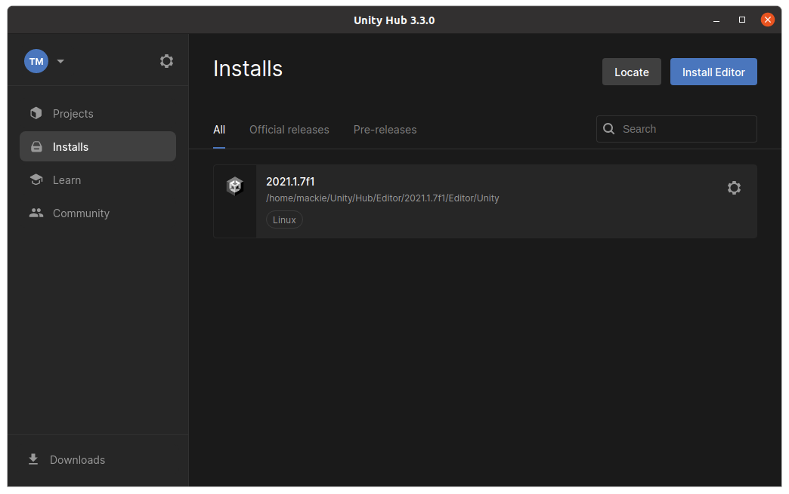
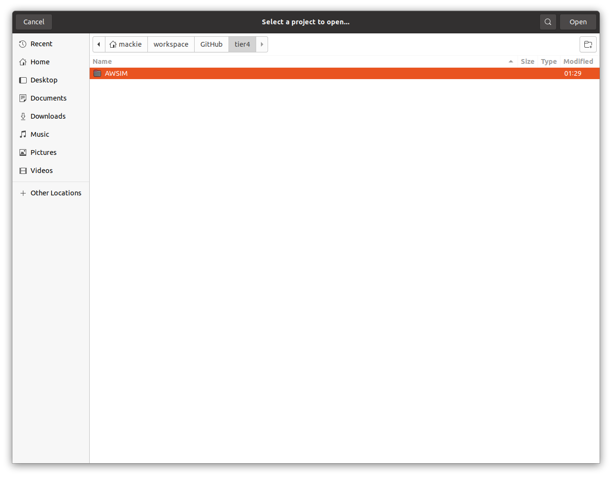
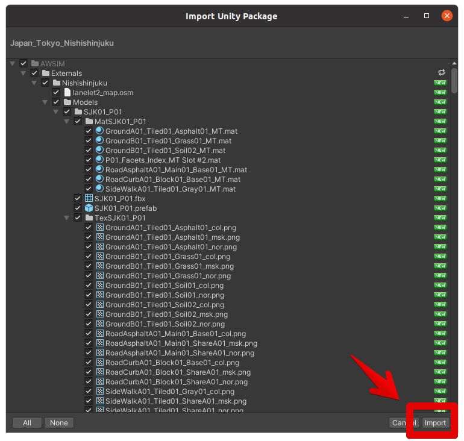
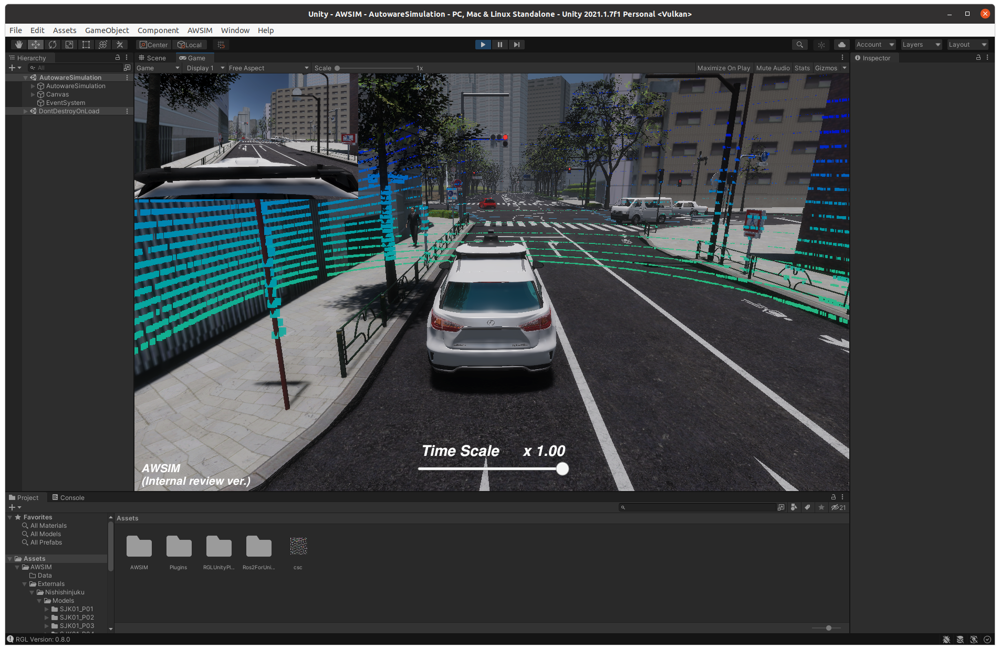

# Setup Unity Project

!!! info

    It is advised to checkout the [Quick Start Demo](../QuickStartDemo) tutorial before reading this section.

This page is a tutorial for setting up a AWSIM Unity project.

## Environment preparation

### System setup

=== "Ubuntu 22"
    1. Make sure your machine meets the [required hardware specifications](../QuickStartDemo/#pc-specs).
        - *NOTE: PC requirements may vary depending on simulation contents which may change as the simulator develops*
    2. Prepare a desktop PC with Ubuntu 22.04 installed.
    2. Install [Nvidia drivers and Vulkan Graphics API](../QuickStartDemo/#running-the-awsim-simulation-demo).
    3. Install [git](https://git-scm.com/).
    4. Set the ROS 2 middleware and the localhost only mode in `~/.profile` (or, in `~/.bash_profile` or `~/bash_login` if either of those exists) file:
    ``` bash
    export ROS_LOCALHOST_ONLY=1
    export RMW_IMPLEMENTATION=rmw_cyclonedds_cpp
    ```

        !!! warning
            A system restart is required for these changes to work.

    4. Set the system optimizations by adding this code to the very bottom of your `~/.bashrc` file:
    ``` bash
    if [ ! -e /tmp/cycloneDDS_configured ]; then
        sudo sysctl -w net.core.rmem_max=2147483647
        sudo ip link set lo multicast on
        touch /tmp/cycloneDDS_configured
    fi
    ```

        !!! info
            As a result, each time you run the terminal (`bash` prompt), your OS will be configured for the best ROS 2 performance. Make sure you open your terminal at least one before running any instance of AWSIM (or Editor running the AWSIM).

=== "Windows"
    1. Make sure your machine meets the [required hardware specifications](../QuickStartDemo/#pc-specs).
        - *NOTE: PC requirements may vary depending on simulation contents which may change as the simulator develops*
    2. Prepare a desktop PC with Windows 10 or 11 (64 bit) installed.
    3. Install [git](https://git-scm.com/).
    4. Install [Microsoft Visual C++ Redistributable packages for Visual Studio 2015, 2017, 2019, and 2022](https://learn.microsoft.com/en-us/cpp/windows/latest-supported-vc-redist?view=msvc-170#visual-studio-2015-2017-2019-and-2022) (X64 Architecture)

### ROS 2

AWSIM comes with a *standalone* flavor of [`Ros2ForUnity`](../../Components/ROS2/ROS2ForUnity/index.md). This means that, to avoid internal conflicts between different ROS 2 versions, you shouldn't run the Editor or AWSIM binary with ROS 2 sourced.

!!! warning

    Do not run the AWSIM, Unity Hub, or the Editor with ROS 2 sourced.

=== "Ubuntu 22"
    - Make sure that the terminal which you are using to run Unity Hub, Editor, or AWSIM doesn't have ROS 2 sourced.
    - It is common to have ROS 2 sourced automatically with `~/.bashrc` or `~/.profile`. Make sure it is not obscuring your working environment:
        - Running Unity Hub from the Ubuntu GUI menu takes the environment configuration from `~/.profile`.
        - Running Unity Hub from the terminal uses the current terminal configuration from `~/.profile` and `~/.bashrc`.
        - Running Unity Editor from the UnityHub inherits the environment setup from the Unity Hub. 

=== "Windows"
    - Make sure your Windows environment variables are ROS 2 free.

### Unity installation

!!! info

    AWSIM's Unity version is currently **2021.1.7f1**

Follow the steps below to install Unity on your machine:

1. Install UnityHub to manage Unity projects. Please go to [Unity download page](https://unity3d.com/get-unity/download) and download latest `UnityHub.AppImage`.

2. Install Unity 2021.1.7f1 via UnityHub.
    - Open new terminal, navigate to directory where `UnityHub.AppImage` is download and execute the following command:
```
./UnityHub.AppImage
```
    - To install Unity Editor please proceed as shown on the images below


    - At this point, your Unity installation process should have started.

        === "Ubuntu 22"
        - *NOTE: If the installation process has not started after clicking the green button (image above), please copy the hyperlink (by rightclicking the button and selecting `Copy link address`) and add it as a argument for Unity Hub app. An example command:
        ```
        ./UnityHub.AppImage unityhub://2021.1.7f1/d91830b65d9b
        ```

    - After successful installation the version will be available under the `Installs` tab in Unity Hub.


### Open AWSIM project

To open the Unity AWSIM project in Unity Editor:

=== "Using Unity Hub"
    1. Make sure you have the AWSIM repository cloned and ROS 2 is not sourced.
        ```
        git clone git@github.com:tier4/AWSIM.git
        ```

    2. Launch UnityHub.
        ```
        ./UnityHub.AppImage
        ```

        !!! info

            If you are launching the Unity Hub from the Ubuntu applications menu (without the terminal), make sure that system optimizations are set. To be sure, run the terminal at least once before running the Unity Hub. This will apply the OS settings.

    3. Open the project in UnityHub
        - Click the `Open` button
        

        - Navigate the directory where the AWSIM repository was cloned to
        

        - The project should be added to `Projects` tab in Unity Hub. To launch the project in Unity Editor simply click the `AWSIM` item
        

        - The project is now ready to use
        

=== "Using Terminal"

    1. Enter the AWSIM directory (make sure ROS 2 is not sourced).
        ```
        cd AWSIM
        ```

    2. If your Unity Editor is in default location, run the project using the editor command.
        ```
        ~/Unity/Hub/Editor/2021.1.7f1/Editor/Unity -projectPath .
        ```

        !!! info
            If your Unity Editor is installed in different location, please adjust the path accordingly.

!!! warning

    If you get the safe mode dialog when starting UnityEditor, you may need to install openssl.

    1. download libssl  
    `$ wget http://security.ubuntu.com/ubuntu/pool/main/o/openssl1.0/libssl1.0.0_1.0.2n-1ubuntu5.13_amd64.deb`
    2. install  
    `sudo dpkg -i libssl1.0.0_1.0.2n-1ubuntu5.13_amd64.deb`

### Import external packages

To properly run and use AWSIM project in Unity it is required to download map package which is not included in the repository.

1. Download and import `Japan_Tokyo_Nishishinjuku.unitypackage`

    [Download Map files (unitypackage)](https://github.com/tier4/AWSIM/releases/download/v1.1.0/Japan_Tokyo_Nishishinjuku.unitypackage){.md-button .md-button--primary}

2. In Unity Editor, from the menu bar at the top, select `Assets -> Import Package -> Custom Package...` and navigate the `Japan_Tokyo_Nishishinjuku.unitypackage` file.


3. `Nishishinjuku` package has been successfully imported under `Assets/AWSIM/Externals/`directory.


!!! info

    The Externals directory is added to the `.gitignore` because the map has a large file size and should not be directly uploaded to the repository.

## Run the demo in Editor

The following steps describe how to run the demo in Unity Editor:

1. Open the `AutowareSimulation.unity` scene placed under `Assets/AWSIM/Scenes/Main` directory
2. Run the simulation by clicking `Play` button placed at the top section of Editor.

<br><br><br><br>
