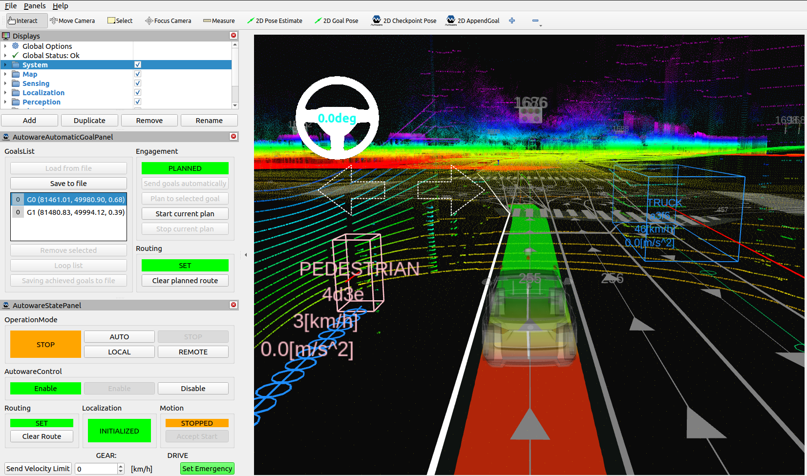
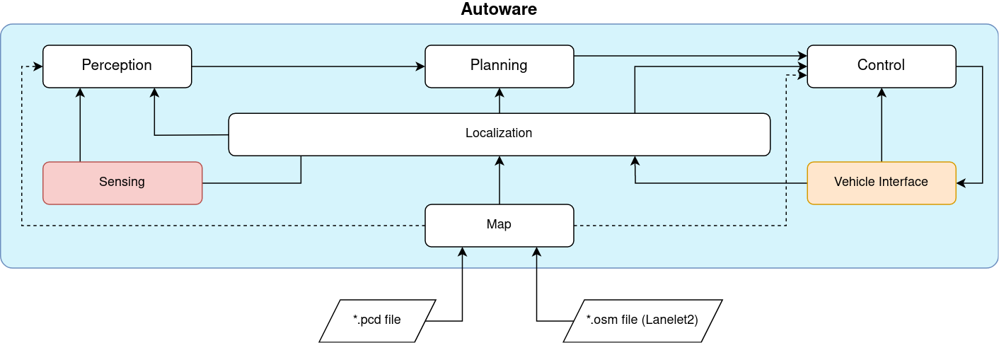

# Autoware

[*Autoware*](https://github.com/autowarefoundation/autoware) is an open-source software platform specifically designed for autonomous driving applications. It was created to provide a comprehensive framework for developing and testing autonomous vehicle systems. [*Autoware*](https://github.com/autowarefoundation/autoware) offers a collection of modules and libraries that assist in various tasks related to perception, planning, and control, making it easier for researchers and developers to build autonomous driving systems.

The primary purpose of [*Autoware*](https://github.com/autowarefoundation/autoware) is to enable the development of self-driving technologies by providing a robust and flexible platform. It aims to accelerate the research and deployment of autonomous vehicles by offering a ready-to-use software stack. [*Autoware*](https://github.com/autowarefoundation/autoware) focuses on urban driving scenarios and supports various sensors such as *LiDAR*, *Radars*, and *Cameras*, allowing for perception of the vehicle's surroundings.

#### Why use AWSIM with Autoware?

[*Autoware*](https://github.com/autowarefoundation/autoware) can be used with a *AWSIM* for several reasons. Firstly, simulators like *AWSIM* provide a cost-effective and safe environment for testing and validating autonomous driving algorithms before deploying them on real vehicles. *Autoware's* integration with a simulator allows developers to evaluate and fine-tune their algorithms without the risk of real-world accidents or damage.

Additionally, simulators enable developers to recreate complex driving scenarios, including difficult conditions or rare events, which may be difficult to replicate in real-world testing with such high fidelity. *Autoware's* compatibility with a *AWSIM* allows seamless integration between the software and the simulated vehicle, enabling comprehensive testing and validation of autonomous driving capabilities. By utilizing a simulator, [*Autoware*](https://github.com/autowarefoundation/autoware) can be extensively tested under various scenarios to ensure its robustness and reliability.

!!! note "Connection with Autoware"
    Introduction about how the connection between *AWSIM* and *Autoware* works can be read [here](../CombinationWithAutoware/).

## Architecture

In terms of architecture, [*Autoware*](https://github.com/autowarefoundation/autoware) follows a modular approach. It consists of multiple independent modules that communicate with each other through a *ROS2*. This modular structure allowing users to select and combine different modules based on their specific needs and requirements. The software stack comprises multiple components, including perception, localization, planning, and control modules. Here's a brief overview of each module:

- *Sensing* -  acquires data from sensors different sensors mounted on the autonomous vehicle such as *LiDARs*, *GNSS*, *IMU* and *cameras*. It pre-processing received data in order to later extract relevant information about the surrounding environment through the *Perception* module or about vehicle location by the *Localization* module.
More details [here](https://autowarefoundation.github.io/autoware-documentation/main/design/autoware-architecture/sensing/).

- *Perception* - performs advanced processing of sensor data (*LiDARs*, *cameras*) to extract meaningful information about the surrounding environment. It performs tasks like object detection (other vehicles, pedestrians), lane detection, and traffic lights recognition. More details [here](https://autowarefoundation.github.io/autoware-documentation/main/design/autoware-architecture/perception/).

- *Localization* - performs a fusion of data from *Sensing* module like *LiDAR*, *GNSS*, *IMU*, and odometry sensors to estimate the vehicle's position and orientation accurately. More details [here](https://autowarefoundation.github.io/autoware-documentation/main/design/autoware-architecture/localization/).

- *Planning* - generates a safe and feasible trajectory for the autonomous vehicle based on the information gathered from *Perception* and *Localization*. It also takes into account various factors from *Map* like traffic rules and road conditions. More details [here](https://autowarefoundation.github.io/autoware-documentation/main/design/autoware-architecture/planning/).

- *Control* - executes the planned trajectory by sending commands to the vehicle's actuators, such as steering, throttle, and braking. It ensures that the vehicle follows the desired trajectory while maintaining safety and stability. More details [here](https://autowarefoundation.github.io/autoware-documentation/main/design/autoware-architecture/control/).

- *Vehicle Interface* - is a crucial component that enables communication and interaction between [*Autoware*](https://github.com/autowarefoundation/autoware) software system and a vehicle. It facilitates the exchange of control signals and vehicle information necessary for autonomous driving operations. The vehicle interface ensures that [*Autoware*](https://github.com/autowarefoundation/autoware) can send commands to the vehicle, such as acceleration, braking, and steering, while also receiving real-time data from the vehicle, such as speed, position, and sensors data. It acts as a bridge, allowing [*Autoware*](https://github.com/autowarefoundation/autoware) to seamlessly interface with the specific characteristics and requirements of the vehicle it is operating with. More details [here](https://autowarefoundation.github.io/autoware-documentation/main/design/autoware-architecture/vehicle/).

- *Map* - the map module creates and maintains  a representation of the environment in which the autonomous vehicle operates. It combines data from *Lanelet2* (`*.osm`) and *PointCloud* (`*.pcd`) to generate a detailed map. The map contains information about road geometries, lane markings, traffic lights, rules, and other relevant features. Map serves as a crucial reference for planning and decision-making processes. More details [here](https://autowarefoundation.github.io/autoware-documentation/main/design/autoware-architecture/map/).
  