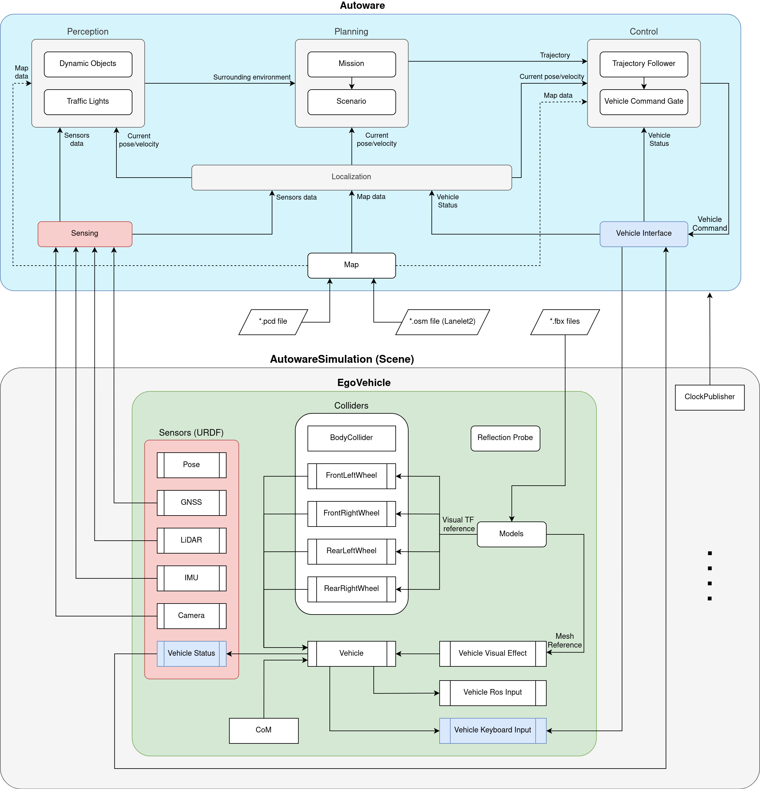

<video width="1920" controls autoplay muted loop>
<source src="awsim_video.mp4" type="video/mp4">
</video>

[*Autoware*](../Autoware/) is a powerful open-source software platform for autonomous driving. Its modular architecture, including perception, localization, planning, and control modules, provides a comprehensive framework for developing self-driving vehicles. [*Autoware*](../Autoware/) combined with  [*AWSIM*](../AWSIM/) simulator provides safe testing, validation, and optimization of autonomous driving algorithms in diverse scenarios.

!!! note "Run with Autoware"
    If you would like to know how to run *AWSIM* with *Autoware*, we encourage you to read this [section](../../GettingStarted/QuickStartDemo/).

## Features
The combination of *Autoware* and *AWSIM* provides the opportunity to check the correctness of the vehicle's behavior in various traffic situations. Below are presented some typical features provided by this combination. Moreover, examples of detecting several bad behaviors are included.

### Engagement

- Driving straight through an intersection with priority
  
    <video width="1920" controls autoplay muted loop>
    <source src="features/DRIVE_STRAIGHT.mp4" type="video/mp4">
    </video>

- Turning at the intersection
 
    <video width="1920" controls autoplay muted loop>
    <source src="features/DRIVE_TURN.mp4" type="video/mp4">
    </video>

### Traffic light recognition

- Stopping at a red light
  
    <video width="1920" controls autoplay muted loop>
    <source src="features/WAIT_RED.mp4" type="video/mp4">
    </video>

- Driving on a green light
 
    <video width="1920" controls autoplay muted loop>
    <source src="features/DRIVE_GREEN.mp4" type="video/mp4">
    </video>

- Stopping at yellow light

    <video width="1920" controls autoplay muted loop>
    <source src="features/WAIT_YELLOW2.mp4" type="video/mp4">
    </video>

- Still driving at yellow light (only when it is too late to stop)

    <video width="1920" controls autoplay muted loop>
    <source src="features/DRIVE_YELLOW2.mp4" type="video/mp4">
    </video>

### Interaction with vehicles
- Yield right-of-way when turning right

    <video width="1920" controls autoplay muted loop>
    <source src="features/vehicle_right_of_way.mp4" type="video/mp4">
    </video>

- Following the vehicles ahead
 
    <video width="1920" controls autoplay muted loop>
    <source src="features/vehicle_following.mp4" type="video/mp4">
    </video>

- Stopping behind the vehicles ahead 
 
    <video width="1920" controls autoplay muted loop>
    <source src="features/vehicle_sudden.mp4" type="video/mp4">
    </video>

- Cutting-in to a different traffic lane
  
    <video width="1920" controls autoplay muted loop>
    <source src="features/vehicle_cut_in.mp4" type="video/mp4">
    </video>

### Interaction with pedestrians
- Giving right of way to a pedestrian crossing at a red light

    <video width="1920" controls autoplay muted loop>
    <source src="features/pedestrian_crosswalk.mp4" type="video/mp4">
    </video>

- Giving way to a pedestrian crossing beyond a crosswalk

    <video width="1920" controls autoplay muted loop>
    <source src="features/pedestrian_road.mp4" type="video/mp4">
    </video>

### Detecting bad behaviors
- Incorrect and dangerous execution of a lane change

    <video width="1920" controls autoplay muted loop>
    <source src="features/bad_cut_in.mp4" type="video/mp4">
    </video>

- Too late detection of a pedestrian entering the roadway

    <video width="1920" controls autoplay muted loop>
    <source src="features/bad_pedestrian_detection.mp4" type="video/mp4">
    </video>

## Combination Architecture

The combination of *AWSIM* with *Autoware* is possible thanks to *Vehicle Interface* and *Sensing* modules of [*Autoware*](../Autoware/) architecture. The component responsible for ensuring connection with these modules from the *AWSIM* side is `EgoVehicle`. It has been adapted to the *Autoware* architecture and provides *ROS2* topic-based communication. However, the other essential component is `ClockPublisher`, which provides simulation time for *Autoware* - also published on the topic - more details [here](../../Components/ROS2/ROS2ForUnity/#extension-scripts).

`EgoVehicle` component provides the publication of the current vehicle status through a script working within `Vehicle Status`. It provides real-time information such as: current speed, current steering of the wheels or current states of lights - these are outputs from *AWSIM*. 

On the other hand, `Vehicle Ros Input` is responsible for providing the values of the outputs from *Autoware*. It subscribes to the current commands related to the given acceleration, gearbox gear or control of the specified lights.  

Execution of the received commands is possible thanks to `Vehicle`, which ensures the setting of appropriate accelerations on the `**Wheel` and controlling the visual elements of the vehicle.

The remaining data delivered from *AWSIM* to *Autoware* are sensors data, which provides information about the current state of the surrounding environment and those necessary to accurately estimate `EgoVehicle` position.

More about `EgoVehicle` and its scripts is described in this [section](../../Components/Vehicle/EgoVehicle/).

### Sequence diagram
Below is a simplified sequential diagram of information exchange in connection between *AWSIM* and *Autoware*. As you can see, the first essential information published from *AWSIM* is `Clock` - the simulation time. Next, `EgoVehicle` is spawned and first sensors data are published, which are used in the process of automatic position initialization on *Autoware* side. At the same time, the simulation on *AWSIM* side is updated.

Next in the diagram is the main information update loop in which:

- During each cycle there is a synchronization with the time from the simulation.
- *AWSIM* publishes data from sensors available in `EgoVehicle`, which are taken into account in the processes carried out in *Autoware*.
- The control commands from *Autoware* are subscribed by *AWSIM*, which are executed on *AWSIM* side and `EgoVehicle` update is performed.
- The current state of the `EgoVehicle` is published.

The order of information exchange presented in the diagram is a simplification. The exchange of information takes place through the publish-subscribe model and each data is sent with a predefined frequency.

