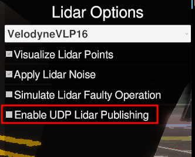
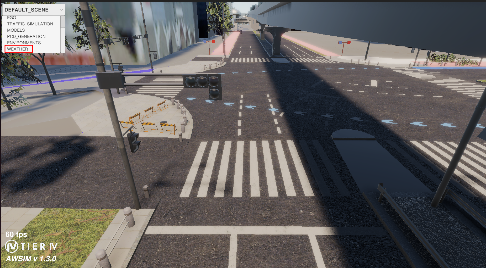

# Private Features Showcase

The following list of features is proprietary and only accessible through contact with TIER IV organisation.The presented features extend functionalities of AWSIM by providing many more tools or extending public accessible features.

## Models

Proprietary AWSIM offers more choice of NPCs available in your simulation environments.

The available models can be observed by opening the [Showcase](https://github.com/tier4/AWSIM-mirror/blob/feature/showcase-documentation/Assets/PrivateAssets/PrivateAWSIM/Scenes/Samples/Showcase/Showcase.unity) scene and choosing the `MODELS` from top left dropdown.

The scene showcases all models available in simulator.

### Showcase

All the podels from public AWSIM are available in closed source simulation. It is possible to choose one of the following categories in right pane dropdown and the following models will be shown

NPC Vehicles

Small Car  
Hatchback 
Taxi 
Van 
Jeeps 
Libousines 
Police car 
Sports cars 
SUV 
Sport motorbike 

NPC Trucks

Ambulance 
City bus 
School bus 
Small bus 
Light commercial vehicle 
Truck with Gas Trailer 
Truck with Platform trailer 

NPC Pedestrians

Elegant Man 
Casual Man 
Biker Men, Women and Children 
People with personal belongings (umbrellas, smartphones etc.) 
Wheelchair users 

EGO Vehicles

Lexus RX 450h 2015 
Toyota Taxi 
BYD J6 

Miscellaneous

Baby stroller 
Barricade 
Bike stand 
Vending machine 
Road bump 
Constructions 
Trash can 
Pallet 
Safety cones 
Traffic Signs 
Traffic barriers 
Parking meters 
Fire hydrants 
Kickscooters and bikes 

<video width="640" height="360" controls>
  <source src="Models/PrivateModelsPresentation.mp4" type="video/mp4">
</video>

## Sensors

Private AWSIM extends sensors simulation with possibility to publish LiDAR data using UDP.

### Showcase

The sensors behavior can be observed by opening the [Showcase](https://github.com/tier4/AWSIM-mirror/blob/feature/showcase-documentation/Assets/PrivateAssets/PrivateAWSIM/Scenes/Samples/Showcase/Showcase.unity) scene and choosing the `SENSORS` from top left dropdown.

To observe the UDP publishing feature:

- Enable the `Enable UDP Lidar Publishing` on right pane

- Download [VeloView](https://www.paraview.org/veloview/) software
- Run and click the sensor option in menu

- Choose `VLP-16` sensor calibration, 2368 LIDAR port and click `OK`

- The UDP LiDAR data is visualized

## EGO

Private AWSIM extends EGO functionalities with:

- collision with simulation objects detection
- vehicle being stuck detection
- unpredicted lane departure detection

### Showcase

The EGO functionalities can be observed by opening the [Showcase](https://github.com/tier4/AWSIM-mirror/blob/feature/showcase-documentation/Assets/PrivateAssets/PrivateAWSIM/Scenes/Samples/Showcase/Showcase.unity) scene 
and choosing the `EGO` from top left dropdown.

Ego vehicle contains features which make it easier to determine if the simulation is running successfully. In case of:

- collision detection
- vehicle getting stuck
- vehicle unpredictably leaves it's current lane

a specific information is shown on screen. The siutation is presented below and can be tested in the aforementioned scene.

## Environments

AWSIM simulates urban environments. In private version the following maps are available:
- Nishinjuku
- Odaiba
- Shiojiri

### Showcase

All available models can be observed by opening the [Showcase](https://github.com/tier4/AWSIM-mirror/blob/feature/showcase-documentation/Assets/PrivateAssets/PrivateAWSIM/Scenes/Samples/Showcase/Showcase.unity) scene and choosing the `ENVIRONMENTS` from top left dropdown.

The scene showcases all available scenes in the simulator.

<video width="640" height="360" controls>
  <source src="Environments/PrivateEnvironments.mp4" type="video/mp4">
</video>

## Weather Effects

Private AWSIM simulates weather effects which can be adjusted for different simulation scenarios:

- Sunlight position for different latitudes, with respect to sun position at seasons
- rain and snowfall

The effects can be observed by opening the [Showcase](https://github.com/tier4/AWSIM-mirror/blob/feature/showcase-documentation/Assets/PrivateAssets/PrivateAWSIM/Scenes/Samples/Showcase/Showcase.unity) scene and choosing the `WEATHER` from top left dropdown.

It can be observed that:

- Sun position changes on horizon making different lightning effects
- Right pane contains controls for Sunlight and Camera Precipitation effects

The loaded scene makes it possible to:

- observe sun progressing on the sky
- manually adjust sun position when automatic progress is disabled
- enable precipitation effects
- choose between snow and rainfall
- observe how fall rate affects simulation environment

<video width="640" height="360" controls>
  <source src="Weather/WeatherShowcase.mp4" type="video/mp4">
</video>

## Other Available Features

Besides the presented features, the proprietary AWSIM offers:

- simulation configuration through JSON file, adjustable to client needs
- configurable models choice for simulation run
- synthetic data generation features for AI models usage
