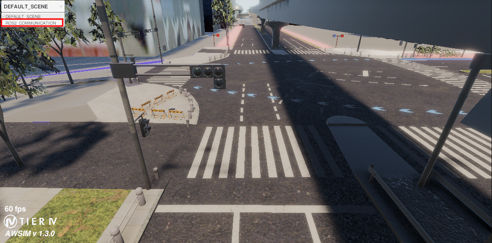
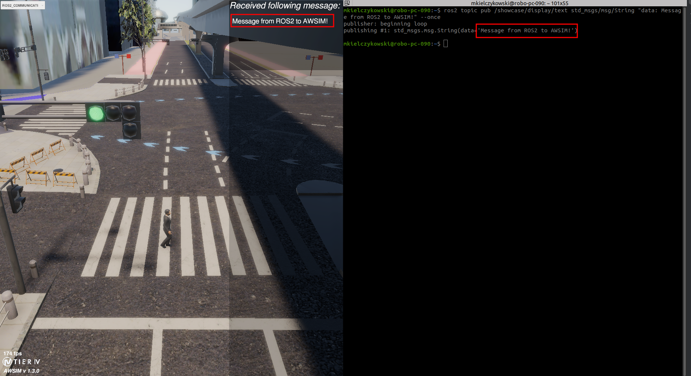
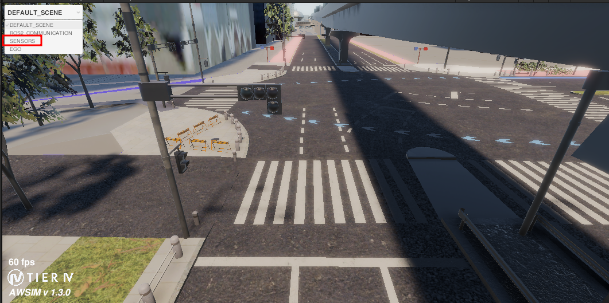
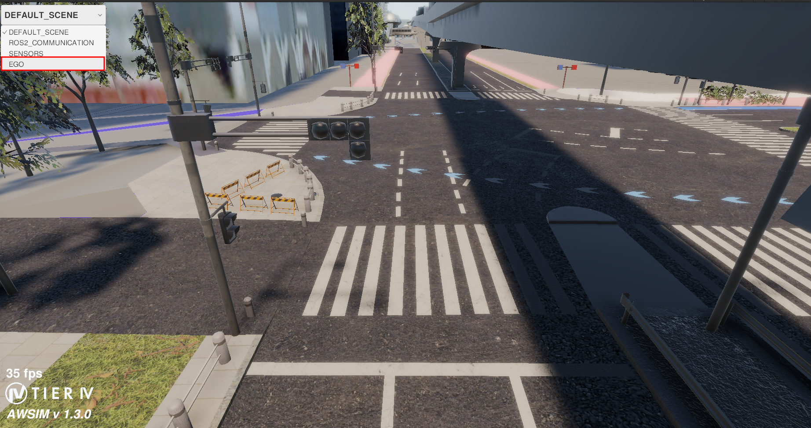
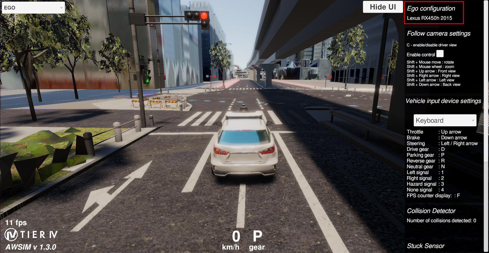
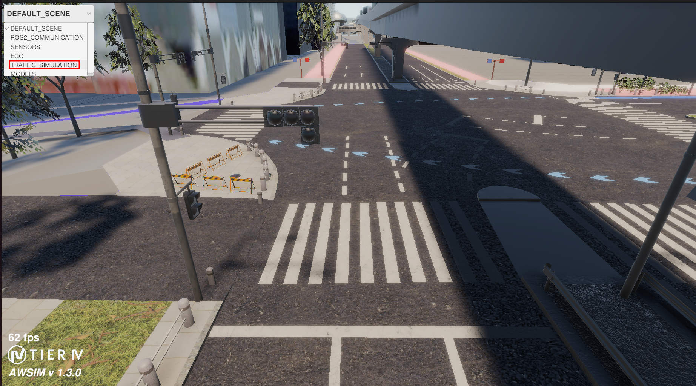
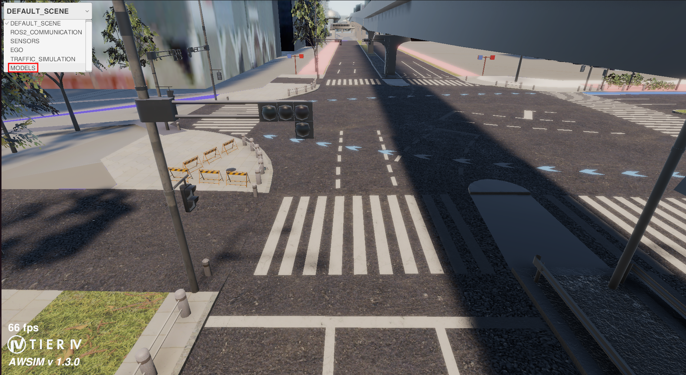
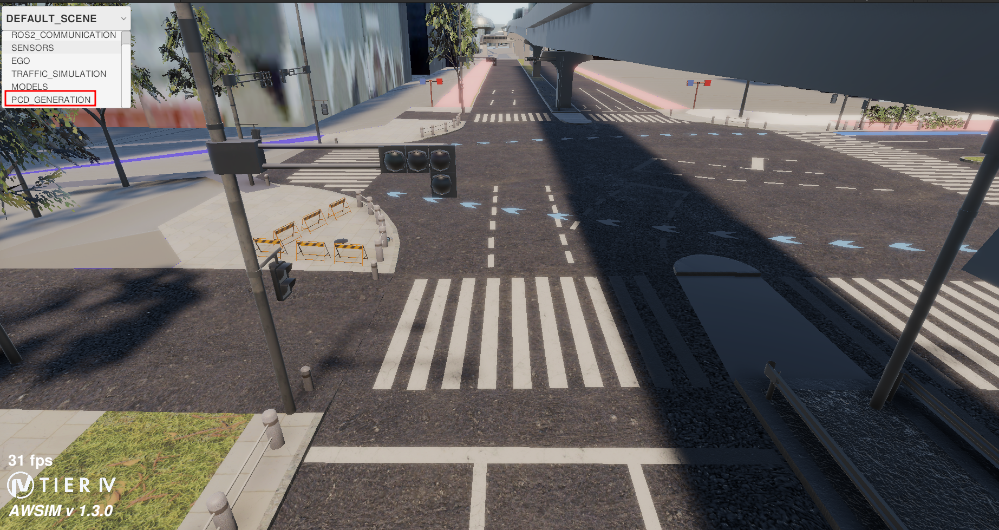
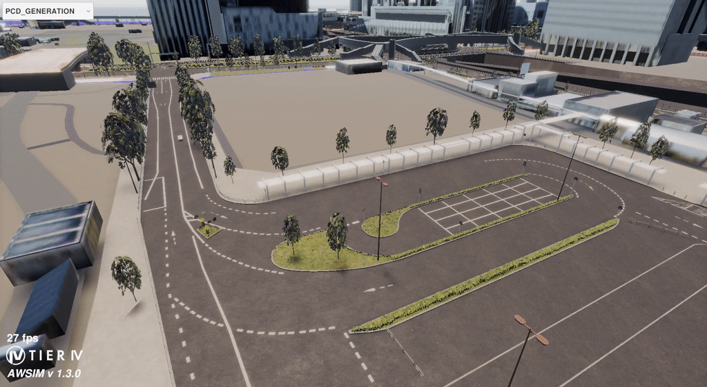

# Public Features Showcase

AWSIM gathers multiple features which make testing Autonomous driving software easier to develop and test.

This page is dedicating to showing what features make the simulator best for your development scenarios.

The following features are accessible for anyone wanting to test the simulator.

### ROS2 communication

AWSIM is ROS2 based. It means it can interact with ROS2 software through the available communication types:

- publish-subscribe
- services

The ROS2 connection is ensured with the help of [ros2-for-unity](https://github.com/RobotecAI/ros2-for-unity/tree/develop) project.

#### Showcase

The ROS2 connection feature can be observed by opening the [Showcase](https://github.com/tier4/AWSIM-mirror/blob/feature/showcase-documentation/Assets/PrivateAssets/PrivateAWSIM/Scenes/Samples/Showcase/Showcase.unity) scene and choosing the `ROS2_COMMUNICATION` from top left dropdown.



It can be observed that:

- a pedestrian walking back and forth appeared
- banner with text in upper right corner appeared
- traffic light changed to green

The loaded scene makes it possible to:

- see `world` -> `pedestrian` transform in Rviz2
- publish text to be displayed in AWSIM
- trigger traffic light change from ROS2

##### Observing Pedestrian Movements in ROS2

The walking pedestrian in the scene publishes TF data about it's position to `/tf` topic.
By opening Rviz2 and focusing on `pedestrian` frame it can be observed that the frame is moving regarding `world` frame.


##### Publishing text to AWSIM

When the simulation runs, a subscription topic named `/showcase/display/text` is available.

By publishing string message to this topic, any message can be displayed on screen! Example command below:

```bash
ros2 topic pub /showcase/display/text std_msgs/msg/String "data: Message from ROS2 to AWSIM!" --once
```



##### Triggering traffic light change

The green traffic light presents AWSIM functionality to react to service calls.

By executing the command presented below, one can trigger traffic light change! 

```bash
ros2 service call /showcase/traffic_light/trigger_change  std_srvs/srv/Trigger {}
```


### Sensors

AWSIM simulates multiple sensors:

- LiDAR using [RGL](https://github.com/RobotecAI/RobotecGPULidar)
- Camera
- GNSS
- IMU
- Odometry

It can also simulate intrinsic and ground truth data:

- Vehicle state
- Ground truth pose
- Vehicle to infrastructure (V2I)

This section focuses on showcasing mostly LiDAR solutions.

#### Showcase

The sensors behavior can be observed by opening the [Showcase](https://github.com/tier4/AWSIM-mirror/blob/feature/showcase-documentation/Assets/PrivateAssets/PrivateAWSIM/Scenes/Samples/Showcase/Showcase.unity) scene and choosing the `SENSORS` from top left dropdown.



It can be observed that:

- a vehicle with attached sensor appears
- LiDAR points visualization is present
- adjustable menu on right screen pane is available
- a second dropdown on upper left corner appears

The loaded scene makes it possible to:

- modify Lidar settings
- observe image from EGO camera

##### Camera image

The scene presents camera sensor which generates camera sensor images. The camera sensor is placed on EGO sensor kit and produces data to ROS. By selecting camera from upper left drop down, a camera image can be previewed.


##### LiDAR runtime configuration

The scene shows LiDAR visualization and possibilities to alter it's behavior during runtime.

All the configuration options are available in the table below


| Option                   | Description                        | Presentation |
|---------------------------------|------------------------------------|--------------|
| Lidar Preset dropdown           | Changes LiDAR model preset. Points pattern change can be observed. |       |
| Visualize LiDAR points          | Enables LiDAR points visualization. |       |
| Apply LiDAR noise               | Enables LiDAR simulation noise. When disabled, pointcloud is constant.     |            |
| Simulate Lidar Faulty Operation | Enables faulty sensor simulation. It can be observed that parts of point cloud start flickering.   |            |


##### ROS2 connection

All the sensors data is available through ROS. The available sensors are:

- LiDAR
- Camera
- GNSS
- IMU

The simulator also publishes EGO state and controls. All the topics can be found in the table below:

| Topic                                     | Message Type |
|-------------------------------------------|--------------|
| /sensing/camera/traffic_light/camera_info |     [sensor_msgs/msg/CameraInfo](https://docs.ros.org/en/noetic/api/sensor_msgs/html/msg/CameraInfo.html)         |
| /sensing/camera/traffic_light/image_raw   |      [sensor_msgs/msg/Image](https://docs.ros.org/en/noetic/api/sensor_msgs/html/msg/Image.html)        |
| /sensing/gnss/pose                        |      [geometry_msgs/msg/PoseStamped](https://docs.ros.org/en/noetic/api/geometry_msgs/html/msg/PoseStamped.html)        |
| /sensing/gnss/pose_with_covariance        |    [geometry_msgs/msg/PoseWithCovarianceStamped](https://docs.ros.org/en/noetic/api/geometry_msgs/html/msg/PoseWithCovarianceStamped.html)          |
| /sensing/imu/tamagawa/imu_raw             |     [sensor_msgs/msg/Imu](https://docs.ros.org/en/noetic/api/sensor_msgs/html/msg/Imu.html)         |
| /control/command/control_cmd              |  [autoware_control_msgs/msg/Control](https://github.com/autowarefoundation/autoware_msgs/blob/main/autoware_control_msgs/msg/Control.msg)            |
| /control/command/emergency_cmd            |      [tier4_vehicle_msgs/msg/VehicleEmergencyStamped](https://github.com/tier4/tier4_autoware_msgs/blob/tier4/universe/tier4_vehicle_msgs/msg/VehicleEmergencyStamped.msg)        |
| /control/command/gear_cmd                 |    [autoware_vehicle_msgs/msg/GearCommand](https://github.com/autowarefoundation/autoware_msgs/blob/main/autoware_vehicle_msgs/msg/GearCommand.msg)          |
| /control/command/hazard_lights_cmd        |       [autoware_vehicle_msgs/msg/HazardLightsCommand](https://github.com/autowarefoundation/autoware_msgs/blob/main/autoware_vehicle_msgs/msg/HazardLightsCommand.msg)       |
| /control/command/turn_indicators_cmd      |      [autoware_vehicle_msgs/msg/TurnIndicatorsCommand](https://github.com/autowarefoundation/autoware_msgs/blob/main/autoware_vehicle_msgs/msg/TurnIndicatorsCommand.msg)        |
| /vehicle/status/control_mode              |      [autoware_vehicle_msgs/msg/ControlModeReport](https://github.com/autowarefoundation/autoware_msgs/blob/main/autoware_vehicle_msgs/msg/ControlModeReport.msg)        |
| /vehicle/status/gear_status               |      [autoware_vehicle_msgs/msg/GearReport](https://github.com/autowarefoundation/autoware_msgs/blob/main/autoware_vehicle_msgs/msg/GearReport.msg)        |
| /vehicle/status/hazard_lights_status      |    [autoware_vehicle_msgs/msg/HazardLightsReport](https://github.com/autowarefoundation/autoware_msgs/blob/main/autoware_vehicle_msgs/msg/HazardLightsReport.msg)          |
| /vehicle/status/steering_status           |     [autoware_vehicle_msgs/msg/SteeringReport](https://github.com/autowarefoundation/autoware_msgs/blob/main/autoware_vehicle_msgs/msg/SteeringReport.msg)         |
| /vehicle/status/turn_indicators_status    |      [autoware_vehicle_msgs/msg/TurnIndicatorsReport](https://github.com/autowarefoundation/autoware_msgs/blob/main/autoware_vehicle_msgs/msg/TurnIndicatorsReport.msg)        |
| /vehicle/status/velocity_status           |      [autoware_vehicle_msgs/msg/VelocityReport](https://github.com/autowarefoundation/autoware_msgs/blob/main/autoware_vehicle_msgs/msg/VelocityReport.msg)        |


### EGO

AWSIM is EGO vehicle oriented simulator. Its main functionalities are to simulate behavior of EGO vehicles and
provide interfaces for interacting with it. Main functionalities are:

- loading different EGO vehicle models and configurations
- vehicle visual effects
- providing vehicle focused, following camera with surrounding observation control
- multiple input options (keyboard, steering wheel controller, [Autoware](https://github.com/autowarefoundation/autoware) control)
- simulation time scale control

#### Showcase

The EGO functionalities can be observed by opening the [Showcase](https://github.com/tier4/AWSIM-mirror/blob/feature/showcase-documentation/Assets/PrivateAssets/PrivateAWSIM/Scenes/Samples/Showcase/Showcase.unity) scene 
and choosing the `EGO` from top left dropdown.



It can be observed that:

- EGO vehicle appears
- velocity and current gear appears
- adjustable menu on right screen pane is available

The loaded scene makes it possible to:

- observe loaded EGO vehicle model
- adjust following camera settings
- choose input device and controls
- Autoware control mode
- time scale slider

##### Loaded vehicle model

On right pane a currently loaded vehicle model is displayed.



##### Follow camera settings

On right pane a follow camera settings are available. User can toggle manual camera control and apply described manual control options.


##### Input device and controls

The right pane also contains input options (keyboard, steering wheel controller) with description of keyboard shortucts to enable EGO functions and visuals.


##### Time scale control

The simulation time can be scaled down to enable working with simulation on less powerful computers. The slider can be found on the bottom of the right pane.


### Traffic Simulation

AWSIM simulates urban environment with an emphasis on traffic simulation. AWSIM provides features to control the traffic simulation and its randomness. It offers:

- controlling vehicles movements and preventing collisions
- to obey traffic rules and lights
- defining specific paths which vehicles follow
- debug visualization of vehicles reasoning phases (available in UnityEditor)
- optimizing resources by spawning vehilces in EGO vehicle proximity if one is available

#### Showcase

The Traffic simulation functionalities can be observed by opening the [Showcase](https://github.com/tier4/AWSIM-mirror/blob/feature/showcase-documentation/Assets/PrivateAssets/PrivateAWSIM/Scenes/Samples/Showcase/Showcase.unity) scene and choosing the `TRAFFIC_SIMULATION` from top left dropdown.



It can be observed that:

- vehicles drive on roads
- pedestrians walking on pavement appear
- right pane with options appears

The loaded scene makes it possible to:

- observe vehicles movement on roads
- observe pedestrian movement on pavements
- change settings for moving vehicles
- enable or disable pedestrians, parked vehicles and moving vehicles
- subscribe information about traffic lights state on ROS2 topic


##### Toggling pedestrians, parked and moving vehicles

On right pane pedestrians, parked and moving vehicles can be toggled to be available in the simulation.


##### Traffic simulation settings

On right pane it is also possible to change number of vehicles driving on roads and seed for simulation models choice and pathing.


##### V2I

The scene publishes information about traffic lights state in runtime through ROS2 topic. To receive the traffic lights data through ROS2:

- open terminal and source ROS2
    - make sure you have [autoware_perception_msgs](https://github.com/autowarefoundation/autoware_msgs/tree/main/autoware_perception_msgs) sourced in your ROS2 environment
- execute the `ros2 topic echo /v2x/traffic_signals` command and observe subscribed messages


### Models

AWSIM simulates urban environment using set of vehicle and pedestrian models. The models contain movement animations and are available out of the box in simulation.

#### Scene

All available models can be observed by opening the [Showcase](https://github.com/tier4/AWSIM-mirror/blob/feature/showcase-documentation/Assets/PrivateAssets/PrivateAWSIM/Scenes/Samples/Showcase/Showcase.unity) scene and choosing the `MODELS` from top left dropdown.



The scene showcases all models available in simulator.


##### Showcase

It is possible to choose one of the following categories in right pane dropdown and the following models will be shown:


- NPC Vehicles
    - Small Car
    - Hatchback
    - Taxi
    - Van
    - Truck
    - Truck with Trailer
- NPC Pedestrians
    - Elegant Man
    - Casual Man
- EGO Vehicles
    - Lexus RX 450h 2015


### PCD Generation

AWSIM provides functionality to generate a PCD map out of modeled environment.

#### Scene

The functionality be observed by opening the [Showcase](https://github.com/tier4/AWSIM-mirror/blob/feature/showcase-documentation/Assets/PrivateAssets/PrivateAWSIM/Scenes/Samples/Showcase/Showcase.unity) scene and choosing the `PCD_GENERATION` from top left dropdown.





The scene showcases all models available in simulator.


##### Showcase

The PCD map will be generated on a small area on the showcase map. The map generation process starts as soon as the `PCD_GENERATION` scene is opened. To regenerate the map, the scene needs to be reopened. The map generation process ends as soon as the box-vehicle stops moving. The generated PCD will be found in the:


- `AWSIM_Data` directory when used as binary
- `Assets` directory when used in UnityEditor


under `MappingShowcase.pcd` file.



