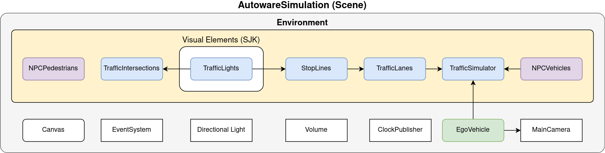
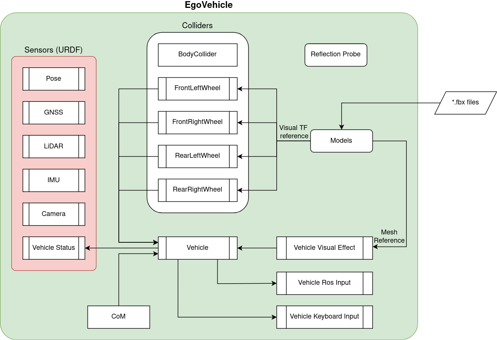
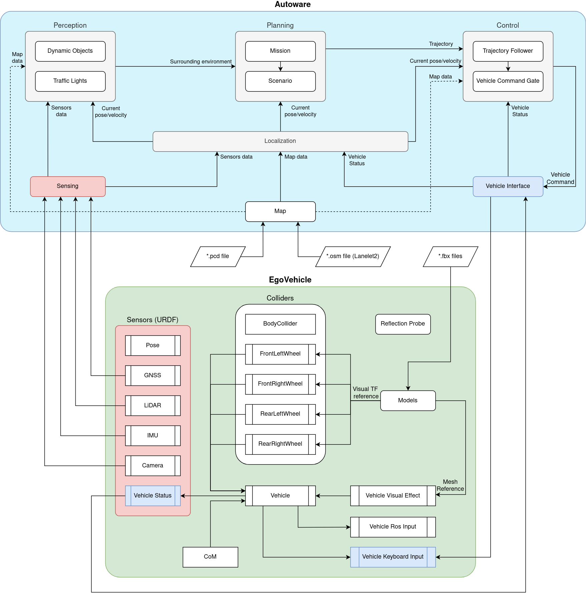
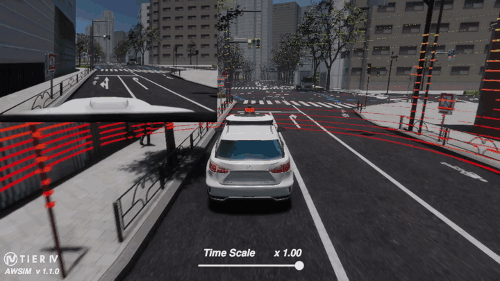
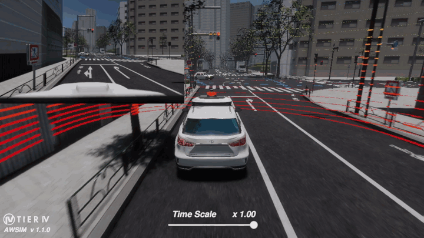
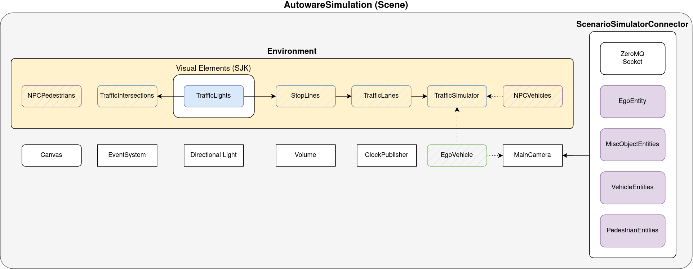
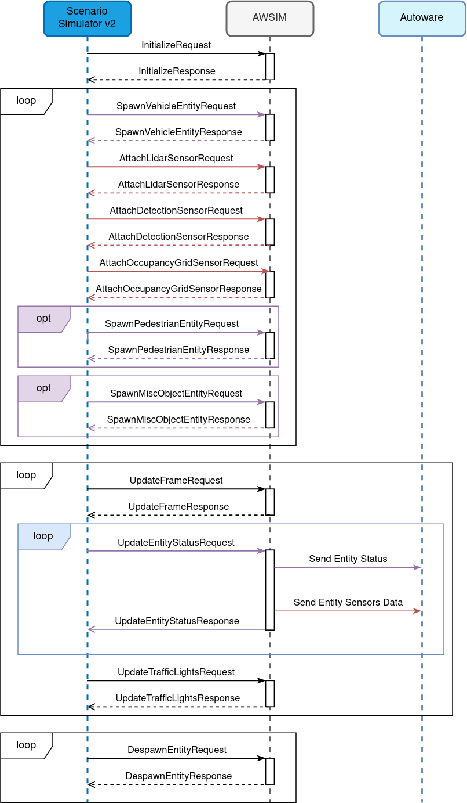

# AWSIM
<video width="1920" controls autoplay muted loop>
<source src="awsim_video.mp4" type="video/mp4">
</video>
*AWSIM* is an open-source simulator made with [*Unity*](https://unity.com/) for autonomous driving research and development. 
It is developed for self-driving software like [Autoware](https://github.com/autowarefoundation/autoware). This simulator aims to bridge the gap between the virtual and real worlds, enabling users to train and evaluate their autonomous agents in a safe and controlled environment before deploying them on real vehicles. It provides a realistic virtual environment for training, testing, and evaluating various aspects of autonomous driving systems. 

*AWSIM* simulates a variety of real-world scenarios, with accurate physics and sensor models. It offers a wide range of sensors, *Cameras*, *GNSS*, *IMU* and  *LiDARs*, allowing developers to simulate their interactions with the environment accurately. The simulator also models dynamic objects, such as pedestrians, other vehicles, and traffic lights, making it possible to study interactions and decision-making in complex traffic scenarios. This enables the testing and evaluation of perception, planning, and control algorithms under different sensor configurations and scenarios.

*AWSIM* supports a flexible and modular architecture, making it easy to customize and extend its capabilities. Users can modify the current or add a new environment with their own assets and traffic rules to create custom scenarios to suit their specific research needs. This allows for the development and testing of advanced algorithms in diverse driving conditions.

Because *AWSIM* was developed mainly to work with *Autoware*, it supports:

- *Ubuntu 22.04* and *Windows 10/11*
- [*ROS2*](https://docs.ros.org/en/humble/index.html) Humble distribution

!!! note "Prerequisites"
    You can read more about the prerequisites and running *AWSIM* [here](../UserGuide/Installation/Prerequisites/).

### Why was it developed?

The main objectives of *AWSIM* are to facilitate research and development in autonomous driving, enable benchmarking of algorithms and systems, and foster collaboration and knowledge exchange within the autonomous driving community. By providing a realistic and accessible platform, *AWSIM* aims to accelerate the progress and innovation in the field of autonomous driving.

## Architecture

To describe the architecture of *AWSIM*, first of all, it is necessary to mention the `Scene`, which contains all the objects occurring in the simulation of a specific scenario and their configurations. The default *AWSIM* scene that is developed to work with *Autoware* is called *AutowareSimulation*.

In the scene we can distinguish individual elements like `MainCamera`, `ClockPublisher`, `Volume`, `Directional Ligh`t, `EventSystem` and `Canvas` a detailed description of each of these scene elements can be read here.

<!-- TODO -->
<!-- DM: Tutaj wstęp, ze ma komponenty, ze sa pojazdy, jest ego, ze jest environment, po kroce o kazdym i hyperlinki do szczegolow -->

# Autoware

*Autoware* is an open-source software platform specifically designed for autonomous driving applications. It was created to provide a comprehensive framework for developing and testing autonomous vehicle systems. *Autoware* offers a collection of modules and libraries that assist in various tasks related to perception, planning, and control, making it easier for researchers and developers to build autonomous driving systems.

The primary purpose of *Autoware* is to enable the development of self-driving technologies by providing a robust and flexible platform. It aims to accelerate the research and deployment of autonomous vehicles by offering a ready-to-use software stack. *Autoware* focuses on urban driving scenarios and supports various sensors such as lidar, radar, and cameras, allowing for perception of the vehicle's surroundings.

## Why use AWSIM with Autoware

*Autoware* can be used with a *AWSIM* for several reasons. Firstly, simulators like *AWSIM* provide a cost-effective and safe environment for testing and validating autonomous driving algorithms before deploying them on real vehicles. *Autoware's* integration with a simulator allows developers to evaluate and fine-tune their algorithms without the risk of real-world accidents or damage.

Additionally, simulators enable developers to recreate complex driving scenarios, including difficult conditions or rare events, which may be difficult to replicate in real-world testing with such high fidelity. *Autoware's* compatibility with a *AWSIM* allows seamless integration between the software and the simulated vehicle, enabling comprehensive testing and validation of autonomous driving capabilities. By utilizing a simulator, Autoware can be extensively tested under various scenarios to ensure its robustness and reliability.

## Architecture

In terms of architecture, *Autoware* follows a modular approach. It consists of multiple independent modules that communicate with each other through a *ROS2*. This modular structure allowing users to select and combine different modules based on their specific needs and requirements. The software stack comprises multiple components, including perception, localization, planning, and control modules. Here's a brief overview of each module:

- *Sensing* -  the sensing module acquires data from sensors different sensors mounted on the autonomous vehicle such as *LiDARs*, *GNSS*, *IMU* and *cameras*. It pre-processing received data in order to later extract relevant information about the surrounding environment through the *Perception* module or about vehicle location by the *Localization* module.

- *Perception* - this module performs advanced processing of sensor data (*LiDARs*, *cameras*) to extract meaningful information about the surrounding environment. It performs tasks like object detection (other vehicles, pedestrians), lane detection, and traffic lights recognition.

- *Localization* - the localization performs a fusion of data from *Sensing* module like *LiDAR*, *GNSS*, *IMU*, and odometry sensors to estimate the vehicle's position and orientation accurately. It helps the vehicle understand its location in a global reference frame.

- *Planning* - the planning module generates a safe and feasible trajectory for the autonomous vehicle based on the information gathered from *Perception* and *Localization*. It also takes into account various factors from *Map* like traffic rules and road conditions.

- *Control* - the control module executes the planned trajectory by sending commands to the vehicle's actuators, such as steering, throttle, and braking. It ensures that the vehicle follows the desired trajectory while maintaining safety and stability.

- *Vehicle Interface* - the vehicle interface is a crucial component that enables communication and interaction between the *Autoware* software system and a vehicle. It facilitates the exchange of control signals and vehicle information necessary for autonomous driving operations. The vehicle interface ensures that *Autoware* can send commands to the vehicle, such as acceleration, braking, and steering, while also receiving real-time data from the vehicle, such as speed, position, and sensor information. It acts as a bridge, allowing *Autoware* to seamlessly interface with the specific characteristics and requirements of the vehicle it is operating with.

- *Map* - the map module creates and maintains  a representation of the environment in which the autonomous vehicle operates. It combines data from *Lanelet2* (`*.osm`) and *PointCloud* (`*.pcd`) to generate a detailed map. The map contains information about road geometries, lane markings, traffic lights, rules, and other relevant features. Map serves as a crucial reference for planning and decision-making processes.
  
# AWSIM & Autoware

Autoware is a powerful open-source software platform for autonomous driving. Its modular architecture, encompassing perception, localization, planning, and control modules, provides a comprehensive framework for developing self-driving vehicles. When combined with a vehicle simulator, Autoware facilitates safe testing, validation, and optimization of autonomous driving algorithms in diverse scenarios.

## Features
- Engagement (driving straight, turning - with a view of the intersection shape, **gifs**)
- Traffic light recognition
    - Stopping at a red and yellow lights (**gifs**)
    - Running a green and yellow lights (**gifs**)
- Interaction with vehicles
    - Following (with suddenly stop, **gifs**)
    - Right-of-way at the intersection (turning right, forcing->stopping, **gifs**)
    - Cut-in situation (**gifs**)
- Interaction with pedestrians
    - Right-of-way at a crosswalk (with red light and forcing, **gifs**)
    - Pedestrian on the road beyond the crosswalk (**gifs**)
- Detecting bad behaviors (**Future**, **gifs)**
<!-- TODO everything -->

## Engagement
Autoware in combination with AWSIM can participate in common road situations

- Drive straight in lane on an intersection

- Turn on an intersection

## Traffic light recognition
AWSIM allows Autoware to recognize traffic lights and act accordingly

- Stop at a red light

- Drive at green light

- Still drive at a yellow light

## Interaction with vehicles
<!-- TODO -->

## Interaction with pedestrians
<!-- TODO -->

# AWSIM & Autoware & Scenario simulator 2

(how the AWSIM-autoware-ss2 connection architecture look like - **screens**)
<!-- TODO everything -->
<!-- DM: tutaj tez nie rodzielalbym tego, mozesz sprobowac podpytac Piotra Z. czy nie ma jakich grafow do tego i kiedy wgl bedzie to skonczone bo mozliwe ze trzeba ta sekcje oznaczyc jako FUTURE -->
