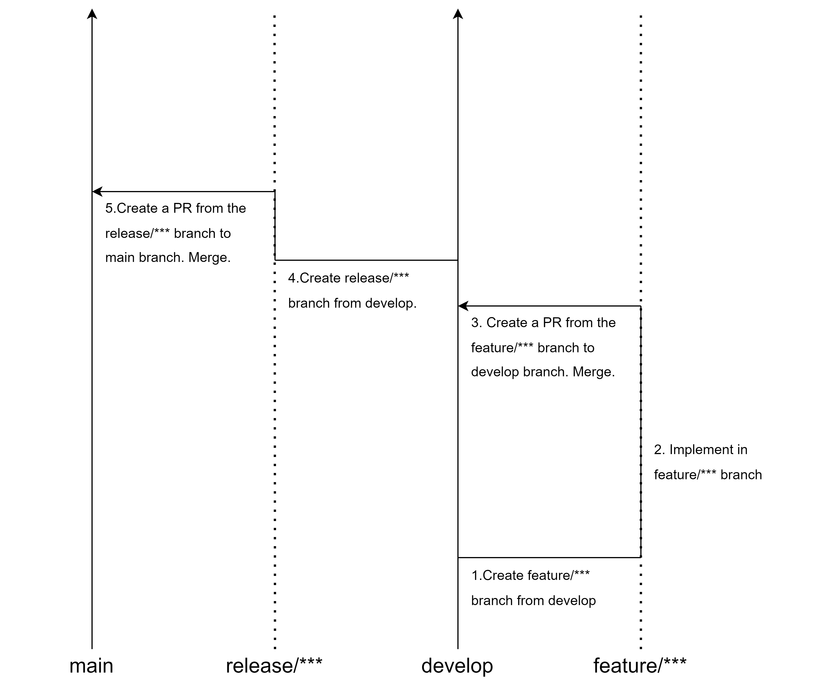

# Git branch

## Branches

|branch|explain|
|:--|:--|
|main|Stable branch. All the latest releases are included.|
|develop|Development Branch. Develops pre-release functionality.|
|feature/***|Feature implementation branch created from develop.  After implementation, it is merged into develop.|
|release/***|Release branch containing release functionality created from the develop branch.  it is merge into main.|

## Branch flow

1. Create `feature/***` branch from develop.
1. Implement in `feature/***` branch.
1. Create a PR from the `feature/***` branch to `develop` branch. Merge.
1. Create `release/*** branch` from develop.
1. Create a PR from the `release/*** branch` to `main` branch. Merge.
 
 
 
 
 

    