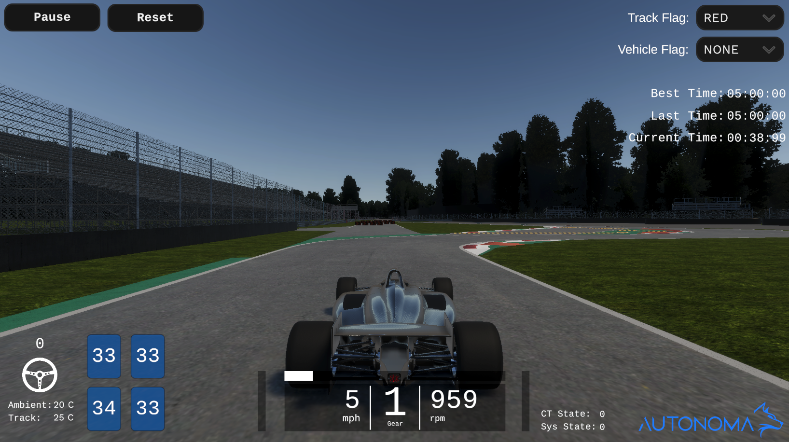

# How to Use Racing Simulator

A vehicle simulator for the Dallara AV-21R. This simulator provides a way for teams to test their autonomous racing software with similar dynamics, sensors, and interface to the real car.

## Documentation
1. How to use racing simulator (this page)

2. [Vehicle dynamics details](../../RacingSim/VehicleDynamics/index.md)

3. [Sensor details](../../RacingSim/Sensors/index.md)

## Downloading Simulator

There are two options to run racing simulations:

1. Download binary (recommended)

    Download the most recent racing simulator build in the Github Releases. (not available yet)

- Windows: Double-click the downloaded executable (.exe)
    
- Linux:

    - Double-click the downloaded executable (.so)

    - The first time you may need to set the executable permissions with ```chmod +x AWSIM.so```

2. From the Unity Editor

    a. To run directly from the Unity editor, follow the instructions in [Getting Started - Setup Unity Projet](../../GettingStarted/SetupUnityProject/index.md), but switch to the racing git branch after cloning.

    b. Download and import `racetracks_v1.unitypackge`

    [Download racetrack assets (unitypackage)](https://netorgft10298407-my.sharepoint.com/:f:/g/personal/will_bryan_autonomalabs_com/EnFiHnKOU2VKpFyvuGNnSoEBHrcnGAxe8js3GnDwgTMl8Q?e=joBXev){.md-button .md-button--primary}

    c. In Unity Editor, from the menu bar at the top, select `Assets -> Import Package -> Custom Package...` and navigate the `racetracks_v1.unitypackage` file.


## Scenario Setup

In the main menu, click the 'Scenario Setup' button.

- Select a saved scenario from the dropdown or create a new one (scenario and vehicle setups are saved in your Documents folder)
- Select a saved vehicle setup
- Select a racetrack
- In the scenario setup, you can select number of cars, how they are controlled, their colors, and their car number
    - You can name your scenario and save it to use the same scenario settings later
    - When you have multiple scenarios saved, you can pick one from the left dropdown menu
    - The most recently saved scenario will be at the top of the dropdown for convenient testing
- ***Currently simulator only supports one ROS2 car (multicar coming soon)***
- If you are controlling a car with ROS2:
    - Set the ROS_DOMAIN_ID to use for the car (This is currently not implemented and will only use ROS_DOMAIN_ID 0)
    - Generic AI mode is currently disabled
    - Human control type will allow for keyboard control
- The option to "Hot start raptor" will start the low level ECU in sys_state = 9 (as explained in [Sensors - Raptor](../Sensors/index.md))

## Vehicle Setup
To view or create a setup, click the 'Vehicle Setup' button.

- Modify an existing setup or save a new one with the 'Save' button
- To fill in suggested values, press the 'Default' button
- Differential
    - Choose between a spool differential and a Limited Slip Differential (LSD)
- Steering
    - Choose between realistic or ideal steering actuation
    - Set the desired pure steering delay (s) and steering bandwidth (hz)
    - Set the max steering motor angle (deg) and max steering motor rate (deg/s)
    - Set the steering ratio
- Suspension
    - Set the anti-roll bar rates (N/m)
- Brakes
    - Set the brake constant (conversion from kPa to Nm of torque)
- Tyres
    - Enable or disable thermal tyre effects
    - Set ambient and track temperatures (deg Celcius)

## Sensor Setup
Sensor setup menu is currently disabled but will be available at a future date

## Simulation operation
To start a simulation, click 'Drive' from the 'Scenario Setup' menu.


- 'C' cycles through various camera angles
- 'R' or Reset button reset the car back onto the track and pointed in the correct direction
- Pause button -> Restart button relaunches the entire scenario
- The HUD shows steering motor input, throttle input, brake input, current gear, speed, rpm, ct_state, sys_state, tire tempuratures, and lap times.


### Human driver mode
- Controls are 'arrow keys' for throttle, steering and brake
- 'tab' for gear up
- 'caps lock' or 'shift' for gear down

### ROS2 driver mode
- You can continue with standard AV-21R startup proceedure
    - If you selected 'Raptor Hot Start' then you can immediately begin driving
    - If you did not, vehicle requires an orange flag and a ct_state = 5, followed by removing the orange flag to begin driving.
    - Low-level state machine is described in more detail in the [Sensors - Raptor](../Sensors/index.md) section.

## Copyright and License

Copyright 2023 Autonoma Inc.

All code is licensed under the Apache 2.0 License. All assets are distributed under the CC BY-NC License.
