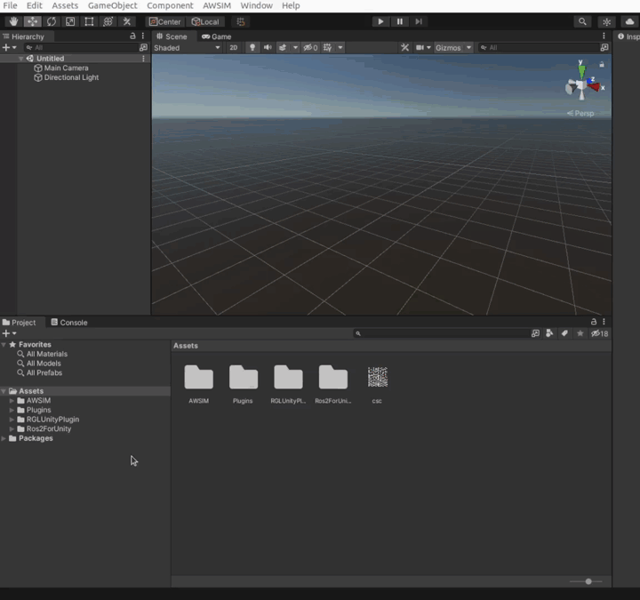
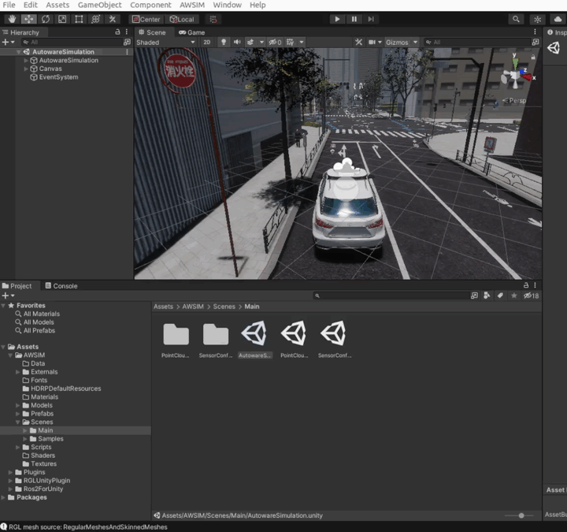

<!-- TODO DM: tutaj tez dodalbym gif sprawdzajacy topicki -->

Before following through with this section make sure you setup *AWSIM* *Unity* project in accordance with section [Setup Unity Project](../SetupUnityProject/).

# Run the scene

To run the *AWSIM* scene in *Unity* with *Autoware* follow these steps:

1. Open the `AutowareSimulation.unity` scene placed under `Assets/AWSIM/Scenes/Main` directory:

1. Run the simulation by clicking `Play` button placed at the top section of Editor:

1. Launch the *Autoware* (the same way as [with AWSIM Demo](../../Installation/RunDemo/#run-with-autoware)) by executing the commands with your own path to the `map files`:

    ```
    source /opt/ros/humble/setup.bash
    source <autoware_workspace_path>/install/setup.bash
    ros2 launch autoware_launch e2e_simulator.launch.xml vehicle_model:=sample_vehicle sensor_model:=awsim_sensor_kit map_path:=<mapfiles_dir_path>
    ```
!!! success
    The *Autoware* that has been started and communicating properly with *AWSIM* should look like this:

    

