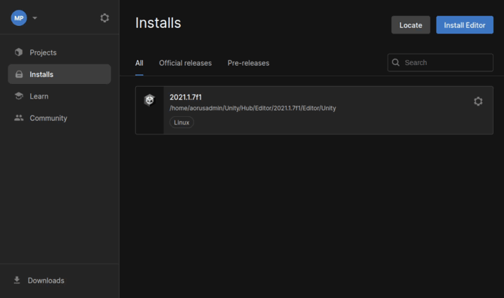

# 1. Unity Hub installation
<!-- DM: gif uruchamiania unityhub w commandline -->
To install *Unity* on *Linux* you need to install *Unity Hub*, run the following commands:

1. Add the public signing key
    ```
    wget -qO - https://hub.unity3d.com/linux/keys/public | gpg --dearmor | sudo tee /usr/share/keyrings/Unity_Technologies_ApS.gpg > /dev/null
    ```
2. Add Unity Hub repository to your sources
    ```
    sudo sh -c 'echo "deb [signedby=/usr/share/keyrings/Unity_Technologies_ApS.gpg] https://hub.unity3d.com/linux/repos/deb stable main" > /etc/apt/sources.list.d/unityhub.list'
    ```
3. Update package cache and install package
    ```
    sudo apt update
    sudo apt-get install unityhub
    ```
!!! warning
    To be on the safe side always check the official documentation on how to install *Unity Hub*, this manual is just for reference.

    Please follow [these instructions](https://docs.unity3d.com/hub/manual/InstallHub.html#install-hub-linux) if you have any problems.

!!! success
    Here will be added gif of unityhub launch
# 2. Unity installation

!!! info

    *AWSIM's* *Unity* version is currently ***Unity 2021.1.7f1***

Follow the steps below to install *Unity 2021.1.7f1* via *UnityHub*:

1. Open *UnityHub* by executing the command `unityhub` in the terminal or by using application menu.
2. Click `Install Editor` in `Installs` tab and navigate to `download archive` as shown below

1. *Unity* webpage will open, here navigate *Unity* version *2021.1.7* and download it as shown below

1. At this point, your *Unity* installation process should have started.
    <!-- TODO this is an old command for AppImage, does this method work for packaged application as well? -->

    !!! tip "Note for Ubuntu 22"
        If the installation process has not started after clicking the blue button (image above), please copy the hyperlink (by rightclicking the button and selecting `Copy link address`) and add it as a argument for *UnityHub* app. An example command:
        ```
        unityhub unityhub://2021.1.7f1/d91830b65d9b
        ```

!!! success
    After successful installation the version will be available under the `Installs` tab in Unity Hub. Now you can proceed to the next step [Setup Unity Project](../SetupUnityProject/).
    
