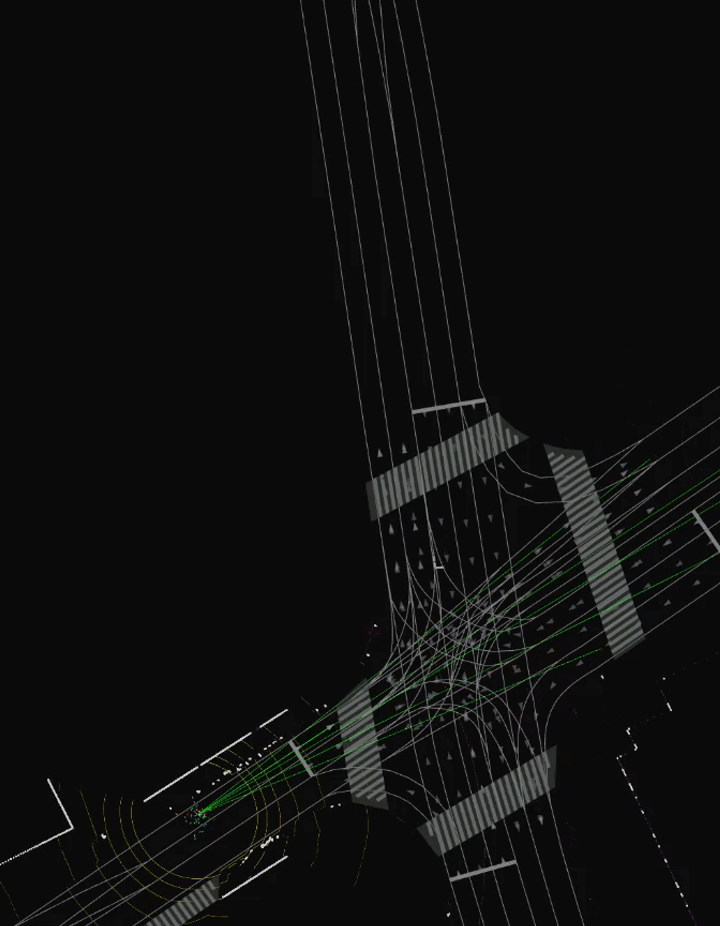
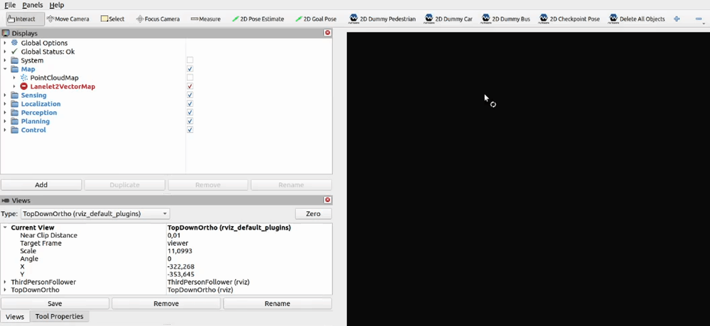
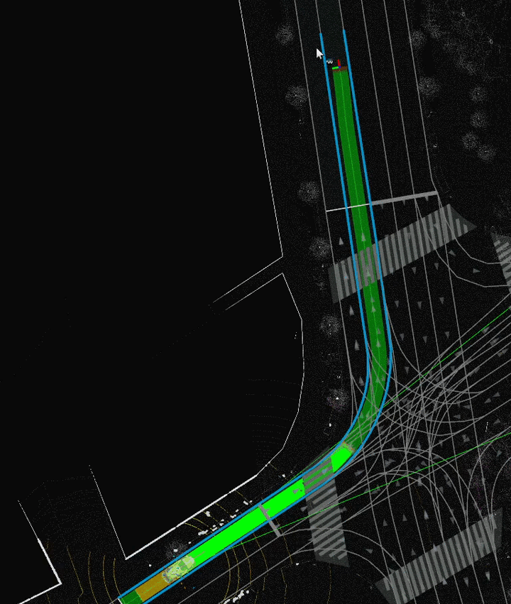
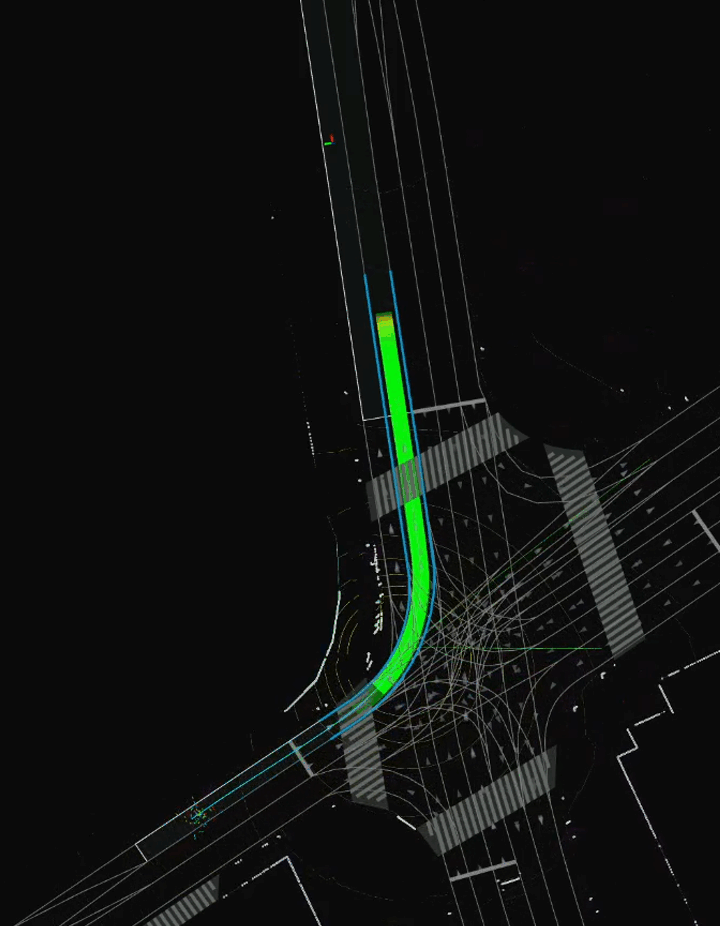

# Add a checkpoint on the way to goal 
Often, a goal selected on a map can be reached through many different paths.
Checkpoints can be used to ensure that the planned path will pass through a given place.

In order to change the planned route using checkpoints, follow these steps:

1. Set goal pose as in [Set a single goal](../SetASingleGoal/).

1. Click on the `2D Checkpoint Pose` button.

1. Click and drag on the map to set the checkpoint the same as with the goal pose. Observe the planned path change.

!!! success
    Now the *Ego* vehicle will first reach the checkpoint and then proceed to reaching the goal. 
    Now you can proceed to the next step: [enable self-driving](../EnableSelf-driving/).
    
