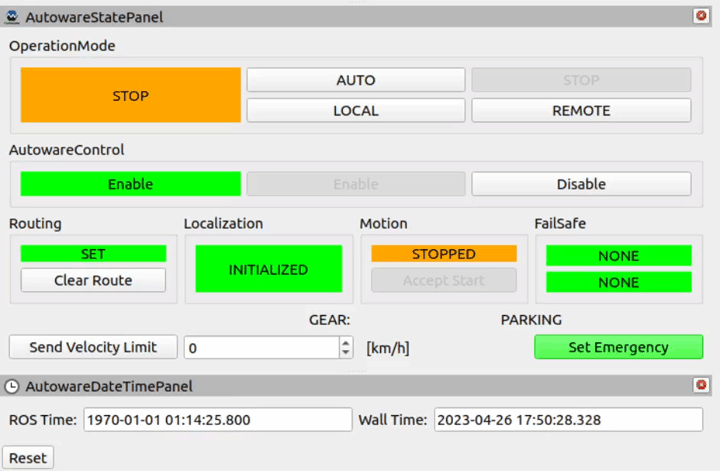

# Enable self-driving

!!! note "Before this section"
    Before performing this step, make sure that the *Ego* position has been automatically initialized and the path to the goal has been planned according to this [section](../SetASingleGoal/).

To start autonomous-driving, follow these steps:

1. Click `AUTO` button in the `OperationMode` of the `AutowareStatePanel`.

    

    **Alternatively** you can publish the appropriate message as presented below:

    ```bash
    source <autoware_workspace_path>/install/setup.bash
    ros2 topic pub /autoware/engage autoware_auto_vehicle_msgs/msg/Engage '{engage: True}' -1
    ```

    !!! question "`AUTO` button inactive"
        If you encounter problems with enabling self-driving, please make sure that *Ego* vehicle [position is initialized](../SetTheInitializationPosition/) and the [goal was set](../SetASingleGoal/).

2. As a result, *Ego* should begin to follow the planned path.

3. An examples of tracking a path to a single goal and with an added checkpoint are shown below.

!!! success 
    You already know how to move the *Ego* to one planned goal. In order to create a list of goals, you can use the `AutomaticGoal` plugin - it is described in this [section](../SetGoalList/).

!!! example
    An example of drive to single goal.
    <video width="1920" controls>
        <source src="set_goal.mp4" type="video/mp4">
    </video>
!!! example
    An example of drive to single goal with an added checkpoint. 
    <video width="1920" controls>
        <source src="goal_checkpoint.mp4" type="video/mp4">
    </video>
