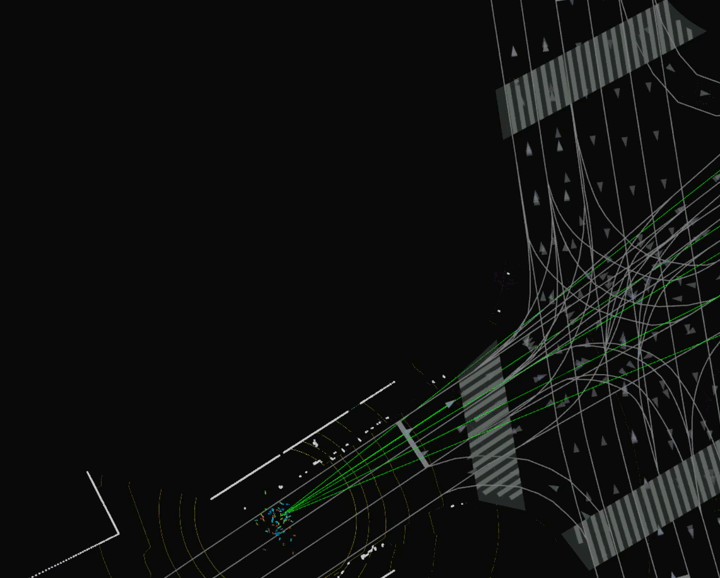

## How to set a single goal step by step

1. Click `2D Goal Pose` button

    

1. Click and drag the mouse on the road to set goal position and orientation.
Planned path should appear on the road after a while.

    

    !!! important
        Remember to always set orientation aligned with road direction.
        Road direction is marked as small arrow marks on the road area.
