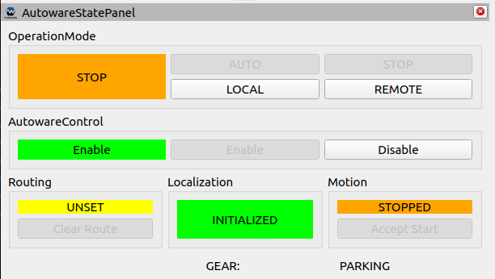
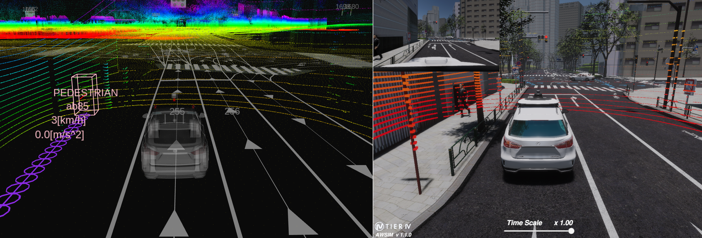
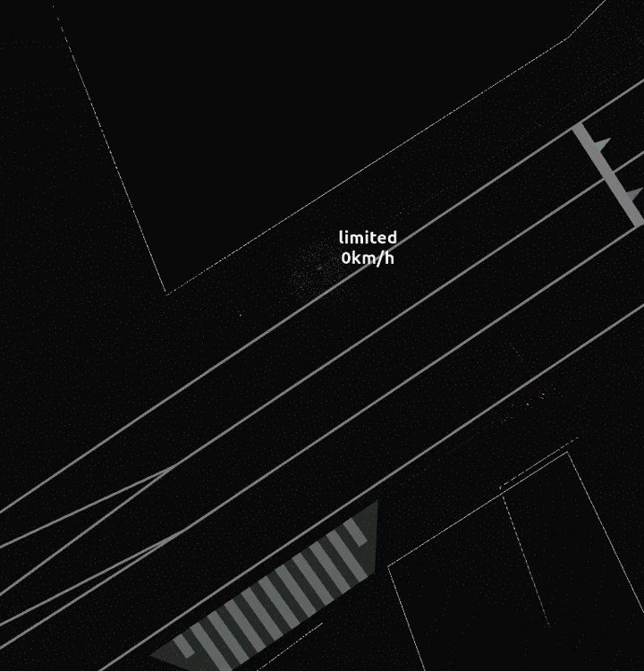
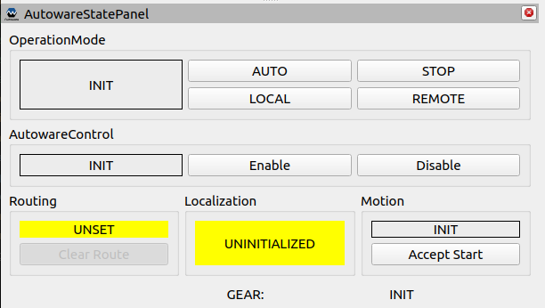
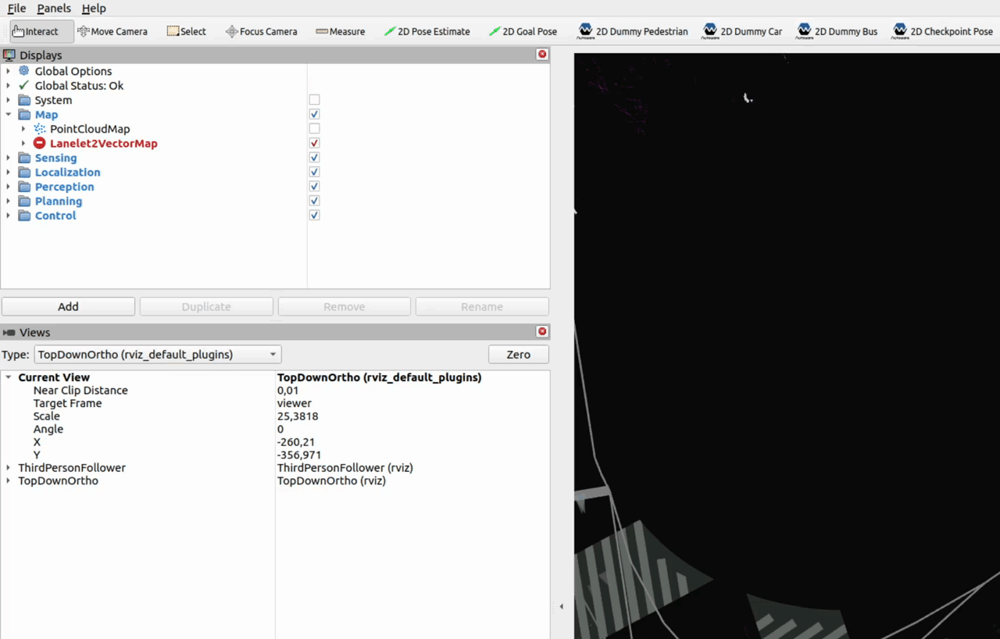
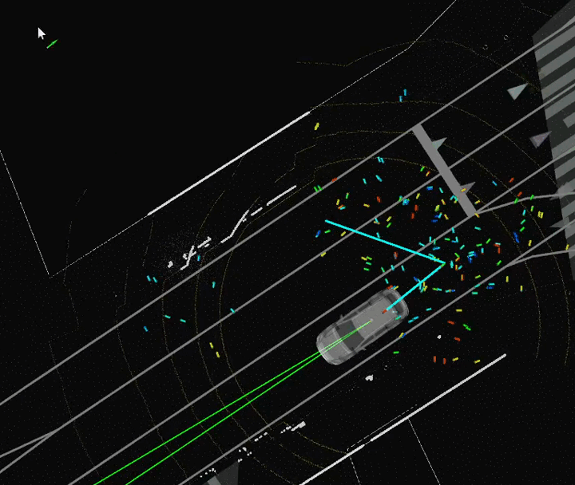
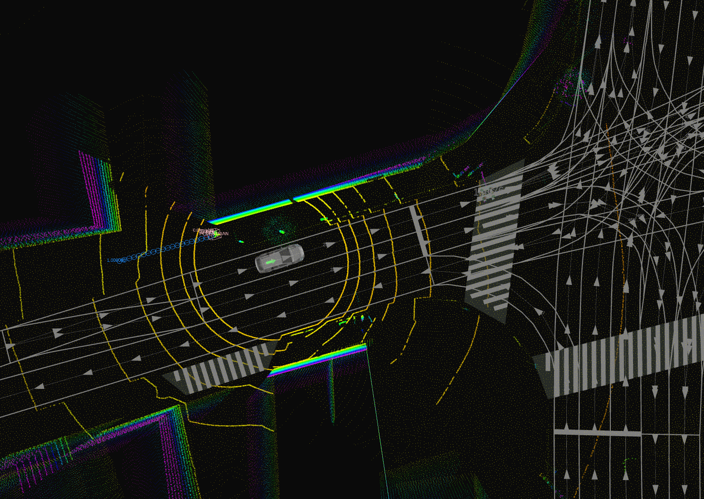

This section describes the automatic and manual process of initializing the vehicle position in *Autoware*.

## Automatic position initialization

When you run *Autoware* while *AWSIM* demo is running in the background, then the vehicle (*Ego*) position should be initialized automatically in *Autoware*. It might take some time - depending on machine performance.

- As a result, `INITIALIZED` information should be visible in the `Localization` part of  the `AutowareStatePanel`:
  
    

- If the *Ego* position has not been initialized precisely please see this [section](#manual-position-initialization).

!!! success
    The correct result of the automatic position initialization should look like this. 
    Now you can proceed to the next step: [setting a single goal](../SetASingleGoal/).
    

!!! example "Automatic position initialization example"
    

!!! question
    If automatic initialization does not work, make sure you start *Autoware* with the correct path to the map files `<mapfiles_dir_path>`. In this case, the state of panel `AutowareStatePanel` is as follows: 
    

## Manual position initialization
In order to set position of *Ego* vehicle manually

1. Click `2D Pose Estimate` button

    

2. Click and drag on the road area position to set estimated position and orientation.
Then wait for the *Ego* vehicle to localize itself.

    

!!! success
    The correct result of the precise position initialization should look like this. 
    Now you can proceed to the next step: [setting a single goal](../SetASingleGoal/). 
    
