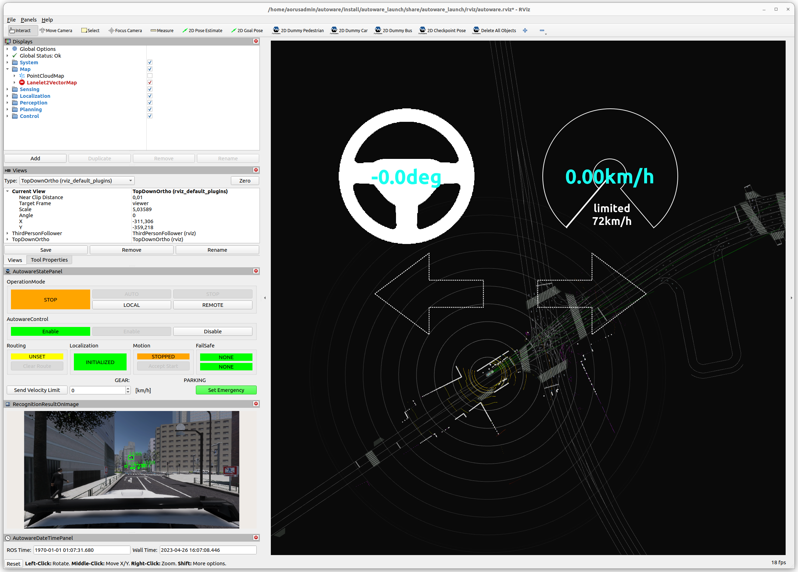

## Demo configuration
<!-- copied 100% from old -->
The simulation provided in the AWSIM demo is configured as follows:

|AWSIM Demo Settings||
|:--|:--|
|Vehicle|Lexus RX 450h|
|Environment|Japan Tokyo Nishishinjuku|
|Sensors|Gnss * 1<br> IMU * 1<br> LiDAR * 1<br> Traffic camera * 1|
|Traffic|Randomized traffic|
|ROS2|humble|

## Download and run
<!-- TODO only copied from old -->
!!! warning
    Before following through with this section make sure to check [prerequisites](/UserGuide/Installation/Prerequisites).

To run the simulator, please follow the steps below.

1. Download the `AWSIM_v1.1.0.zip`.

    [Download AWSIM Demo for ubuntu](https://github.com/tier4/AWSIM/releases/download/v1.1.0/AWSIM_v1.1.0.zip){.md-button .md-button--primary}

2. Unzip the downloaded file.

3. Make the `AWSIM_demo.x86_64` file executable.

    Rightclick the `AWSIM_demo.x86_64` file and check the `Execute` checkbox
    <!--  -->
    

    <!--  -->

    or execute the command below.

    ```
    chmod +x <path to AWSIM folder>/AWSIM_demo.x86_64
    ```

4. Launch `AWSIM_demo.x86_64`.
    ```
    ./<path to AWSIM folder>/AWSIM_demo.x86_64
    ``` 

    !!! warning

        It may take some time for the application to start the so please wait until image similar to the one presented below is visible in your application window.

    Running AWSIM should look something like te one below.

    

## Run with Autoware (**gifs/video**)
<!-- TODO whole section -->

1. Launch AWSIM like in [section before](#download-and-run)

1. Launch Autoware.

    1. Open new terminal and source the Autoware workspace

        ```
        source <autoware workspace>/install/setub.bash
        ```

    1. Launch the Autoware

        !!! warning

            `<your mapfile location>` must be changed arbitrarily.
            Specify the path to the outermost map folder.
            When specifying the path the `~` operator cannot be used - please specify absolute full path, or use the `$HOME` environmental variable.

        ```
        source install/setup.bash
        ros2 launch autoware_launch e2e_simulator.launch.xml vehicle_model:=sample_vehicle sensor_model:=awsim_sensor_kit map_path:=<your mapfile location>
        ```


    Successfully launched Autoware should look something like the one below.

    
