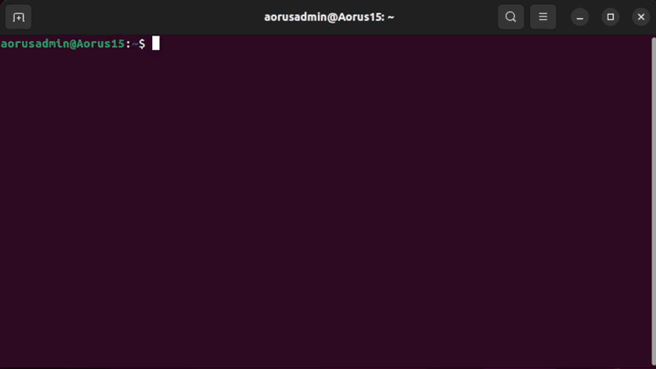

<!-- DM: fajnie jakby udalo sie dodac zwijanie sekcji linux/windows
trzeba tez niestety zrobic wywiad jak zainstalowac to na windowsie i uzupelnic.. -->

# System Requirements
<!-- copied from old -->
Before installation, please make sure that your machine meets the following requirements in order to run the simulation correctly:

| System Requirements |                                                                          |
| :------------------ | :----------------------------------------------------------------------- |
| OS                  | Ubuntu 22.04 / Windows 10 or 11 (64 bit)                                 |
| CPU                 | 6 cores and 12 thread or higher                                          |
| GPU                 | Nvidia GPU with at least 8GB of memory (recommended RTX2080Ti or higher) |

!!! info  
    System requirements may vary depending on simulation contents which may change as the simulator develops.

# Linux
Follow these steps to get your *Ubuntu* system ready to run *AWSIM* with *Autoware*.

## 1. Localhost settings
<!-- TODO copied from old and added what I think is some additional help -->

The simulation is based on the appropriate network setting, which allows for trouble-free communication of the *AWSIM* simulation with the *Autoware* software.

To apply required localhost settings please add the following lines to `~/.bashrc` file:

``` bash
export ROS_LOCALHOST_ONLY=1
export RMW_IMPLEMENTATION=rmw_cyclonedds_cpp

if [ ! -e /tmp/cycloneDDS_configured ]; then
	sudo sysctl -w net.core.rmem_max=2147483647
	sudo ip link set lo multicast on
	touch /tmp/cycloneDDS_configured
fi
```

!!! Warning
    If you are having trouble with network connection consider replacing `export ROS_LOCALHOST_ONLY=1` with `export ROS_DOMAIN_ID=XX` where `XX` is a unique number in your network between *0* and *101* inclusive.

    For more information about `ROS_DOMAIN_ID` head to official [documentation](https://docs.ros.org/en/rolling/Concepts/About-Domain-ID.html).

!!! info

    Adding these lines to your `.bashrc` file will require you to supply your password first time you open a terminal after each PC restart.

## 2. Install Git
To download *AWSIM* from a [remote repository](https://github.com/tier4/AWSIM) you need to install [git](https://git-scm.com/).

Install it by executing the following commands in the terminal:

```
sudo apt update
sudo apt install git
```

## 3. Install Nvidia GPU driver
To run *AWSIM* on *Ubuntu*, it is required to install *Nvidia* `515.43.04` drivers or higher.

To check what version you currently have installed, run the `nvidia-smi` command in the terminal. 
!!! example
    The message displayed in the example means that the drivers are in version `525.105.17` and work properly:
    

If you do not have drivers installed or you need to update them, select one of the options below and follow it.
!!! Warning

    After installing the graphics driver, a system restart is **required**.

### 3.1 App option
You can open `Additional Drivers` application and from there select one driver and install it.


To verify that the drivers have been installed correctly, run the command `nvidia-smi` again and check.
### 3.2 Command line option

Other possibility is to install drivers from command line.

1. Add *Nvidia* driver to apt repository:
```
sudo add-apt-repository ppa:graphics-drivers/ppa
sudo apt update
```
1. Install the recommended version of the driver:
```
sudo ubuntu-drivers autoinstall
```

To verify that the drivers have been installed correctly, run the command `nvidia-smi` again and check.

## 4. Install Vulkan Graphics Library
*AWSIM* uses *Vulkan Graphics Library*, to install it run the following commands:

1. Update the environment.
```
sudo apt update
```
1. Install Vulkan library
```
sudo apt install libvulkan1
```

## 5. Installing Autoware
*AWSIM* has been developed to work with *Autoware*, to install *Autoware* follow these steps:

!!! warning
    The *AWSIM*-compatible version of *Autoware* is developed for the [***ROS2 Humble distribution***](https://docs.ros.org/en/rolling/Releases/Release-Humble-Hawksbill.html)

1. Clone [Autoware](https://github.com/autowarefoundation/autoware) and move to the directory.
```
git clone https://github.com/autowarefoundation/autoware.git
cd autoware
```
1. Switch branch to `awsim-stable`. 
```
git checkout awsim-stable
```
1. Configure the environment. (Skip if *Autoware* environment has been configured before)
```
./setup-dev-env.sh
```
1. Create the `src` directory and clone external dependent repositories into it.
```
mkdir src
vcs import src < autoware.repos
```
1. Install dependent ROS packages.
```
source /opt/ros/humble/setup.bash
rosdep update
rosdep install -y --from-paths src --ignore-src --rosdistro $ROS_DISTRO
```
1. Build the workspace.
```
colcon build --symlink-install --cmake-args -DCMAKE_BUILD_TYPE=Release -DCMAKE_CXX_FLAGS="-w"
```

!!! info
    More details related to the Autoware installation process can be found here: [Autoware Installation](https://autowarefoundation.github.io/autoware-documentation/main/installation/autoware/source-installation/)

# Windows
Follow these steps to get your *Windows* system ready to run *AWSIM* with *Autoware*.
<!-- TODO -->
## 1. Localhost settings
<!-- TODO -->
## 2. Install Git
<!-- TODO -->
## 3. Install Nvidia GPU driver
Nvidia Driver (Windows) | >=472.50     
<!-- TODO -->
## 4. Install Vulkan Graphics Library
<!-- TODO -->
## 5. Installing Autoware
<!-- TODO -->

