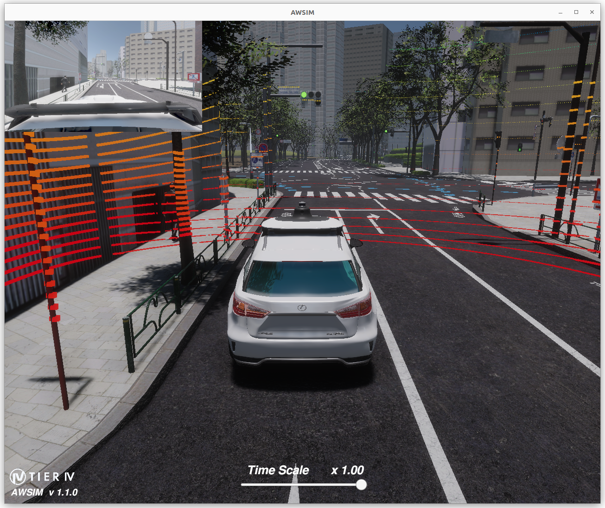

The following describes how to run the default *AWSIM* demo on an *Ubuntu* system. Also included is the combination with *Autoware* - which is the base for starting the first steps described [here](../../FirstSteps/SetTheInitializationPosition/).

#### Demo configuration
    
The simulation provided by the default *AWSIM* demo is configured as follows:

| Settings          | Description                                         |
| :---------------- | :-------------------------------------------------- |
| Vehicle           | Lexus RX 450h                                       |
| Environment       | Japan Tokyo Nishishinjuku                           |
| Sensors           | GNSS * 1,  IMU * 1,  LiDAR * 1,  Traffic camera * 1 |
| Traffic           | Randomized traffic                                  |
| ROS2 Distribution | Humble                                              |


!!! note
    Before following through with this section make sure to check [prerequisites](../Prerequisites/).

=== "Ubuntu"
    ## Ubuntu
    ### 1. Download demo and run

    To run the demo, please follow the steps below.

    1. Download the `AWSIM_v1.1.0.zip`.

        [Download AWSIM Demo for Ubuntu](https://github.com/tier4/AWSIM/releases/download/v1.1.0/AWSIM_v1.1.0.zip){.md-button .md-button--primary}

    2. Unzip the downloaded file.

    3. Make the `AWSIM_demo.x86_64` file executable.

        Rightclick the `AWSIM_demo.x86_64` file and check the `Execute` checkbox
        

        or execute the command below.

        ```
        chmod +x <path to AWSIM folder>/AWSIM_demo.x86_64
        ```

    4. Launch `AWSIM_demo.x86_64`.
        ```
        ./<path to AWSIM folder>/AWSIM_demo.x86_64
        ``` 

        !!! info "Startup time"

            It may take some time for the application to start the so please wait until image similar to the one presented below is visible in your application window.


    !!! success
        The *AWSIM demo* that has been started and working properly should look like this:

        

    ### 2. Run demo with Autoware
    To run *AWSIM* with *Autoware* follow these steps:
    !!! warning
        The *AWSIM*-compatible version of *Autoware* is developed for the [***ROS2 Humble distribution***](https://docs.ros.org/en/rolling/Releases/Release-Humble-Hawksbill.html)

    
    1.  Before launching *Autoware* please check whether the demo has started the communication.
        
        1. Source *ROS2*:

            ```bash
            source /opt/ros/humble/setup.bash
            ```

        1. Run the following command and inspect te output.

            ```bash
            ros2 topic list
            ```

            

        1. If topics used by *AWSIM* are listed correctly then the communication should be working and you can go to the next step. List of topics is available [here](../../ProjectGuide/Ros2TopicList/).
        Otherwise please visit the [troubleshooting page](../../../DeveloperGuide/TroubleShooting/).


    2. Download `map files (pcd, osm)` and unzip them to the desired location<br> (keep the path to the folder - it will be needed).

        [Download Map files (pcd, osm)](https://github.com/tier4/AWSIM/releases/download/v1.1.0/nishishinjuku_autoware_map.zip){.md-button .md-button--primary}

    3. Launch *AWSIM* demo like in [section before](#download-and-run)

    4. Open new terminal and source *ROS2* and *Autoware* workspace by executing:

        ```
        source /opt/ros/humble/setup.bash
        source <autoware_workspace_path>/install/setup.bash
        ```

    5. In the same terminal launch *Autoware* by executing the commands with your own path to the `map files`:

        ```
        ros2 launch autoware_launch e2e_simulator.launch.xml vehicle_model:=sample_vehicle sensor_model:=awsim_sensor_kit map_path:=<mapfiles_dir_path>
        ```

        !!! warning

            `<mapfiles_dir_path>` must be changed arbitrarily.
            Specify the path to the outermost map folder.
            
            When specifying the path the `~` operator cannot be used - please specify absolute full path, or use the `$HOME` environmental variable.


    !!! success
        The *Autoware* that has been started and communicating properly with *AWSIM* should look like this. <br>Now you can proceed and get to know the [first steps of using *AWSIM* with *Autoware*](../../FirstSteps/SetTheInitializationPosition/).
        
    


=== "Windows"
    ## Windows
    !!! warning
        Unfortunately, the official demo for *Windows* has not yet been released.
