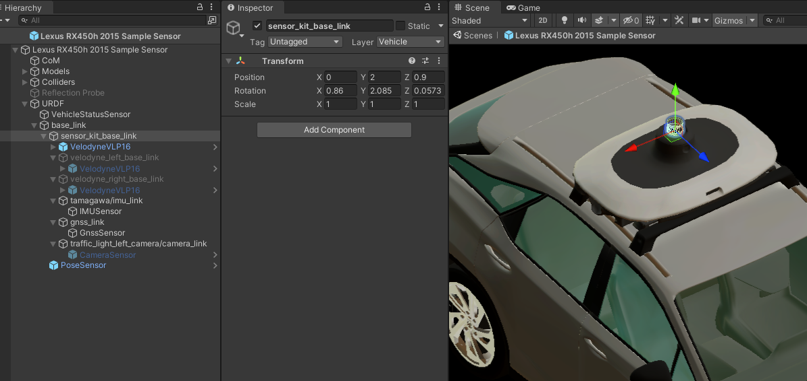
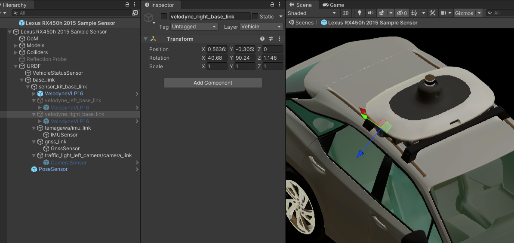

# URDF and Sensors
`URDF` (*Unified Robot Description Format*) is equivalent to the simplified [`URDF`](https://docs.ros.org/en/humble/Tutorials/Intermediate/URDF/URDF-Main.html) format used in *ROS2*. This format allows to define the positions of all sensors of the vehicle in relation to its main parent prefab coordinate system. 

`URDF` is added directly to the main parent of the prefab and there are no transforms between these objects.
It is built using multiple *GameObjects* as children appropriately transformed with relation to its parent. 

The transforms in the `URDF` object are defined using the data from the *sensor kit* documentation used in the vehicle. Such data can be obtained from *sensor kit* packages for *Autoware*, for example, [`awsim_sensor_kit_launch`](https://github.com/RobotecAI/awsim_sensor_kit_launch) is used in the *AWSIM* compatible version of *Autoware*. This package contains a description of transforms between coordinate systems (frames) in the form of `*.yaml` files: [sensors_calibration](https://github.com/RobotecAI/awsim_sensor_kit_launch/blob/main/awsim_sensor_kit_description/config/sensors_calibration.yaml) and [sensor_kit_calibration](https://github.com/RobotecAI/awsim_sensor_kit_launch/blob/main/awsim_sensor_kit_description/config/sensor_kit_calibration.yaml).

In the first file, the transform of the *sensor kit* frame (`sensor_kit_base_link`) relative to the local vehicle frame (`base_link`) is defined - in *Unity*, this transform is defined in the object [`Sensor Kit`](#sensor-kit). While the second file contains a definition of the transformations of all sensors with respect to the *sensor kit* - they are described in the [`Sensor Kit`](#sensor-kit) subsections. 

## Base Link
`Base Link` (frame named `base_link`) is the formalized local coordinate system in `URDF`. In relation to this frame, all sensors are defined that publish data specified in some frame present in *Autoware*.

If any device publishes data directly in `base_link` - it is added directly as a child (`VelodyneVLP16` is an example). However, if this device has its own frame, it is added as a child to its framed object - which provides an additional transformation - only that object is added to the `base_link` (`GnssSensor` and its parent `gnss_link` are an example).

### Sensor Kit
`Sensor Kit` (frame named `sensor_kit_base_link`) is a set of objects that consists of all simulated sensors that are physically present in an autonomous vehicle and have their own coordinate system (frame). This set of sensors has its own frame `sensor_kit_base_link` that is relative to the `base_link`. 

In the `Lexus RX450h 2015 Sample Sensor` prefab, it is added to the `base_link` *GameObject* with an appropriately defined transformation. `Sensor Kit` is located on the top of the vehicle, so it is significantly tra relative to the `Oy` and `Oz` axes. Some sensors are added in the `sensor_kit_base_link` object, which means that the sensors described in this subsection are defined in relation to this frame.

#### LiDARs
`LidarSensor` is the component that simulates the *LiDAR* (*Light Detection and Ranging*) sensor. The *LiDARs* mounted on the top of autonomous vehicles are primarily used scan the environment for localization in space and to detect and identify obstacles. *LiDARs* placed on the left and right sides of the vehicle are mainly used to monitor the traffic lane and detect vehicles moving in adjacent lanes. A detailed description of this sensor is available in this [section](../../Sensors/Lidar/).

`Lexus RX450h 2015 Sample Sensor` prefab has one `VelodyneVLP16` prefab sensor configured on the top of the vehicle, mainly used for location in space, but also for object recognition. Since the top *LiDAR* publishes data directly in the `sensor_kit_base_link` frame, the prefab is added directly to it - there is no transform. The other two remaining *LiDARs* are defined but disabled - they do not provide data from space (but you can enable them!). 

##### Top

##### Left - *disabled*

##### Right - *disabled*

#### IMU
`IMUSensor` is a component that simulates an *IMU* (*Inertial Measurement Unit*) sensor. Measures acceleration and angular velocity of the `EgoVehicle`. A detailed description of this sensor is available in this [section](../../Sensors/IMU/).

`Lexus RX450h 2015 Sample Sensor` has one such sensor located on the top of the vehicle. It is added to an object `tamagawa/imu_link` that matches its `frame_id` and contains its transform with respect to `sensor_kit_base_link`. This transformation has no transition, but only rotation around the `Oy` and `Oz` axes. The transform is defined in such a way that its axis `Oy` points downwards - in accordance with the gravity vector.

#### GNSS
`GnssSensor` is a component which simulates the position of vehicle computed by the *Global Navigation Satellite*. A detailed description of this sensor is available in this [section](../../Sensors/Gnss/).

`Lexus RX450h 2015 Sample Sensor` prefab has one such sensor located on top of the vehicle. It is added to an object `gnss_link` that matches its `frame_id` and contains its transform with respect to `sensor_kit_base_link`. The frame is slightly moved back along the `Oy` and `Oz` axes.

#### Camera
`CameraSensor` is a component that simulates an *RGB* camera. Autonomous vehicles can be equipped with many cameras used for various purposes. A detailed description of this sensor is available in this [section](../../Sensors/Camera/).

`Lexus RX450h 2015 Sample Sensor` prefab has one camera, positioned on top of the vehicle in such a way that the camera's field of view provides an image including traffic lights, the status of which must be recognized by *Autoware*. 
It is added to an object `traffic_light_left_camera/camera_link` that matches its `frame_id` and contains its transform with respect to `sensor_kit_base_link`. 

### Pose
`PoseSensor` is a component which provides access to the current position and rotation of the `EgoVehicle` -  is added as a ground truth. A detailed description of this sensor is available in this [section](../../Sensors/GroundTruths/Pose/).

The position and orientation of `EgoVehicle` is defined as the position of the frame `base_link` in the global frame, so this object is added directly as its child without a transform.

## VehicleSensor
`VehicleStatusSensor` is a component that is designed to aggregate information about the current state of the `EgoVehicle`, such as the active control mode, vehicle speed, steering of its wheels, or turn signal status. A detailed description of this sensor is available in this [section](../../Sensors/VehicleStatus/).

This object is not strictly related to any frame, however, it is assumed as a sensor, therefore it is added to the `URDF`.

<!-- (prefab location, transform links, **screens**)

**Dynamics Concept**

(description, required parameters, **gifs** - dynamic presentation)

**Scripts**

- Vehicle (physis settings, inputs and outputs - hyperlink to ros topic list)
- Vehicle Ros Input (limits, impact of the ros inputs on the vehicle behavior - reference to Autoware)
- Vehicle KeyBoard Input (control description)
- Vehicle Visual Effect (**gifs**: brake, turn signal, reverse lights)

**Sensors**

- VehicleStatusSensor (a short description and a hyperlink to a detailed description)
- RobotecGPULidars (eg. VelodyneVLP16 on top, a short description and a hyperlink to a detailed description)
- IMUSensor (a short description and a hyperlink to a detailed description)
- GnssSensor (a short description and a hyperlink to a detailed description)
- CameraSensor (a short description and a hyperlink to a detailed description)
- Sensor links definition - Autoware dependency (URDF, sensor_calibration in Autoware)

**Colliders**

- Body (**screen**, description for what purpose it may be used)
- Wheels (**gifs**, wheel script, wheel collider script, why are important, parameters)

**Others**

- Center of mass (where it is used)
- Models (Body, Wheels, Sensor Kit, **screens**)
- Reflection Probe (**screens**, hyperlink to unity) -->
