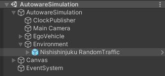
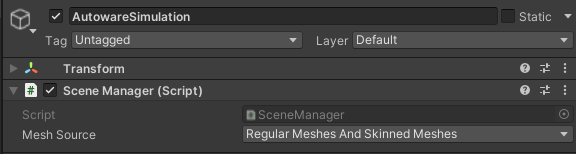
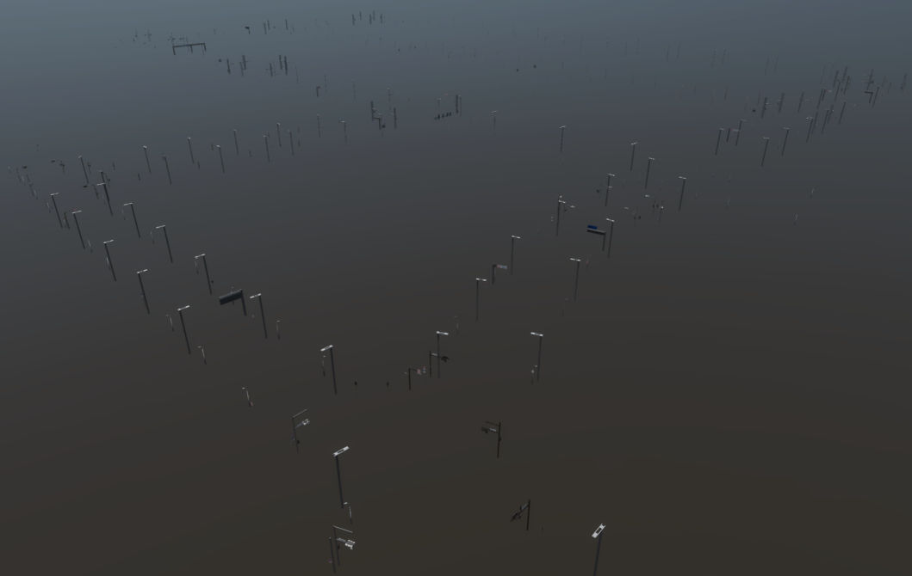
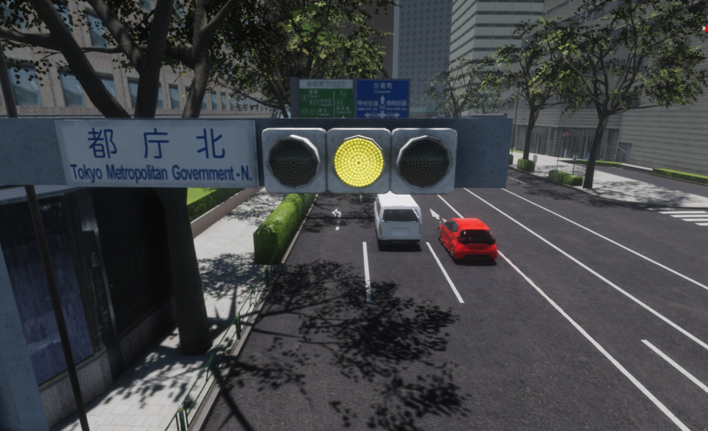
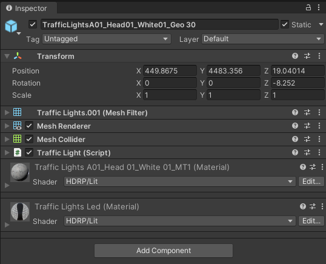
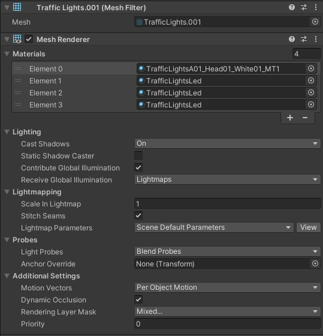
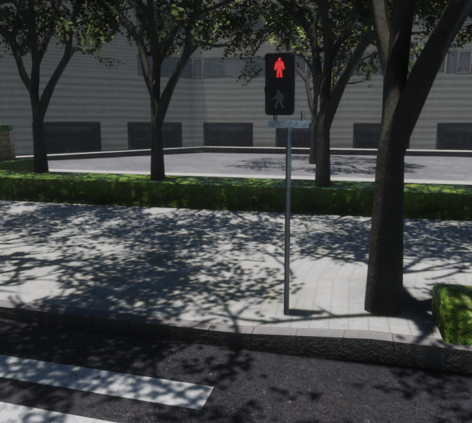
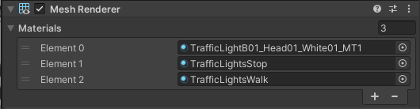

# Environment
`Environment` is an object that contains all the elements visible on the scene along with components that affect how they are rendered. It contains several objects aggregating static environment objects in terms of their type. Moreover, it contains elements responsible for controlling random traffic.

!!! note "AutowareSimulation scene"
    If you would like to see how `Environment` with random traffic works or run some tests, we encourage you to familiarize yourself with the `AutowareSimulation` scene described in this [section](../../../DefaultExistingScenes/).

!!! tip "Own Environment prefab"
    If you would like to develop your own prefab `Environment` for *AWSIM*, we encourage you to read this [tutorial](../../../../../DeveloperGuide/Tutorials/AddANewEnvironment/).

!!! tip "Create PointCloud (*.pcd file)"
    If you would like to learn how to create a point cloud in *AWSIM* using `Environment` prefab, we encourage you to read this [tutorial](../../../../../DeveloperGuide/Tutorials/CreateAPCDFromMesh/).

#### Prefabs

Prefabs can be found under the following path: 

| Name                          | Description                                   | Path                                                                   |
| :---------------------------- | :-------------------------------------------- | :--------------------------------------------------------------------- |
| *Nishishinjuku*               | Only visual elements, no traffic              | `Assets/AWSIM/Prefabs/Environments/Nishishinjuku.prefab`               |
| *Nishishinjuku RandomTraffic* | Visual elements along with random traffic     | `Assets/AWSIM/Prefabs/Environments/Nishishinjuku RandomTraffic.prefab` |
| *Nishishinjuku Traffic*       | Visual elements along with non-random traffic | `Assets/AWSIM/Prefabs/Environments/Nishishinjuku Traffic.prefab`       |

!!! note "Environment prefab" 
    Due to the similarity of the above prefabs, this section focuses on prefab `Nishishinjuku RandomTraffic`. The exact differences between `Nishishinjuku RandomTraffic` and `Nishishinjuku Traffic` will be described in the future.

!!! note "Environment name"
    In order to standardize the documentation, the name `Environment` will be used in this section as the equivalent of the prefab named `Nishishinjuku RandomTraffic`.

`Nishishinjuku RandomTraffic` prefab has the following content: 

As you can see it contains:

- `SJK*` objects - which are aggregators for visual models.
- `RandomTrafficSimulator`, `TrafficIntersections`, `TrafficLanes`, `StopLines` - which are responsible for random traffic of [`NPCVehicles`](../../NPCs/Vehicle/).
- `NPCPedestrians` - which is an aggregator of [`NPCPedestrian`](../../../Components/NPCs/Pedestrian/). prefabs added to the scene.
- `Volume`, `Directional Light` - which are components that affect the appearance of objects on the scene.

All of these objects are described later in this section.

#### Visual elements
The `Nishishinjuku RandomTraffic` prefab contains many visual elements which are described [here](#visual-elements-sjk).

#### Link
Prefab `Nishishinjuku RandomTraffic` is added to the `Environment` object - between which there is rotation about the `Oy` axis by 90 degrees. This rotation is added because of the differences in coordinate alignments between the `Nishishinjuku RandomTraffic` prefab objects (which have been modeled as `*.fbx` files) and the specifics of the *GridZone* definition (more on this is described [here](#components-and-scripts)).

Object `Environment` is added to `AutowareSimulation` which is added directly to the main parent of the scene - there are no transformations between these objects.

#### Components and Scripts

`Nishishinjuku RandomTraffic` (`Environment` prefab) contains only one component - *Environment Script* - which is important for communicating with *Autoware* and loading elements from *Lanelet2*. Because it allows to define the location of the environment in relation to the world.

*Environment Script* contains the information about how a simulated `Environment` is positioned in real world.
That means it describes what is the real world position of a simulated `Environment`.

*AWSIM* uses part of a [*Military Grid Reference System*][mgrs] (*MGRS*).
To understand this topic, you only need to know, that using *MGRS* you can specify distinct parts of the globe with different accuracy.
For *AWSIM* the chosen accuracy is a 100x100 km square.
Such a square is identified with a unique code like `54SUE` (for more information on *Grid Zone* please see [this page][mgrs]).

Inside this *Grid Zone* the exact location is specified with the offset calculated from the bottom-left corner of the *Grid Zone*. You can interpret the *Grid Zone* as a local coordinate system in which you position the `Environment`.

!!! warning "The essence of Environment Script"
    The *Environment Script* configuration is necessary at the moment of loading data from *Lanelet2*.

    Internally it shifts the elements from *Lanelet2* by the given offset so that they align with the `Environment` that is located at the local origin with no offset.

In the `Nishishinjuku RandomTraffic` prefab, the simulated `Environment` is positioned in the *Grid Zone* `54SUE`. The offset if equal to `81655.73` meters in the `Ox` axis, `50137.43` meters in the `Oy` axis and `42.49998` meters in the `Oz` axis. In addition to this shift, it is also necessary to rotate the Environment in the scene by `90` degrees about the `Oy` axis - this is ensured by the transform in the prefab object.

This means that the *3D* models were created in reference to this exact point and because of that the *3D* models of `Environment` align perfectly with the data from *Lanelet2*.

#### Layers
In order to enable the movement of vehicles around the environment, additional layers have been added to the project: `Ground` and `Vehicle`. 

All objects that are ground for `NPCVehicles` and `EgoVehicle` to move on have been added to `Ground` layer - they cannot pass through each other and should collide for the physics engine to calculate their interactions.  

For this purpose, `NPCVehicles` and `EgoVehicle` have been added to the `Vehicle` layer. 

In the project physics settings, it is ensured that collisions between objects in the `Vehicle` layer are disabled (this applies to `EgoVehicle` and `NPCVehicles` - they do not collide with each other):

## Traffic Components

Due to the specificity of the use of `RandomTrafficSimulator`, `TrafficIntersections`, `TrafficLanes`, `StopLines` objects, they have been described in a separate section [*Traffic Components*](../TrafficComponents) - where all the elements necessary in simulated random traffic are presented.

## Visual Elements (SJK)

!!! warning "Scene Manager"
    For models (visual elements) added to the prefab to work properly with the [`LidarSensor`](../../Sensors/Lidar/) sensor using [`RGL`](../../../ExternalLibraries/RGLUnityPlugin/), make sure that the `SceneManager` component is added to the scene - more about it is described in this [section](../../../ExternalLibraries/RGLUnityPlugin/#rglscenemanager).

    In the scene containing `Nishishinjuku RandomTraffic`prefab *Scene Manager Script* is added as a component to the `AutowareSimulation` object containing the `Environment`.
    

#### `SJK01_P01`

#### `SJK01_P02`

#### `SJK01_P03`

#### `SJK01_P04`

#### `SJK01_P05`

#### `SJK01_P06`

### TrafficLights

#### TrafficLights

#### PedestrianLights

## Volume

`Volume` is *GameObject* with [*Volume*](https://docs.unity3d.com/Packages/com.unity.render-pipelines.high-definition@11.0/manual/Volumes.html) component which is used in the [*High Definition Render Pipeline*](https://docs.unity3d.com/Packages/com.unity.render-pipelines.high-definition@10.2/manual/index.html) (*HDRP*). It defines a set of scene settings and properties. It can be either global, affecting the entire scene, or local, influencing specific areas within the scene. *Volumes* are used to interpolate between different property values based on the Camera's position, allowing for dynamic changes to environment settings such as fog color, density, and other visual effects.

In case of prefab `Nishishinjuku RandomTraffic` volume works in global mode and has loaded [*Volume profile*](https://docs.unity3d.com/Packages/com.unity.render-pipelines.high-definition@11.0/manual/Volume-Profile.html). This volume profile has a structure that overrides the default properties of *Volume* related to the following components: [Fog](https://docs.unity3d.com/Packages/com.unity.render-pipelines.high-definition@11.0/manual/Override-Fog.html), [Shadows](https://docs.unity3d.com/Packages/com.unity.render-pipelines.high-definition@11.0/manual/Override-Shadows.html), [Ambient Occlusion](https://docs.unity3d.com/Packages/com.unity.render-pipelines.high-definition@11.0/manual/Override-Ambient-Occlusion.html), [Visual Environment](https://docs.unity3d.com/Packages/com.unity.render-pipelines.high-definition@11.0/manual/Override-Visual-Environment.html), [HDRI Sky](https://docs.unity3d.com/Packages/com.unity.render-pipelines.high-definition@11.0/manual/Override-HDRI-Sky.html). It can be found in the following path: 
`Assets/AWSIM/Prefabs/Environments/Nishishinjuku/Volume Profile.asset`

## Directional Light

`Directional Light` is *GameObject* with [`Light`](https://docs.unity3d.com/Packages/com.unity.render-pipelines.high-definition@12.0/manual/Light-Component.html) component which is used in the [*High Definition Render Pipeline*](https://docs.unity3d.com/Packages/com.unity.render-pipelines.high-definition@10.2/manual/index.html) (*HDRP*). It controls the shape, color, and intensity of the light. It also controls whether or not the light casts shadows in scene, as well as more advanced settings.

In case of prefab `Nishishinjuku RandomTraffic` a `Directional` type light is added. It creates effects that are similar to sunlight in scene. This light illuminates all *GameObjects* in the scene as if the light rays are parallel and always from the same direction. `Directional` light disregards the distance between the Light itself and the target, so the light does not diminish with distance.
The strength of the Light (`Intensity`) is set to `73123.09 Lux`. In addition, a `Shadow Map` with a resolution of `4096` is enabled, which is updated in `Every Frame` of the simulation. The transform of the `Directional Light` object is set in such a way that it shines on the environment almost vertically from above.

## NPCPedestrians
`NPCPedestrians` is an aggregating object for `NPCPedestrian` objects placed in the environment. Prefab `Nishishinjuku RandomTraffic` has 7 `NPCPedestrian` (`humanElegant`) prefabs defined in selected places. More about this `NPCPedestrian` prefab you can read in this [section](../../../Components/NPCs/Pedestrian/).

