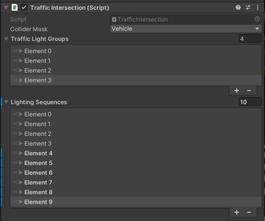
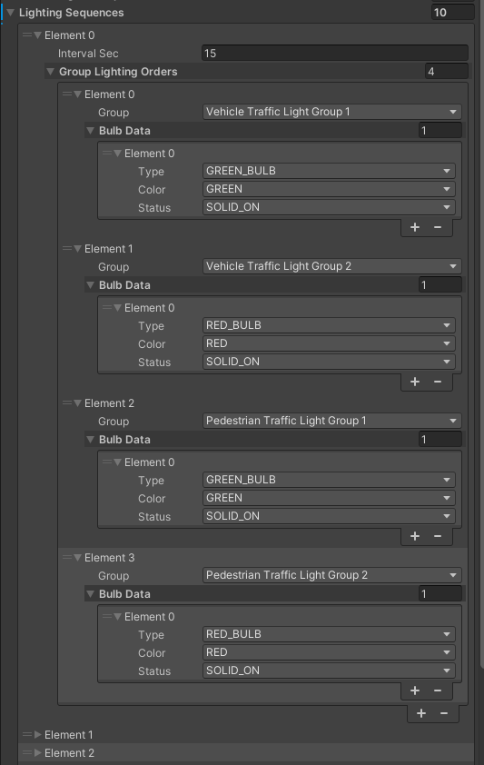
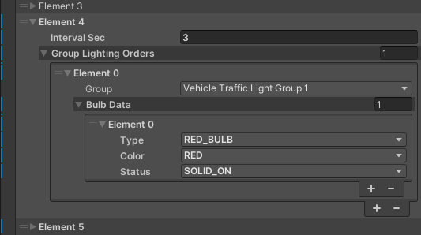
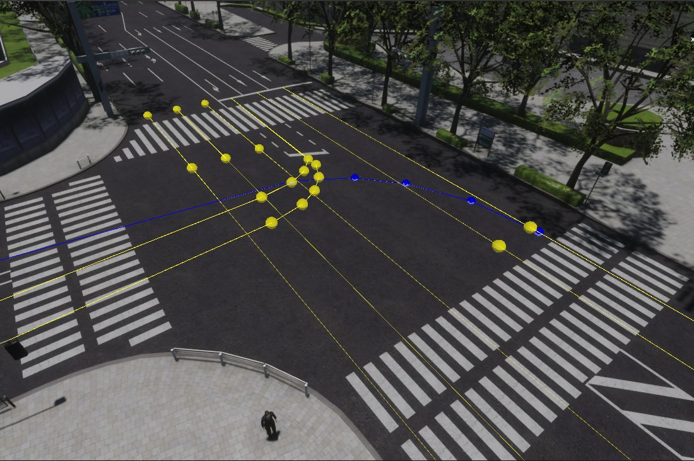
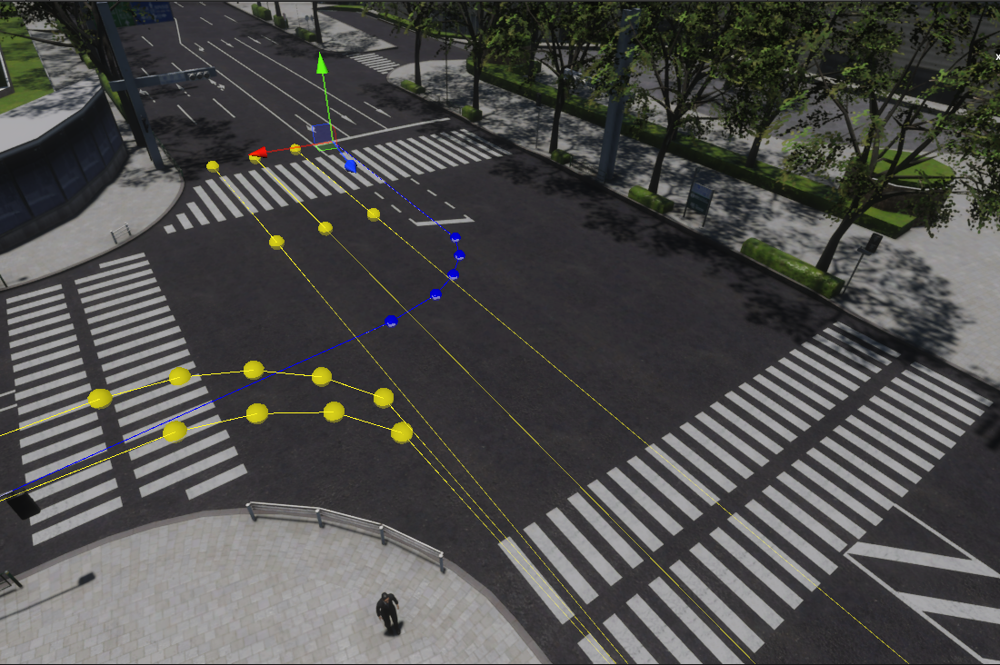
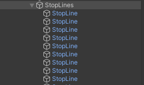
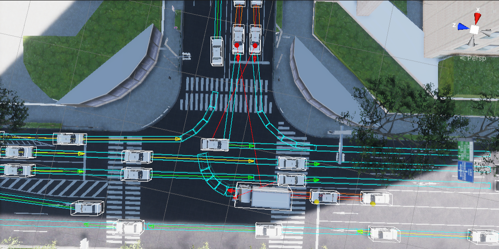

!!! warning "This section"
    This section is still under development!

This is a section that describes in detail all components related to simulated traffic in the `Environment` prefab.

The random traffic system consists of the following components:

- `TrafficSimulator` (`RandomTrafficSimulator`):  manages lifecycle of `NPCs` and simulates NPC behaviours.
- `TrafficLane`, `TrafficIntersection` and `StopLine`: represent traffic entities
- `NPCVehicle`: vehicle models (NPCs) controlled by `TrafficSimulator`

## Lanelet2
*Lanelet2* is a library created for handling a map focused on automated driving.
It also supports *ROS* and *ROS2* natively.
In *AWSIM* *Lanelet2* is used for reading and handling a map of all roads.
You may also see us referring to the actual map data file (`*.osm`) as a *Lanelet2*.

!!! info "Lanelet2 official page"
    If you want to learn more we encourage to visit the [official project page](https://github.com/fzi-forschungszentrum-informatik/Lanelet2/tree/master).

## RandomTrafficSimulator
`RandomTrafficSimulator` simulates city traffic with respect to all traffic rules. The system allows for random selection of car models and the paths they follow. It also allows adding static vehicles in the simulation.

### Link in the default Scene
The `RandomTrafficSimulator` consists of several *GameObjects*.

- `RandomTrafficSimulator` - this is an *Object* consisting of a `Traffic Manager` (script). 
    You can learn more about it [here](#traffic-intersection-script).
- `TrafficIntersections` - this is a parent *Object* for all `Traffic Lanes`. 
    You can learn more about it [here](#trafficintersections).
- `TrafficLanes` - this is a parent *Object* for all `Traffic Lanes`. 
    You can learn more about it [here](#trafficlanes).
- `StopLines` - this is a parent *Object* for all `Stop Lines`. 
    You can learn more about it [here](#stoplines).

### Components

`RandomTrafficSimulator` only has one component: *Traffic Manager* (script) which is described below.

### Traffic Manager (script)
`Traffic Manager` (script) is responsible for all of top level management of the [NPC Vehicles](../../NPCs/Vehicle/).
It does spawn NPC Vehicles on the Traffic Lanes.

If a random mode is selected then [NPC Vehicles](../../NPCs/Vehicle/) will spawn in random places (from the selected list) and drive in random directions.
To be able to reproduce the behavior of the Random Traffic Simulator a `Seed` can be specified - which is used in the pseudo-random number generation.

This script also configures all of the spawned NPC Vehicles, so that they all have common parameters

- `Acceleration` - the acceleration used by the vehicles at all times when accelerating
- `Deceleration` - the value of deceleration used in ordinary situations
- `Sudden Deceleration` - deceleration used when standard `Deceleration` is not sufficient to avoid accident
- `Absolute Deceleration` - value of deceleration used when no other deceleration allows to avoid the accident

The `Vehicle Layer Mask` and `Ground Layer Mask` are used to make sure all vehicles can correctly interact with the ground to guarantee simulation accuracy.

`Max Vehicle Count` specifies how many [NPC Vehicles](../../NPCs/Vehicle/) can be present on the scene at once.
When the number of NPC Vehicles on the scene is equal to this value the [Random Traffic Simulator](#random-traffic-simulator) stops spawning new vehicles until some existing vehicles drive away and disappear.

The `Ego Vehicle` field provides the information about Ego vehicle used for correct behavior of NPC Vehicles when interacting with Ego.

`Show Gizmos` checkbox specifies whether the [Gizmos](#gizmos) visualization should be displayed when running the simulation.

!!! note "Gizmos performance"
    Gizmos have a high computational load.
    Enabling them may cause the simulation to lag.

`Traffic Manager` (script) can operate in two modes ([Random Traffic](#random-traffic) and [Route Traffic](#route-traffic)) separately or simultaneously.

#### Random Traffic 
In the Random Traffic mode the NPC Vehicle prefabs (*NPC Prefabs*) can be chosen as well as *Spawnable Lanes*.
The later are the only Traffic Lanes on which the NPC Vehicles can spawn.
After that the NPC Vehicle takes a random route until it drives out of the map - then it is destroyed.

#### Route Traffic
In the Route Traffic mode one of the NPC Vehicle prefabs (*NPC Prefabs*) spawns on the first Route Element (`Element 0`) and then drives on the specified route.
After the first vehicle drove off the next one spawns according to the configuration.
It is **important** for all *Route* section elements to be connected an to be arranged in order of appearance on the map.
The NPC Vehicle disappears after completing the Route.

Many different *Routes* can be added and they will operate independently.

#### Parameter explanation
| Parameter                | Description                                                                                                 |
| ------------------------ | ----------------------------------------------------------------------------------------------------------- |
| **General Settings**     |                                                                                                             |
| Seed                     | Seed value for random generator                                                                             |
| Ego Vehicle              | Transform of ego vehicle                                                                                    |
| Vehicle Layer Mask       | LayerMask that masks only vehicle(NPC and ego) colliders                                                    |
| Ground Layer Mask        | LayerMask that masks only ground colliders of the map                                                       |
| Culling Distance         | Distance at which NPCs are culled relative to EgoVehicle                                                    |
| Culling Hz               | Culling operation cycle                                                                                     |
| **NPC Vehicle Settings** |                                                                                                             |
| Max Vehicle Count        | Maximum number of NPC vehicles to be spawned in simulation                                                  |
| NPC Prefabs              | Prefabs representing controlled vehicles.  They must have `NPCVehicle` component attached.              |
| Spawnable Lanes          | `TrafficLane` components where NPC vehicles can be spawned during traffic simulation                        |
| Vehicle Config           | Parameters for NPC vehicle control `Sudden Deceleration` is a deceleration related to emergency braking |
| **Debug**                |                                                                                                             |
| Show Gizmos              | Enable the checkbox to show editor gizmos that visualize behaviours of NPCs                                 |

## Traffic Light (script)
*Traffic Light* (script) is a component added to every `TrafficLight` on the scene.
It is responsible for configuring the `TrafficLight` behavior - the bulbs and their colors.

The `Renderer` filed points to the renderer that should be configured, so the `TrafficLight` renderer.

`Bulbs Emission Config` is a list describing available colors for this Traffic Light.
Every element of this list configures the following

- `Bulb Color` - the name of the configured color that will be used to reference this color
- `Color` - the actual color with which the bulb should light up
- `Intensity` - the intensity of the color
- `Exposure Weight` - how bright should the color be when lighting up

The `Bulb Material Config` is a list of available bulbs in a given Traffic Light.
Every element describes a different bulb.
Every bulb has the following aspects configured

- `Bulb Type` - the name that will be usd to reference the configured bulb
- `Material Index` - The index of a material of the configured bulb.
    This is an index of a sub-mesh of the configured bulb in the Traffic Light mesh.
    The material indices are described in detail [here](../Environment/#materials) and [here](../Environment/#materials_1).

## TrafficIntersections
`TrafficIntersection` is a representation of a road intersection.
It consists of several components.
`TrafficIntersection` is used in the `Scene` for managing `TrafficLights`.
All Traffic Lights present on one Traffic Intersection must be synchronized and that is why the logic of `TrafficLight` operation is included in the `Traffic Intersection`.

### Link in the default Scene
Every `TrafficIntersection` has its own *GameObject* and is added as a child of the aggregate `TrafficIntersections` *Object*.
`Traffic Intersections` are an element of an `Environment`, so they should be placed as children of an appropriate `Environment` *Object*.

### Components
`TrafficIntersection` has the following components:

- *Box Collider* - marks the area of the Traffic Intersection, it should cover the whole intersection area
- *Traffic Intersection* (script) - controls all Traffic Lights on the given intersection according to the configuration

### Collider
Every `TrafficIntersection` contains a *Box Collider* element.
It needs to accurately cover the whole area of the `TrafficIntersection`.
*Box Collider* - together with the [*Traffic Intersection* (script)](#traffic-intersection-script) - is used for detecting vehicles entering the `TrafficIntersection`.

### Traffic Intersection (script)
*Traffic Intersection* (script) is used for controlling all `TrafficLights` on a given intersection.
The `Collider Mask` field is a mask on which all Vehicle Colliders are present.
It - together with Box Collider - is used for keeping track of how many Vehicles are currently present on the Traffic Intersection.
The [`Traffic Light Groups`](#traffic-lights-groups) and [`Lighting Sequences`](#lighting-sequences) are described below.

#### Traffic Light Groups
`Traffic Light Group` is a collection of all `Traffic Lights` that are in the same state at all times.
This includes all redundant `Traffic Lights` shining in one direction as well as the ones in the opposite direction - in the case they should indicate exactly the same thing.
This grouping simplifies the creation of [`Lighting Sequences`](#lighting-sequences).

#### Lighting Sequences
`Lighting Sequences` is the field in which the whole intersection `Traffic Lights` logic is defined.
It consists of different *Elements*.
Each *Element* is a collection of *Orders* that should take an effect for the period of time specified in the `Interval Sec` field.
`Lighting Sequences` *Elements* are executed sequentially, in order of definition and looped  - after the last element sequence goes back to the first element.

The `Group Lighting Orders` field defines which [`Traffic Light Groups`](#traffic-light-groups) should change their state and how.
For every `Group Lighting Orders` *Element* the [`Traffic Lights Group`](#traffic-light-groups) is specified with the exact description of the goal state for all Traffic Lights in that group - which bulb should light up and with what color.

One `Lighting Sequences` *Element* has many `Group Lighting Orders`, which means that for one period of time many different orders can be given.
E.g. when `Traffic Lights` in one direction change color to green - `Traffic Lights` in the parallel direction change color to red.

!!! info "Traffic Light state persistance"
    If in a given `Lighting Sequences` *Element* no order is given to some [Traffic Light Group](#traffic-light-groups) - this Group will keep its current state into the next `Lighting Sequences` *Element*.

??? info "Lighting Sequence Sample - details"
    <table>
        <tr>
            <td>Description</td>
            <td>Editor</td>
        </tr>
        <tr>
            <td>
                Traffic Lights in Pedestrian Group 1 change color to flashing green.  
                Other Groups keep their current state.  
                This state lasts for 5 seconds.
            </td>
            <td></td>
        </tr>
        <tr>
            <td>
                Traffic Lights in Pedestrian Group 1 change color to solid red.  
                Other Groups keep their current state.  
                This state lasts for 1 second.
            </td>
            <td></td>
        </tr>
        <tr>
            <td>
                Traffic Lights in Vehicle Group 1 change color to solid yellow.  
                Other Groups keep their current state.  
                This state lasts for 5 seconds.
            </td>
            <td></td>
        </tr>
        <tr>
            <td>
                Traffic Lights in Vehicle Group 1 change color to solid red.  
                Other Groups keep their current state.  
                This state lasts for 3 seconds.
            </td>
            <td></td>
        </tr>
        <tr>
            <td>
                Traffic Lights in Vehicle Group 2 change color to solid green.  
                Traffic Lights in Pedestrian Group 2 change color to solid green.  
                Other Groups keep their current state.  
                This state lasts for 15 seconds.
            </td>
            <td></td>
        </tr>
        <tr>
            <td>
                Traffic Lights in Pedestrian Group 2 change color to flashing green.  
                Other Groups keep their current state.  
                This state lasts for 5 seconds.
            </td>
            <td></td>
        </tr>
        <tr>
            <td>
                Traffic Lights in Pedestrian Group 2 change color to solid red.  
                Other Groups keep their current state.  
                This state lasts for 1 second.
            </td>
            <td></td>
        </tr>
        <tr>
            <td>
                Traffic Lights in Vehicle Group 2 change color to solid yellow.  
                Other Groups keep their current state.  
                This state lasts for 5 seconds.
            </td>
            <td></td>
        </tr>
        <tr>
            <td>
                Traffic Lights in Vehicle Group 2 change color to solid red.  
                Other Groups keep their current state.  
                This state lasts for 3 second.  
                Sequence **loops back** to the first element of the list.
            </td>
            <td></td>
        </tr>
    </table>

## TrafficLanes
`TrafficLane` is a representation of a short road segment.
It consists of several waypoints that are connected by straight lines.
`TrafficLanes` are used as a base for a [Random Traffic Simulator](#random-traffic-simulator).
They allow [`NPC Vehicles`](../../NPCs/Vehicle/) to drive on the specific lanes on the road, perform different maneuvers with respect to the traffic rules.

### Link in the default Scene
Every `Traffic Lane` has its own *GameObject* and is added as a child of the aggregate `TrafficLanes` *Object*.
`Traffic Lanes` are an element of an `Environment`, so they should be placed as children of an appropriate `Environment` *Object*.

`Traffic Lanes` can be imported from the [*lanelet2*](#lanelet2) `*.osm` file.

### Components
`TrafficLane` consists of an *Object* containing [*Traffic Lane* (script)](#traffic-lane-script).

Traffic Lane has a transformation property as every *Object* in Unity, but it is not used.
All details are configured in the `Traffic Lane` (script), the information in *Object* transformation is ignored.

### Traffic Lane (script)
`Traffic Lane` (script) defines the `Traffic Lane` structure.
The `Waypoints` field is an ordered list of points that - when connected with straight lines - create a `Traffic Lane`.

!!! note "Traffic Lane (script) coordinate system"
    `Waypoints` are defined in the `Environment` coordinate system, the transformation of *GameObject* is ignored.

`Turn Direction` field contains information on what is the direction of this `Traffic Lane` - whether it is a right or left turn or straight road.

Traffic lanes are connected using `Next Lanes` and `Prev Lanes` fields.
This way individual `Traffic Lanes` can create a connected road network.
One Traffic Lane can have many `Next Lanes` and `Prev Lanes`.
This represents the situation of multiple lanes connecting to one or one lane splitting into many - e.g. the possibility to turn and to drive straight.

[Right Of Way Lanes](#right-of-way-lanes) are described below.

Every `Traffic Lane` has to have a `Stop Line` field configured when the [Stop Line](#stoplines) is present on the end of the `Traffic Lane`.
Additionally the `Speed Limit` field contains the highest allowed speed on given `Traffic Lane`.

#### Right Of Way Lanes
`Right Of Way Lanes` is a collection of `Traffic Lanes`.
Vehicle moving on the given `Traffic Lane` has to give way to all vehicles moving on every Right Of Way Lane.
It is determined based on basic traffic rules.
Setting `Right Of Way Lanes` allows [`Random Traffic Simulator`](#random-traffic-simulator) to manage all [`NPC Vehicles`](../../NPCs/Vehicle/) so they follow traffic rules and drive safely.

In the *Unity* editor - when a `Traffic Lane` is selected - aside from the selected `Traffic Lane` highlighted in blue, all `Right Of Way Lanes` are highlighted in yellow.

!!! example "Right Of Way Lanes Sample - details"
    The selected `TrafficLane` (blue) is a right turn on an intersection.
    This means, that before turning right the vehicle must give way to all vehicles driving from ahead - the ones driving straight as well as the ones turning left.
    This can be observed as `TrafficLanes` highlighted in yellow.

    

## StopLines
`StopLine` is a representation of a place on the road where vehicles giving way to other vehicles should stop and wait.
They allow [`Random Traffic Simulator`](#random-traffic-simulator) to manage [`NPC Vehicles`](../../NPCs/Vehicle/) in safe and correct way - according to the traffic rules.

###  Link in the default Scene
Every `StopLine` has its own *GameObject* and is added as a child of the aggregate `StopLines` *Object*.
Stop Lines are an element of an `Environment`, so they should be placed as children of an appropriate `Environment` *Object*.

### Components
`StopLine` consists of an *Object* containing [*Stop Line* (script)](#stop-line-script).

`StopLine` has a transformation property as every *Object* in *Unity*, but it is not used.
All details are configured in the *Traffic Lane *(script), the information in *Object* transformation is ignored.

### Stop Line (script)
*Stop Line* (script) defines `StopLine` configuration.
The `Points` field is an ordered list of points that - when connected - create a `StopLine`.
The list of points should always have two elements that create a straight `StopLine`.

!!! note "Stop Line (script) coordinate system"
    `Points` are defined in the Environment coordinate system, the transformation of *GameObject* is ignored.

The `Has Stop Sign` field contains information whether the configured `StopLine` has a corresponding `StopSign` on the scene.

Every Stop Line needs to have a `Traffic Light` field configured with the corresponding [`Traffic Light`](../Environment/#trafficlights).
This information allows the [`Random Traffic Simulator`](#random-traffic-simulator) to manage the [`NPC Vehicles`](../../NPCs/Vehicle/) in such a way that they respect the Traffic Lights and behave on the [`Traffic Intersections`](#trafficintersections) correctly.

## Gizmos
*Gizmos* are a simulation-time visualization showing current and short-time future moves of the [`NPCVehicles`](../../NPCs/Vehicle/).
They are useful for checking current behavior of NPCs and its causes.

*Gizmos* have a high computational load so please disable them if the simulation is laggy.

<!-- 
!!! node "Draft note"
    (description of what it is and how spawned NPCs behave in the environment)

    - Architecture description [30% current] (**graph**)
    - Seed, Spawnable Lanes, Max Vehicle Count, Spawning process (description, **gif**: example of spawning on a specific line)
    - Vehicle Prefabs (**screens** - examples of vehicles and the impact of boundaries)
    - Vehicle and Ground Layer masks (impact on spawning and behavior)
    - Vehicle Config (an explanation of each and a reference to SpeedMode)
    - Simulator steps (cognition, decision, control -> SpeedMode and Yielding states, **graph**)
    - Yielding process (stop lines, **gifs**)
    - Visualization description (**screens**: yielding, SpeedMode)

    **TrafficIntersection**

    (description of what it is and where it occurs in the environment, **screen**)

    - Traffic Lights (description, bulbs, dependence of the location on the lanelet, impact on the recognition of traffic lights in Autoware, **screens**)
    - Traffic Intersection (script)
        - Collider Mask (probably out of date)
        - Traffic Light Groups (what they are and the result of adding traffic lights to them)
        - Lighting Sequences (description, how it works - **gifs**)

    **StopLine**

    (description of what it is and where it occurs in the environment **screen**, impact on Random Traffic)

    - Stop Line (script)
        - Points
        - Stop sign (why this association occurs)
        - Traffic light (why this association occurs)

    **TrafficLane**

    (description of what it is and where it occurs in the environment **screen**, impact on Random Traffic)

    - Traffic Lane (script)
        - Waypoints (**screen**)
        - Turn Direction (**screens**)
        - Next and Prev Lanes (**screens**)
        - Right of Way Lanes (**gifs**: a few examples with explanations regarding to Random Traffic)
        - Stop Line (**screen**)
        - Speed Limit -->

