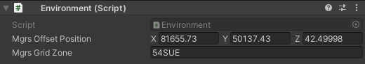

!!! draft-note
    (prefab location, description of what it is, hyperlinks to tutorials)

    - Environment files (lanelet, pointcloud, fbx)
    - Scene
        - Layers (what they are and where they are used - collisions, **screens**)
        - Environment Script (MGRS, **screen** - example of transform AWSIM world -> MGRS)
        - Models SJK* (roads, buildings, greenery, signs, road markings… - **gifs/sceens**: provide some examples, mention the impact on self-localization)
        - Traffic Lights (mention the script and traffic light recognition **screen**)
        - Scene Manager Script (hyperlink)

An environment is a very important part of simulated world in AWSIM.
It consists of almost every part of simulated surrounding world.

### Layers
<!-- TODO -->
### Environment Script
An Environment Script is a very important Script.
It allows you to specify the location of the environment in reference to the world.

Environment Script contains the information about how a simulated Environment is positioned in real world.
That means it describes what is the real world position of a simulated Environment.

AWSIM uses part of a [Military Grid Reference System][mgrs].
For the sake of understanding this topic you only need to know, that using MGRS you can specify distinct parts of the globe with different accuracy.
For AWSIM the chosen accuracy is a 100x100 km square.
Such a square is identified with a unique code like `4QFJ` (for more information on *Grid Zone* please see [this page][mgrs]).

Inside this *Grid Zone* the exact location is specified with the **offset** calculated from the bottom-left corner of the *Grid Zone*.

You can interpret the *Grid Zone* as a local coordinate system in which you position the Environment.

!!! info
    The Environment Script information is necessary at the moment of loading data from *lanelet2*.

    Internally it shifts the elements from *lanelet2* by the given offset so that they align with the Environment that is located at the local origin with no offset.

!!! example
    In the Nishinshinjuku the simulated Environment is positioned in the *Grid Zone* `54SUE`.

    The offset if equal to `81655.73`m in the X axis, `50137.43`m in the Y axis and `42.49998`m in the Z axis.

    

    This means that the 3D models were created in reference to this exact point and because of that the 3D models of Environment align perfectly with the data from *lanelet2*.

[mgrs]: https://en.wikipedia.org/wiki/Military_Grid_Reference_System

### Models SJK
<!-- TODO -->
### Traffic Lights
<!-- TODO -->
### Scene Manager Script
<!-- TODO -->
