# Scene
In *Unity*, a scene refers to a self-contained environment where *GameObjects* (prefabs) and assets are placed and organized.
In addition, the scene contains objects that provide configurations for scene appearance, gameplay area or user interface.

In the *AWSIM* project, the default scene is `AutowareSimulation` - it's the base on which the [demo](../../../Installation/RunDemo/) is built.

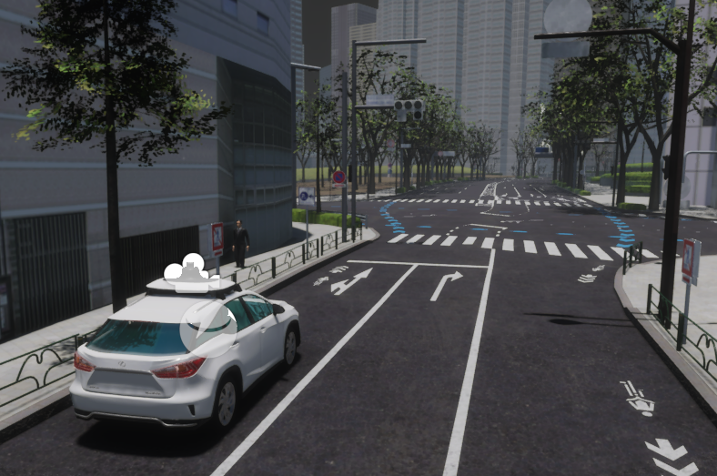

Scene asset can be found under the following path:

```
Assets/AWSIM/Scenes/Main/AutowareSimulation.unity
```

`AutowareSimulation` scene has the following content:

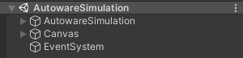

As you can see, it consists of 2 parents for *GameObjects*: 

- `AutowareSimulation` - aggregating all objects on the scene, those of the environment, vehicles and others,
-  `Canvas` - aggregating all user interface (*UI*) elements in the scene, 
  
and 1 single GameObject: 

- `EventSystem` - which manage input events and interactions with *UI* elements in the scene.
  
All objects are described in the sections below.

## AutowareSimulation


`AutowareSimulation` is an object that contains objects strictly related to the simulation - `Environment`, `EgoVehicle`, the time of the simulation or the camera to follow the `EgoVehicle`.

It contains the following content:

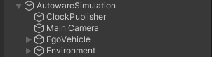

Each of these elements is described below in this section.

`AutowareSimulation` contains only one component - *Scene Manager* script.
It is extremely important in case of using the [`RGL`](../../ExternalLibraries/RGLUnityPlugin/) library in *AWSIM*.

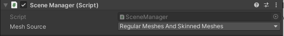

More about this component can be found [here](../../ExternalLibraries/RGLUnityPlugin/#scenemanager).

### ClockPublisher
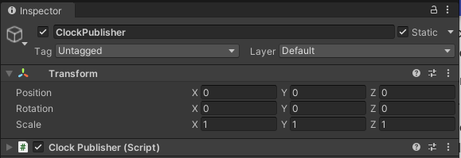

`ClockPublisher` is the object that is responsible for providing the simulation time (from *AWSIM*) for *Autoware*.
It contains an *ClockPublisher* script that reads the current simulation time and publishes it on topic `/clock` in *ROS2*.

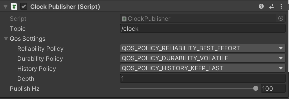

The default publish frequency is set to `100Hz` and `QoS` to `BestEffort`, `Volatile`, `KeepLast/1`.
More about this script and communication with *ROS2* you can read [here](../../ExternalLibraries/Ros2Unity/).

### MainCamera
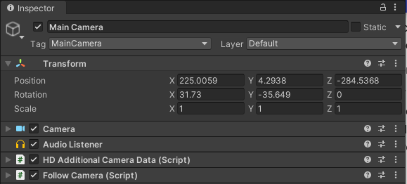

`MainCamera` is an object that contains the main camera in the scene which gives the user a third-person view of `EgoVehicle` as it moves through the environment.

The components added to this object are:

- [*Camera component*](https://docs.unity3d.com/Manual/class-Camera.html) - the basic component that ensures the functionality of the camera as a device in *Unity* that capture and display the world to the player.
- [*HDAdditionalCameraData* (script)](https://docs.unity3d.com/Packages/com.unity.render-pipelines.high-definition@13.1/api/UnityEngine.Rendering.HighDefinition.HDAdditionalCameraData.html) - additional component that holds [*HDRP*](https://docs.unity3d.com/Packages/com.unity.render-pipelines.high-definition@16.0/manual/index.html) specific parameters for camera.
This Component should be added automatically together with [*Camera component*](https://docs.unity3d.com/Manual/class-Camera.html).
- [*Audio Listener*](https://docs.unity3d.com/Manual/class-AudioListener.html) - it receives input from any given [*Audio Source*](https://docs.unity3d.com/Manual/class-AudioSource.html) in the scene and plays sounds through the computer speakers.
- *Follow Camera* (script) - a script to ensure that the [*Camera component*](https://docs.unity3d.com/Manual/class-Camera.html) follows the moving `EgoVehicle`

#### Follow Camera (script) - configurable elements
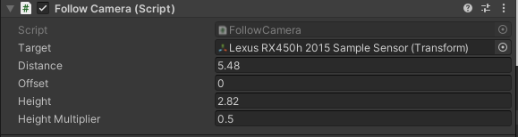

- `Target` - the object that the camera follows, usually it is `EvoVehicle` (default: `None`).
- `Distance` - the distance the camera is supposed to keep from the `Target` (default: `10`).
- `Offset` - it is an offset that moves the camera to the left or right side of the `Target`, entering a positive value provides a view from the left side - for a value of `0` the camera is directly behind the `Target` (default: `0.0`).
- `Height` - it is the height the camera is supposed to keep above the `Target` (default: `5.0`).
- `Height Multiplier` - it is an offset that ensures that the camera does not look centrally at the vehicle, and rotates the camera at the view in front of it (default: `0.5`).

### EgoVehicle
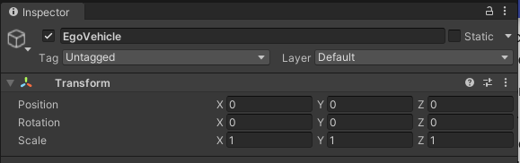

It is an object in which a prefab `EgoVehicle` is always added - as you can see, there is no transform here.
You can read more about `EgoVehicle` [here](../EgoVehicle/EgoVehicle/).

### Environment


It is an object in which a prefab `Environment` is always added - as you can see, there is no transform here.
You can read more about `Environment` [here](../Environment/Environment/).

## Canvas
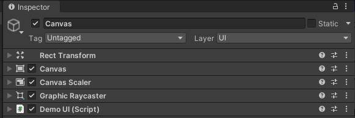

`Canvas` is a component that serves as a container for all *UI* elements in the scene.
It acts as a 2D plane on which *UI* elements such as buttons, text, images, and panels are placed and arranged.
The canvas provides a way to control the rendering order and positioning in screen space of these *UI* elements in application.
It contains the following components:

- [*RectTransform*](https://docs.unity3d.com/Packages/com.unity.ugui@1.0/manual/class-RectTransform.html) - defines the position, size, and anchoring of a *UI* element within the Canvas.
- [*Canvas*](https://docs.unity3d.com/Packages/com.unity.ugui@1.0/manual/class-Canvas.html) - provides a rendering surface for *UI* elements to be displayed on.
- [*Canvas Scaler*](https://docs.unity3d.com/Packages/com.unity.ugui@1.0/manual/script-CanvasScaler.html) - controls how the *UI* elements within the *Canvas* are scaled to fit different screen resolutions and aspect ratios.
- [*GraphicRaycaster*](https://docs.unity3d.com/Packages/com.unity.ugui@1.0/manual/script-GraphicRaycaster.html) - enables *UI* elements within the *Canvas* to respond to raycast-based interactions, such as mouse clicks.

- *Demo UI* (script) - it provides the ability to set the demo version display and control the time scale.

`Canvas` object has the following content:

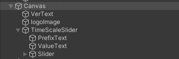

Where

- `VerText` is responsible for displaying *AWSIM* version
- `logoImage` for displaying the logo
- and `TimeScaleSlider` for providing the ability to configure the simulation timescale.

Moreover, `TimeScaleSlider` has a `Slider` object in it, which is a key *UI* element as it provides value to the *Demo UI* (script).

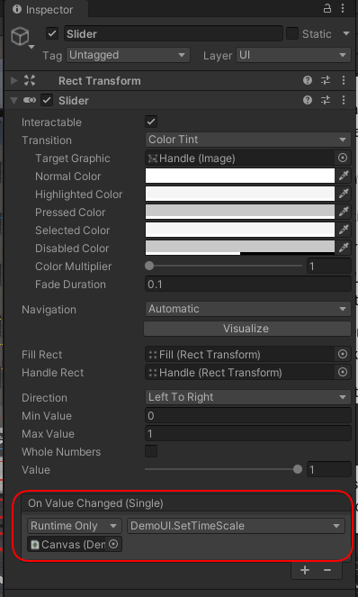

*Demo UI* is a script that provides a link between the value of the `Slider` object and the configured value of the time scale in the simulation.
In addition, it enters the current version of the application into the `VerText` object, which displays it on the screen.
For this reason, it contains references to all these elements:

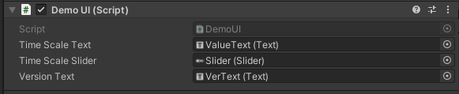

## EventSystem

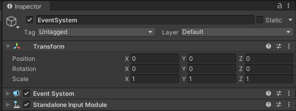

`EventSystem` is an object that contains components responsible for interactions between the user and the objects of the application:

- [*EventSystem*](https://docs.unity3d.com/2021.3/Documentation/Manual/EventSystem.html) - is responsible for managing and dispatching input events to the appropriate *GameObjects* in the scene.
It acts as a centralized hub that receives input from various sources, such as keyboard or mouse, and delivers the events to the appropriate *GameObjects* that have registered to receive them.

- [*StandaloneInputModule*](https://docs.unity3d.com/2018.2/Documentation/ScriptReference/EventSystems.StandaloneInputModule.html) - provides input handling for standalone platforms using keyboard and mouse.
It works in conjunction with the EventSystem to convert input from the keyboard and mouse into events that can be processed by *GameObjects* in the scene.
