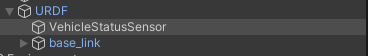
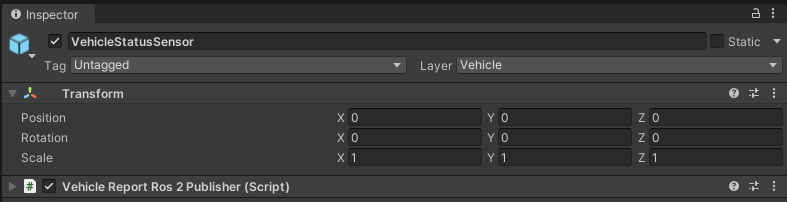

# Vehicle Status Sensor
*VehicleStatusSensor* is a sensor that is designed to aggregate information about the current state of the vehicle. This sensor is added to the *Ego* prefab, just like the other sensors, in the [*URDF*](https://docs.ros.org/en/humble/Tutorials/Intermediate/URDF/URDF-Main.html) object.

*VehicleStatusSensor* aggregates information about:

- *Control mode* - currently active control mode, e.g. `AUTONOMOUS` or `MANUAL`.
- *Gear status* - currently engaged gearbox gear, e.g. `DRIVE` or `REVERSE`.
- *Steering status* - current angle of the steering tire in radians left, e.g. `0.1745` (10&deg;).
- *Turn indicators status* - current status of the direction indicators, e.g. `DISABLE` or `ENABLE_LEFT`.
- *Hazard lights status* - current status of the hazard lights, e.g. `DISABLE` or `ENABLE`.
- *Velocity status* - current lateral, longitudinal and heeding velocities values, e.g `{0.2, 0.0, 0.0}`.

The information is updated with every frame, however, the publication frequency in *ROS2* is configurable from the *Unity Editor*. *VehicleStuckSensor* doesn't have it's own prefab, just a `VehicleReportRos2Publisher` script that does all the work.

## VehicleReportRos2Publisher Script
The *VehicleReportRos2Publisher* object has an `VehicleReportRos2Publisher` script as a component.
The script is located in the `AWSIM/Scripts/Sensors` folder of the *AWISM* git repository.

The default configuration of the script is shown in the image below:

An important element of the script configuration that should be remembered is to specify the scene object (`Vehicle`) about which the data will be aggregated - the appropriate `Ego` object should be selected.

The script is responsible for publishing each of the aggregated data on a separate topic. Therefore, it has 6 publishers publishing the appropriate type of message with a constant frequency - one common for all data, default set to `30Hz`.

In addition, the [`VehicleReport`](https://github.com/tier4/autoware_auto_msgs/blob/tier4/main/autoware_auto_vehicle_msgs/msg/VelocityReport.idl) message type includes the [`Header`](https://docs.ros2.org/latest/api/std_msgs/msg/Header.html) type, which requires `frame_id` - by default it is assumed as `base_line`. `QoS` profile is assumed as [`"system_default"`](https://docs.ros.org/en/humble/Concepts/About-Quality-of-Service-Settings.html) (`Reliable`, `Volatile`, `Keep last/1`).

### Published topics
The table below summarizes the topics and message types of published data

|         Category         | Topic                                    | Message type                                                                                                                                                             | `frame_id`  |
| :----------------------: | :--------------------------------------- | :----------------------------------------------------------------------------------------------------------------------------------------------------------------------- | :---------: |
|      *Control mode*      | `/vehicle/status/control_mode`           | [`autoware_auto_vehicle_msgs/ControlModeReport`](https://github.com/tier4/autoware_auto_msgs/blob/tier4/main/autoware_auto_vehicle_msgs/msg/ControlModeReport.idl)       |      -      |
|      *Gear status*       | `/vehicle/status/gear_status`            | [`autoware_auto_vehicle_msgs/GearReport` ](https://github.com/tier4/autoware_auto_msgs/blob/tier4/main/autoware_auto_vehicle_msgs/msg/GearReport.idl)                    |      -      |
|    *Steering status*     | `/vehicle/status/steering_status`        | [`autoware_auto_vehicle_msgs/SteeringReport`](https://github.com/tier4/autoware_auto_msgs/blob/tier4/main/autoware_auto_vehicle_msgs/msg/SteeringReport.idl)             |      -      |
| *Turn indicators status* | `/vehicle/status/turn_indicators_status` | [`autoware_auto_vehicle_msgs/TurnIndicatorsReport`](https://github.com/tier4/autoware_auto_msgs/blob/tier4/main/autoware_auto_vehicle_msgs/msg/TurnIndicatorsReport.idl) |      -      |
|  *Hazard lights status*  | `/vehicle/status/hazard_lights_status`   | [`autoware_auto_vehicle_msgs/HazardLightsReport`](https://github.com/tier4/autoware_auto_msgs/blob/tier4/main/autoware_auto_vehicle_msgs/msg/HazardLightsReport.idl)     |      -      |
|    *Velocity status*     | `/vehicle/status/velocity_status`        | [`autoware_auto_vehicle_msgs/VehicleReport`](https://github.com/tier4/autoware_auto_msgs/blob/tier4/main/autoware_auto_vehicle_msgs/msg/VelocityReport.idl)              | `base_line` |

