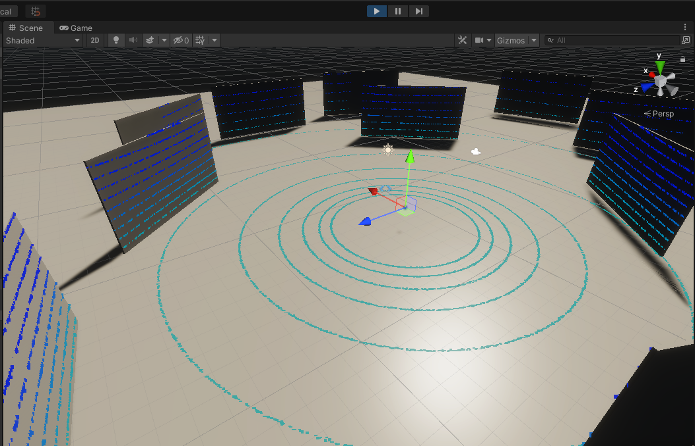

**VehicleStatusSensor**
<!-- TODO everything about this sensor -->

(prefab location, purpose of existence, link, **screen**)

- Vehicle Report Ros Publisher Script (inputs, outputs, topics, frame_id, qos)

**RobotecGPULidars [70% current]**
<!-- TODO copied old, needs to be adjusted (70%) -->

(prefab location, purpose of existence, RGL repository - hyperlink)

- Note: to use RobotecGPULidar, the scene must have Scene Manager Script (hyperlink)
- Lidar Sensor Script
    - Available models (prefabs location, description of differences)
    - Parameters (min/max h angle, max range, horizontal steps)
    - Noise (type and params)
    - Laser array configuration
    - Output (Pcl24 vs Pcl48)
- Rgl Lidar Ros Publisher Script (topics, frame_id, qos)
- Point Cloud Visualization Script (points, colors, limits)

## Lidar Sensor
AWSIM uses Robotec GPU Lidar, which is a cross-platform (Windows and Linux), RTX-accelerated, CUDA/C++ library developed by [Robotec.AI](https://robotec.ai/). For more information about RGL library, visit [its repository](https://github.com/RobotecAI/RobotecGPULidar).

AWSIM is integrated with RGL out-of-the-box - using RGLUnityPlugin Asset.


### ROS2 configuration

The following sections describe RGL configuration in AWSIM.
#### Published Topics
The table below shows topics published by `RglLidarPublisher` script.

|topic|msg|frame_id|hz|QoS|
|:--|:--|:--|:--|:--|
|`/lidar/pointcloud`|`sensor_msgs/PointCloud2`|`world`|`10`|`Reliable`, `Volatile`, `Keep last/1`|
|`/lidar/pointcloud_ex`|`sensor_msgs/PointCloud2 `|`world`|`10`|`Reliable`, `Volatile`, `Keep last/1`|

#### Output Data


The following table describes `LidarSensor.OutputData` struct used in Unity:

|field|type|feature|
|:--|:--|:--|
|hitCount|int|Number of rays that hit any object|
|hits|Vector3 [ ]|Vertices for visualization in Unity's coordinate system|
|rosPCL24|byte [ ]|Vertices for publishing Autoware format pointcloud in ROS coordinate system|
|rosPCL48|byte [ ]|Vertices for publishing extended Autoware format pointcloud in ROS coordinate system|

### Minimal scene example

The scene `Assets/AWSIM/Scenes/Samples/LidarSceneDevelop.unity` can be used as a complete, minimalistic example of how to setup RGL. It contains `RGLSceneManager` component, four lidars, and an environment composed of floor and walls.


### RGLSceneManager

Each scene needs `RGLSceneManager` component to synchronize models between Unity and RGL. On every frame, it detects changes in the Unity's scene  and propagates the changes to native RGL code. Three different strategies to interact with in-simulation 3D models are implemented. `RGLSceneManager` uses executes one of the following policies to obtain raycast hit:

- `Only Colliders` - active colliders only,
- `Regular Meshes And Colliders Instead Of Skinned` - mesh for non-skinned MeshRenderers or set of colliders (if provided) attached to the rootBone and below for SkinnedMeshRenderers,
- `RegularMeshesAndSkinnedMeshes` - mesh for both MeshRenderer and SkinnedMeshRenderer.

Mesh source can be changed in the Scene Manager (Script) properties:


*Note: RGLSceneManager performance depends on mesh source option selected.*

#### Setup instruction

To configure RGL for new scenes, please:

1. Create an empty object (name it RGLSceneManager).
2. Attach script `SceneManager.cs` to the RGLSceneManager object.

### Lidar models

Lidar prefabs typically consist of three scripts:

- `LidarSensor` - provides lidar configuration and performs native RGL raytrace calls
- `PointCloudVisualization` - visualizes point cloud collected by sensor
- `RglLidarPublisher` - converts the data output from LidarSensor to ROS2 msg and publishes it

To use one of the prepared prefab lidars, drag the prefab file and drop it into a scene:


A lidar GameObject should be instantiated automatically:


Next, you can modify scripts parameters in Unity Inspector:

In `LidarSensor` script, the following configuration can be changed:

- `Automatic Capture Hz` - the rate of sensor processing
- `Model Preset` - allows selecting one of the built-in LiDAR models
- `Apply Gaussian Noise` - enable/disable gaussian noise
- `Configuration` - advanced lidar configuration (in most cases no need to change)
    - `Laser Array` - geometry description of lidar array
    - `Horizontal Steps` - the number of laser array firings between `Min H Angle` and `Max H Angle`
    - `Min H Angle` - minimum horizontal angle (left)
    - `Max H Angle` - maximum horizontal angle (right)
    - `Max Range` - maximum range of the sensor
    - `Noise Params` - lidar noise paramteres


In the script `Point Cloud Visualization` the material of points can be changed. If material is `None` then `PointCloudMaterial` from `Assets/RGLUnityPlugin/Resources` will be automatically loaded. You can disable visualization by deactivating the component.


`Point Cloud Visualization` preview:



In the last script - `RglLidarPublisher` - ROS properties such as topics names, frame IDs, publish activation or QoS settings can be modified:


#### Adding new lidar models

To add a new lidar model, perform the following steps:

1. Add its name to the `LidarModels.cs`
2. If the Lidar has a non-uniform laser array construction (e.g. different linear/angular spacing between lasers), add an entry to the `LaserArrayLibrary`.
3. Add an entry to `LidarConfigurationLibrary`. Use the provided laser array or generate a uniform one using static method `LaserArray.Uniform()`.
4. Done. New lidar preset should be available via Unity Inspector.

#### Creating Lidar GameObject

To create GameObject (or prefab) containing lidar sensor, please perform the following steps:

1. Create an empty object
2. Attach script `LidarSensor.cs`.
3. `PointCloudVisualization.cs` will be added automatically, however, you can disable it.
4. Now you can add a callback from another script to receive a notification when data is ready:
   ```cs
   lidarSensor = GetComponent<LidarSensor>();
   lidarSensor.OnOutputData += HandleLidarDataMethod;
   ```
5. For publishing point cloud via ROS2 attach script `RglLidarPublisher.cs`

##### Prefabs

The list of available prefabs can be found below.

|LiDAR|Path|
|:--|:--|
|HESAI Pandar40P|`Assets/AWSIM/Prefabs/Sensors/RobotecGPULidars/HesaiPandar40P.prefab`|
|HESAI PandarQT64|`Assets/AWSIM/Prefabs/Sensors/RobotecGPULidars/HesaiPandarQT64.prefab`|
|Ouster OS1-64|`Assets/AWSIM/Prefabs/Sensors/RobotecGPULidars/OusterOS1-64.prefab`|
|Velodyne VLP-16|`Assets/AWSIM/Prefabs/Sensors/RobotecGPULidars/VelodyneVLP16.prefab`|
|Velodyne VLC-32C|`Assets/AWSIM/Prefabs/Sensors/RobotecGPULidars/VelodyneVLP32C.prefab`|
|Velodyne VLS-128-AP|`Assets/AWSIM/Prefabs/Sensors/RobotecGPULidars/VelodyneVLS128.prefab`|

### Usage requirements
Objects, to be detectable by Robotec GPU lidar, must fulfill the following requirements:

1. Contain one of the components: `Collider`, `Mesh Renderer`, or `Skinned Mesh Renderer`. It depends on RGLSceneManager mesh source parameter.
2. Be readable from CPU-accessible memory. It can be achieved using the “Read/Write Enabled” checkbox in mesh settings. *Note: Primitive Objects are readable by default.*


### RGL Unity side scripts

The following table describes the most essential lidar simulation scripts:

|script|feature|path|
|:--|:--|:--|
|SceneManager.cs|Synchronize the scene between Unity and RGL.|`Assets/RGLUnityPlugin/Scripts/SceneManager.cs`|
|LidarSensor.cs|Lidar Sensor. Provide lidar configuration and collect point cloud.|`Assets/RGLUnityPlugin/Scripts/LidarSensor.cs`|
|PointCloudVisualization.cs|Visualize point cloud collected by lidar.|`Assets/RGLUnityPlugin/Scripts/PointCloudVisualization.cs`|
|RglLidarPublisher.cs|Convert the data output from LidarSensor to ROS2 msg and publish.|`Assets/AWSIM/Scripts/Sensors/LiDAR/RglLidarPublisher.cs`|


**IMUSensor [50% current]**
<!-- TODO copied old, needs to be adjusted (50%) -->

(prefab location, purpose of existence, link, **screen**)

- Imu Sensor Script (gravity, output)
- Imu Ros Publisher Script (topics, frame_id, qos)

## IMU Sensor

The document describes inertial measurement unit sensor simulation component.

### Prefabs
Path : `Assets\AWSIM\Prefabs\Sensors\IMUSensor.prefab`

### Scripts

All the most important scripts can be found under the `Assets\AWSIM\Scripts\Sensors\Imu\*`

The table below describes features contained in each provided script:

|script|feature|
|:--|:--|
|ImuSensor.cs|Core Inertial Measurement Unit Sensor.<br>Measures the Acceleration(m/s^2) and AngularVelocity(rad/s) based on the Transform of the GameObject to which this component is attached to.|
|ImuRos2Publisher.cs|Converts the data output from ImuSensor-specific struct to ROS2 message and publishes it.|

### Output Data

The following table describes `ImuSensor.OutputData` properties:

|field|type|feature|
|:--|:--|:--|
|LinearAcceleration|Vector3|Measured acceleration (m/s^2)|
|AungularVelocity|Vector3|Measured angular velocity (rad/s)|

### Published Topics

The data output is published to the following topics:

|topic|msg|frame_id|hz|QoS|
|:--|:--|:--|:--|:--|
|`/sensing/imu/tamagawa/imu_raw`|`sensor_msgs/Imu`|`tamagawa/imu_link`|`30`|`Reliable`, `Volatile`, `Keep last/1000`|

**GnssSensor [50% current]**
<!-- TODO copied old, needs to be adjusted (50%) -->

(prefab location, purpose of existence, link, **screen**)

- Gnss Sensor Script (MGRS, output)
- Gnss Ros Publisher Script (topics, frame_id, qos)

## GNSS Sensor

GNSS senor is a component which simulates the position of vehicle computed by the Global Navigation Satellite System. The GNSS sensor outputs the position in the MGRS coordinate system.

### Prefabs

The component prefab can be found under the following path: `Assets\AWSIM\Prefabs\Sensors\GnssSensor.prefab`

### Scripts

All the most important scripts can be found under the ``Assets\AWSIM\Prefabs\Sensors\Gnss\*` path.

The table below describes features contained in each provided script:

|script|feature|
|:--|:--|
|GnssSensor.cs|Core GNSS sensor. Publishes pose and poseWithCovarianceStamped in MGRS coordinate system. Requires MgrsReference of the Environment for the output data conversion.|
|GnssRos2Publisher.cs|Converts the data output from GnssSensor to ROS2 message and publishes it.|

### Output Data

The following table describes `GnssSensor.OutputData` properties:

|field|type|feature|
|:--|:--|:--|
|MgrsPosition|Vector3|Position in the MGRS coordinate system.|

### Published Topics

The data output is published to the following topics:

|topic|msg|frame_id|hz|QoS|
|:--|:--|:--|:--|:--|
|`/sensing/gnss/pose`|`geometry_msgs/Pose`|`gnss_link`|`1`|`Reliable`, `Volatile`, `Keep last/1`|
|`/sensing/gnss/pose_with_covariance`|`geometry_msgs/PoseWithCovarianceStamped `|`gnss_link`|`1`|`Reliable`, `Volatile`, `Keep last/1`|

**CameraSensor [10% current]**
<!-- TODO copied old, needs to be adjusted a lot (10%) -->

(prefab location, purpose of existence, link, **screen**)

- Camera component (https://docs.unity3d.com/Manual/class-Camera.html)
- Camera Sensor Script (parameters, output, gui - **screen**)
    - Distortion shader (what is it and where is it located)
    - ROS image shader (what is it and where is it located)
- Camera Ros Publisher Script (topics, frame_id, qos)
- Impact on the traffic lights recognition in autoware

## Camera Sensor

The following document describes Unity component used for camera simulation. The `CameraSensor` component is used for Autoware traffic light recognition.

### Prefabs

The component prefab can be found under the following path: `Assets\AWSIM\Prefabs\Sensors\CameraSensor.prefab`

### Scripts

All the most important scripts can be found under the `Assets\AWSIM\Prefabs\Sensors\CameraSensor\*` path.

The table below describes features contained in each provided script:

|script|feature|
|:--|:--|
|CameraSensor.cs|Core camera sensor component. It is responsible for applying OpenCV distortion and encoding to bgr8 format. Uses `ComputeShader`.|
|CameraRos2Publisher.cs|Converts the data output from CameraSensor to ROS2 message and publishes it.|

### Output Data

The sensor computation output format is presented below:

|field|type|feature|
|:--|:--|:--|
|ImageDataBuffer|byte[ ]|Buffer with image data.|
|CameraParameters|CameraParameters|Set of the camera parameters.|

### Published Topics

The data output is published to the following topics:

|topic|msg|frame_id|hz|QoS|
|:--|:--|:--|:--|:--|
|`/sensing/camera/traffic_light/camera_info`|`sensor_msgs/CameraInfo`|`traffic_light_left_camera/camera_link`|`10`|`Best effort`, `Volatile`, `Keep last/1`|
|`/sensing/camera/traffic_light/image_raw`|`sensor_msgs/Image`|`traffic_light_left_camera/camera_link`|`10`|`Best effort`, `Volatile`, `Keep last/1`|
