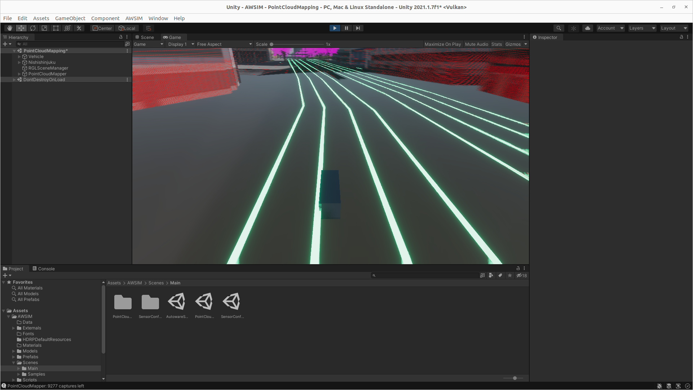

<!-- TODO Add descriptions -->
## AutowareSimulation
AutowareSimulation scene is a scene used for simulating environment in which Autoware is operating.
It allows for effortless operation with Autoware, simply run this scene, launch Autoware with correct map file and everything should work out of the box.

## NPCVehicleSample

## NPCPedestrianSample

## TrafficIntersectionSample

## TrafficLightSample

## PointCloudMapping

## SensorConfig

## Lidar

### LidarSkinnedStress

### LidarSceneDevelop

### LidarDisablingTest

