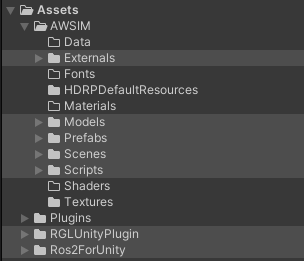

# AWSIM Unity project
## Introduction to Unity
The basic element in the *Unity* project is the scene - it's where all the objects are located and it's the scene that is run for simulation. The scene consists of various *Gameobjects*, such as the main camera, the canvas (with UI elements) or the environment.

Gameobjects can contain other *Gameobjects* (called children), it can be, for example, several gameobjects  that are separate visual models of parts of one object, in total giving one large model - for example a vehicle. What's more, these objects can be saved as pre-configured (then called prefabs) and used many times.

*Gameobjects* can have pre-configured components attached - also in their children. An attached component can be an object animation, a collider or a just developed script.
Components are an essential part of the objects used in the simulation. They make it possible to adjust the object in order to control it by physics ([Rigidbody](https://docs.unity3d.com/ScriptReference/Rigidbody.html) component) or configure and detect collisions ([MeshCollider](https://docs.unity3d.com/Manual/class-MeshCollider.html) component).


### Prefabs with components
In the *AWSIM Unity* project, there are several types of prefabs that have pre-configured components, these are:

- [*Sensors*](../Components/Sensors/VehicleStatus/) - these are prefabs that simulate sensors in an autonomous vehicle. They allow to obtain data on the current situation (e.g. the state of the environment) in order to use them.
  
- [*EgoVehicle*](../Components/EgoVehicle/) - it is a prefab of an autonomous vehicle that contains configured sensors, elements responsible for collisions and scripts that enable control.
  
- [*NPCVehicles*](../Components/NPCs/Vehicle/) - these are prefabs of vehicles that have configured elements responsible for collisions and traffic control. They can be used by `RandomTrafficSimulator`.
  
- [*NpcPedestrians*](../Components/NPCs/Pedestrian/) - these are prefabs of humans that have configured elements responsible for cyclic movement and animations.
  
- [*RandomTrafficSimulator*](../Components/Environment/TrafficComponents/) - it is a prefab that is responsible for controlling random traffic using other objects in the environment.
  
- [*Environment*](../Components/Environment/Environment/) - it is a prefab that contains all the visual objects in the world, as well as elements responsible for controlling road intersections - their lights and a map of traffic lanes on which vehicles can move. It contains `NPCs` and `RandomTrafficSimulator` prefabs.

!!! tip "Default scene"
    Description of each of the above prefabs can be found in the appropriate sections of the Components group. However, in order to better understand the whole project, we encourage you to run the default scene `AutowareSimulation` and read this [section](../Components/Scene/) first.

### Project arrangement


Project *AWSIM Unity* consists of several main groups:

- *Scenes* - this group contains the main scene `AutowareSimulation` with with added `Environment` prefab to run the simulation, also contains a scene that can be used to map this environment (creating a point cloud) and other [sample scenes](../DefaultExistingScenes/) to help with development.
  
- *Prefabs* - this group contains prefabs of: `Environment`, `EgoVehicle`, `NPCVehicles` and `NPCPedestrian` that have pre-configured components (also scripts) and can be added to the scene.
  
- *Scripts* - this group contains scripts used for `Environment` objects, `Ego` and its sensors, `NPCVehicle`, `NPCPedestrian`, and others.
  
- *Models* - this group contains visual models (`*.fbx` files) of objects used in their prefabs (except `Environment` prefab) - each model contains materials and textures.
  
- *Externals* - this group contains visual models of objects used in the `Environment` prefab. These are the only objects that are outside of the repository and must be loaded as a downloaded `unitypackage`.

In addition, it contains two external libraries as assets groups:

- [*RGLUnityPlugin*](../ExternalLibraries/RGLUnityPlugin/) - it is library developed by [Robotec.AI](https://robotec.ai/) for simulating *LiDARs* on *CUDA*-enabled *GPUs*, accelerated by *RTX* cores if available.
  
- [*Ros2ForUnity*](../ExternalLibraries/Ros2Unity/) - it is library developed by [Robotec.AI](https://robotec.ai/) for a high-performance communication solution to connect *Unity* and *ROS2* ecosystem in a *ROS2* "native" way.

#### Directory structure

Project *AWSIM Unity*  has the following directory structure. Mostly they are grouped by file type.

```
AWSIM       //  root directory.
 │
 │
 ├─Assets                           // Unity project Assets directory.
 │  │                               // Place external libraries
 │  │                               // under this directory.
 │  │                               // (e.g. RGLUnityPlugin, ROS2ForUnity, etc..)
 │  │
 │  │
 │  ├─AWSIM                         // Includes assets directly related to AWSIM
 │  |                               // (Scripts, Prefabs etc.)
 │  │  │
 │  │  │
 │  │  ├─Externals                  // Place for large files or
 │  │  |                            // external project dependencies
 │  │  |                            // (e.g. Ninshinjuku map asset).
 │  │  │                            // The directory is added to `.gitignore`
 │  │  │
 │  │  ├─HDRPDefaultResources       // Unity HDRP default assets.
 │  │  │
 │  │  ├─Materials                  // Materials used commonly in Project.
 │  │  │
 │  │  ├─Models                     // *3D* models
 │  │  │  │                         // Textures and materials for *3D* models
 │  │  │  │                         // are also included.
 │  │  │  │
 │  │  │  └─<*3D* Model>              // Directory of each *3D* model.
 │  │  │     │
 │  │  │     │
 │  │  │     ├─Materials            // Materials used in *3D* model.
 │  │  │     │
 │  │  │     │
 │  │  │     └─Textures             // Textures used in *3D* model.
 │  │  │
 │  │  │
 │  │  ├─Prefabs                    // Prefabs not dependent on a specific scene.
 │  │  │
 │  │  ├─Scenes                     // Scenes
 │  │  │  │                         // Includes scene-specific scripts, etc.
 │  │  │  │
 │  │  │  │
 │  │  │  ├─Main                    // Scenes used in the simulation.
 │  │  │  │
 │  │  │  │
 │  │  │  └─Samples                 // Sample Scenes showcasing components.
 │  │  │
 │  │  │
 │  │  └─Scripts                    // C# scripts.
 │  │
 │  │
 │  ├─RGLUnityPlugin        // Robotec GPU LiDAR external Library.
 │  │                       // see: https://github.com/RobotecAI/RobotecGPULidar
 │  │
 │  │
 │  └─Ros2ForUnity          // ROS2 communication external Library.
 │                          // see: https://github.com/RobotecAI/ros2-for-unity
 │
 ├─Packages         // Unity automatically generated directories.
 ├─ProjectSettings  //
 ├─UserSettings     //
 │
 │
 └─docs             // AWSIM documentation. Generated using mkdocs.
                    // see: https://www.mkdocs.org/

```


